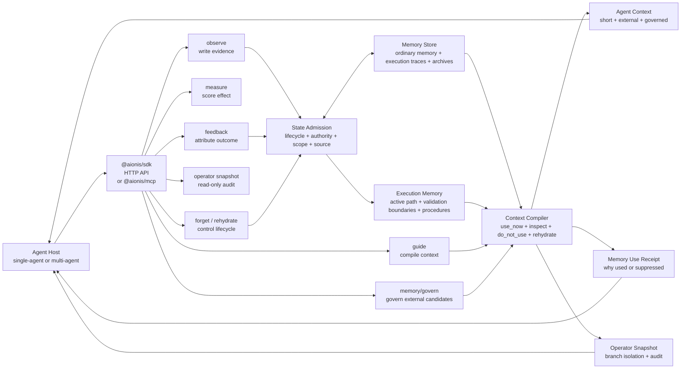

# Aionis

**Execution memory for Agents whose context gets noisy, stale, oversized, or
lost across sessions.**

**Compact, governed execution memory.**

Memory is not recall. Memory is executable state.

Long-running Agents do not fail only because they forget. They fail because
their context drifts, old facts compete with current state, irrelevant history
bloats the prompt, and handoff state disappears across sessions, threads,
agents, devices, and model switches.

Aionis turns plans, decisions, source evidence, feedback, handoff state, and
memory candidates into shorter, cleaner, auditable Agent context.

## Results at a Glance

| Evaluation | Result | Why it matters |
|---|---:|---|
| External Agent E2E, 40 continuations | **40/40 completion** with **56.4% fewer total tokens** than Full History | Keeps long-task state usable without replaying everything. |
| Buried-history stress | **100% completion** with **83.0% fewer prompt tokens** than Full History | Preserves the active state when useful evidence is buried in noisy history. |
| MGBench v0.1.1 strict holdout | **40/40 product-positive**, **100% active-state recovery**, **100% trace coverage** | Recovers governed execution state without semantic fixture IDs. |
| MemoryData 50-sample replay | Exact answer **43/50 -> 48/50**, evidence coverage **47/50 -> 50/50** | Ordinary factual memory recall is now backed by source-span coverage. |
| Zvec ANN candidate retrieval | **100% recall@10**, **100% recall@50**, p50 **5.70 ms** on 4,096 nodes | Scales candidate retrieval while SQLite remains the governed truth source. |

See the evidence map:
[docs/AIONIS_EVIDENCE_INDEX.md](docs/AIONIS_EVIDENCE_INDEX.md) and
[docs/research/2026-06-28-aionis-evaluation-evidence-report.md](docs/research/2026-06-28-aionis-evaluation-evidence-report.md).
For the Agent-facing context contract, see
[docs/AIONIS_AGENT_CONTEXT_CONTRACT.md](docs/AIONIS_AGENT_CONTEXT_CONTRACT.md).

## The Claim

Memory is not about storing more text.

Memory is about preserving executable state: what is current, what should be
used now, what needs inspection, what should stay blocked, what can be
rehydrated later, and why each decision was made.

```bash
npx aionis setup
```

Current candidate: **Runtime v0.3.11 / SDK v0.3.19 / Manifest v0.1.1**.
The frozen `aionis` installer still installs Runtime v0.3.6; the command above
does not install this candidate. Runtime v0.3.10 remains the latest
immutable release, but its default Docker command does not make Runtime the
container's PID 1, so it must not be treated as the durable-container release.
v0.3.11 fixes that packaging boundary and adds exact-image graceful/crash
recovery gates. Until a new immutable tag is published, test v0.3.11 only from
the reviewed source checkout. The candidate is intended for a single
self-hosted Runtime process with same-host Agent clients.
The TypeScript SDK, HTTP API, MCP bridge, AIFS file surface, Memory Firewall,
Agent Flight Recorder, optional Zvec candidate retrieval, and Substrate
evidence sidecar are available for beta integration and evaluation.

This product line is not a GA managed service and does not claim multi-instance
high availability. Lite keeps SQLite as authority; its in-process ANN is rebuilt
from committed SQLite vectors after restart. Deployments that run several
Runtime processes need a shared persistent ANN or an explicit cross-instance
reconciliation design.

The protected write boundary is crash recoverable: `observe`, direct handoff,
and measure writes accept an `operation_id` and replay the exact durable receipt
after an ambiguous network failure. Measure also persists an immutable
measurement identity and digest; a sufficient Runtime-verified product trace
binds its effect to the authoritative after episode. These evidence writes do
not by themselves change memory posture or authorize promotion. Semantic memory
state and durable embedding/ANN projection intents commit together. A scheduled
projection is not the same as completed projection; inspect `/health` for worker
and backlog state.

Docs: [docs.aionis.work](https://docs.aionis.work)

## Choose Your Entry Point

| Goal | Use | First command | Source |
|---|---|---|---|
| Guided local setup | `aionis` | `npx aionis setup` | [ostinatocc/aionis-cli](https://github.com/ostinatocc/aionis-cli) |
| Install the Runtime locally | `aionis` | `npx aionis setup` | [ostinatocc/aionis-cli](https://github.com/ostinatocc/aionis-cli) |
| Integrate from a TypeScript host | `@aionis/sdk` | `npm install @aionis/sdk` | [ostinatocc/aionis-sdk](https://github.com/ostinatocc/aionis-sdk) |
| Compile or resume a Manifest workflow | `@aionis/manifest` | `npm install @aionis/manifest` | [ostinatocc/AionisManifest](https://github.com/ostinatocc/AionisManifest) |
| Connect any MCP client | `@aionis/mcp` | `npx @aionis/mcp@latest --base-url http://127.0.0.1:3001` | [ostinatocc/aionis-mcp](https://github.com/ostinatocc/aionis-mcp) |
| Mirror governed context into files | `@aionis/aifs` | `npx aionis setup --with-aifs` | [ostinatocc/aionis-aifs](https://github.com/ostinatocc/aionis-aifs) |
| Give Claude Code automatic memory hooks | Claude Code plugin | `/plugin marketplace add https://github.com/ostinatocc/aionis-claude-code` | [ostinatocc/aionis-claude-code](https://github.com/ostinatocc/aionis-claude-code) |

```bash
npx aionis setup
```

`aionis setup` is the product installer shell and the recommended first entry
point. It asks for the install directory, provider, optional AIFS/Zvec/Claude
Code setup. API keys are collected with hidden terminal input. The command
writes the generated Runtime `.env`, delegates the install to `@aionis/create`,
then prints the next Runtime start and SDK/API/MCP/AIFS connection commands.
It installs for real Agent integration without running optional verification
flows by default. The frozen installer currently selects Runtime v0.3.6; it is
the default published-beta install path, not the v0.3.11 candidate test path.

For non-interactive installs, set the provider key in the environment:

```bash
OPENAI_API_KEY="your-key" npx aionis setup --provider openai --yes
```

Optional local ANN candidate retrieval:

```bash
npx aionis setup --with-zvec-ann
```

This enables Zvec as a persisted candidate index while keeping SQLite as the
Runtime fact source. Aionis still performs final scope, lifecycle, authority,
admission, and rehydrate governance after candidates are loaded.

The candidate Docker coordinate is `ghcr.io/ostinatocc/aionis:v0.3.11`. It is
not a published artifact before the immutable tag workflow verifies and
promotes its digest. After that workflow succeeds, run it with:

```bash
docker run --rm \
  -p 127.0.0.1:3001:3001 \
  -v aionis-data:/data \
  ghcr.io/ostinatocc/aionis:v0.3.11
```

The container process listens on `0.0.0.0` inside its network namespace so
Docker port publishing can reach it. The host publish remains
`127.0.0.1:3001`, so the unauthenticated Lite Runtime is reachable only from
the local host. Direct host installs keep `AIONIS_LISTEN_HOST=127.0.0.1`; do
not attach the unauthenticated Lite container to an untrusted shared network.

Then start the local Runtime from the generated checkout:

```bash
cd Aionis
npm run -s lite:start
```

For the recommended isolated Claude Code path, install Runtime into a side
directory. This uses `http://127.0.0.1:3101` and keeps it separate from any
Runtime you use for Aionis development:

```bash
npx aionis setup .aionis-runtime --with-claude-code
cd .aionis-runtime
npm run -s lite:start
```

Claude Code plugin path:

```text
/plugin marketplace add https://github.com/ostinatocc/aionis-claude-code
/plugin install aionis@aionis-claude-code
/aionis:onboard
```

The Claude Code plugin is maintained in the dedicated
[ostinatocc/aionis-claude-code](https://github.com/ostinatocc/aionis-claude-code)
adapter repo. This Runtime repo owns the product APIs, execution-memory
semantics, and validation loops that the plugin calls.

The plugin installs user-level Aionis MCP plus lifecycle hooks. It uses stable
workspace scopes without writing hook files into every project. After that, run
`claude` from any project:

```text
UserPromptSubmit -> Aionis guide -> injected execution context
PostToolUse / PostToolUseFailure -> Aionis observe
PostCompact / SessionEnd -> Aionis handoff
```

The Claude Code adapter records verified session handoffs when Claude Code
changes files and validation passes. The next run receives target files,
acceptance checks, validation evidence, and execution-boundary notes as active
execution context.

CLI onboarding path:

```bash
npx @aionis/claude-code@latest onboard --base-url http://127.0.0.1:3101
```

MCP bridge setup for MCP-capable hosts:

```bash
claude mcp add --transport stdio --scope project aionis -- \
  npx -y @aionis/mcp@latest \
  --base-url http://127.0.0.1:3001 \
  --scope-from workspace
```

Generic MCP clients can run the bridge directly:

```bash
npx @aionis/mcp@latest --base-url http://127.0.0.1:3001 --scope-from workspace
```

The TypeScript SDK is maintained in the dedicated
[ostinatocc/aionis-sdk](https://github.com/ostinatocc/aionis-sdk) package repo.
The MCP bridge is maintained in the dedicated
[ostinatocc/aionis-mcp](https://github.com/ostinatocc/aionis-mcp) adapter repo.

Package boundary:

| Repository | Owns |
|---|---|
| [ostinatocc/Aionis](https://github.com/ostinatocc/Aionis) | Runtime core, product APIs, docs, output contracts, Docker image, and validation loops. |
| [ostinatocc/aionis-cli](https://github.com/ostinatocc/aionis-cli) | Published top-level `aionis` product CLI, including `npx aionis setup`. |
| [ostinatocc/aionis-create](https://github.com/ostinatocc/aionis-create) | Published one-command Runtime installer package. |
| [ostinatocc/aionis-sdk](https://github.com/ostinatocc/aionis-sdk) | Published TypeScript SDK package. |
| [ostinatocc/aionis-mcp](https://github.com/ostinatocc/aionis-mcp) | Published MCP stdio bridge package. |
| [ostinatocc/aionis-aifs](https://github.com/ostinatocc/aionis-aifs) | Published AIFS file-surface package. |
| [ostinatocc/aionis-claude-code](https://github.com/ostinatocc/aionis-claude-code) | Claude Code plugin manifest, lifecycle hooks, and helper package. |

The default guided install is Agent-first. After setup, start the Runtime
and connect your Agent host through SDK, HTTP, MCP, AIFS, or a native plugin.
The low-level `@aionis/create` package remains the installer backend; most users
should enter through `npx aionis setup`.

For coding agents and MCP-capable hosts, the first useful loop is:

```text
Claude Code hooks -> Aionis context -> Agent action -> Aionis observe/handoff
```

Use lifecycle hooks when the host supports them. Use MCP when a host exposes
tools through the Model Context Protocol. Add feedback, measure, and snapshot
once the host loop is ready.

Already using Mem0, Zep, Supermemory, Pinecone, pgvector, Chroma, Weaviate,
LangGraph Store, markdown memory, logs, or a custom vector store? Keep it for
retrieval. Put Aionis in front of the Agent as the Memory Firewall:

```text
external memory search -> Aionis governMemory / governMem0SearchResults -> safe Agent context
```

In a backend-agnostic local verification run, raw retrieval direct-uses failed, stale, and
unknown memory; Aionis keeps the current route in `use_now`, moves failed/stale
memory to `do_not_use`, leaves unknown memory `inspect_before_use`, and keeps
archived evidence pointer-only under `rehydrate`. For Mem0 specifically, a
12-scenario local A/B showed Mem0 retrieved the current route in every case but
also retrieved unsafe memories in 10 cases; Aionis preserved 100% current-route
recall while reducing wrong direct-use from 83.3% to 0%.

External proof paths:

- Claude Code lifecycle hooks:
  [docs/AIONIS_CLAUDE_CODE_INTEGRATION.md](docs/AIONIS_CLAUDE_CODE_INTEGRATION.md)
- Claude Code / Cursor over MCP:
  [docs.aionis.work/integrations/mcp](https://docs.aionis.work/integrations/mcp)
- Memory Firewall for existing backends:
  [docs.aionis.work/products/memory-firewall](https://docs.aionis.work/products/memory-firewall)
- Public benchmark and proof artifacts:
  [docs.aionis.work/mgbench](https://docs.aionis.work/mgbench)
- Profile-scoped admission activation:
  [docs/AIONIS_ADMISSION_PROFILE_ACTIVATION_QUICKSTART.md](docs/AIONIS_ADMISSION_PROFILE_ACTIVATION_QUICKSTART.md)

Use Aionis when your Agents must continue real work across sessions, roles,
handoffs, and mistakes.

## Why Teams Use Aionis

Most memory systems retrieve text. Aionis governs state.

| You need | Aionis gives you |
|---|---|
| Shorter context without losing the task | Execution history is compressed into current state, reusable procedures, and rehydrate pointers. |
| Execution continuity across sessions | The next Agent receives the accepted route and action boundary without replaying full history. |
| Safer memory than raw RAG | Memories are gated into `use_now`, `inspect_before_use`, `do_not_use`, or `rehydrate`. |
| Governed alternatives | Invalidated or low-authority history remains available as evidence without becoming future instruction. |
| Admission for any memory backend | Mem0, Zep, Supermemory, Pinecone, pgvector, Chroma, Weaviate, LangGraph Store, markdown, logs, or custom memory candidates can be routed through Aionis before prompt use. |
| Memory Firewall for retrieval systems | Use your memory backend for recall, then prevent failed, stale, contested, unknown, or rehydrate-required memories from becoming Agent instructions. |
| Plans that survive model and session boundaries | Strong planners can create plans; Aionis keeps their decisions, checks, validation boundaries, and handoff state executable for later workers. |
| Multi-agent execution continuity | Planner, worker, verifier, and reviewer share branch-aware execution memory. |
| Memory that can be controlled | Stale or harmful memory can be suppressed, archived, restored, or rehydrated. |
| Operator confidence | Every guide can produce memory use receipts, decision traces, and read-only snapshots. |

## Architecture Overview

Aionis turns raw history into compact, governed Agent context.



The default product loop is:

```text
observe -> guide -> agent action -> feedback -> measure -> snapshot
```

Full architecture guide:
[docs/AIONIS_RUNTIME_ARCHITECTURE.md](docs/AIONIS_RUNTIME_ARCHITECTURE.md).

Recall Engine roadmap:
[docs/AIONIS_RECALL_ENGINE_ROADMAP.md](docs/AIONIS_RECALL_ENGINE_ROADMAP.md).
Aionis is improving candidate retrieval underneath the product surface while
state admission remains the final control plane for Agent-facing context.

Recall Engine runbook:
[docs/AIONIS_RECALL_ENGINE_RUNBOOK.md](docs/AIONIS_RECALL_ENGINE_RUNBOOK.md).
Use it to diagnose whether a missing or surprising memory outcome came from
candidate retrieval, admission, rehydration, host prompt integration, or Agent
compliance.

## Aionis vs Recall Memory

| Approach | Default behavior | Aionis behavior |
|---|---|---|
| Long context | Pass everything to the model. | Compile only external memory state into Agent context. |
| Vector recall / RAG | Retrieve related text. | Decide whether memory is current, stale, contested, invalidated, or rehydratable before use. |
| Recall memory | Return relevant memories. | Split memory into `use_now`, `inspect_before_use`, `do_not_use`, and `rehydrate`. |
| Workflow memory | Store successful procedures. | Preserve passed paths, validation boundaries, and active state. |

Full positioning guide:
[docs/AIONIS_PRODUCT_POSITIONING.md](docs/AIONIS_PRODUCT_POSITIONING.md).

## Govern Any Memory Backend

Aionis can sit in front of existing memory systems. Pass candidates from Mem0,
Zep, a vector DB, markdown, logs, or your own store to `POST /v1/memory/govern`,
SDK `governMemory()`, or the Mem0 drop-in helper
`governMem0SearchResults()`. Aionis returns the same four admission surfaces it
uses for native memory:

```text
use_now | inspect_before_use | do_not_use | rehydrate
```

This lets teams keep their current storage while adding a memory firewall layer:
failed, stale, contested, suppressed, blocked, or rehydrate-required candidates
are routed away from direct Agent instructions and kept available as audit or
rehydration evidence.

For any backend, use `governMemory()` with external candidates. For Mem0 users,
the drop-in helper is:

```ts
const mem0Results = await mem0.search("continue the task", { user_id, top_k: 10 });
const governed = await aionis.governMem0SearchResults({
  query_text: "Continue on the verified route and inspect risky history first.",
  mem0_results: mem0Results,
});

await agent.run(governed.agent_context.prompt_text);
```

API details:
[docs/AIONIS_PRODUCT_API_USAGE.md](docs/AIONIS_PRODUCT_API_USAGE.md#post-v1memorygovern).

Security/product packaging:
[docs/AIONIS_MEMORY_FIREWALL.md](docs/AIONIS_MEMORY_FIREWALL.md).

Mem0 A/B evidence:
[docs/AIONIS_MEM0_FIREWALL_AB_REPORT.md](docs/AIONIS_MEM0_FIREWALL_AB_REPORT.md).

Launch copy:
[docs/AIONIS_MEM0_FIREWALL_LAUNCH_POST.md](docs/AIONIS_MEM0_FIREWALL_LAUNCH_POST.md).

## Replay Agent Decisions

Aionis also exposes an Agent Flight Recorder. After a run, call
`POST /v1/audit/flight-recorder` or SDK `flightRecorder()` to reconstruct which
memories entered direct use, which were blocked, which required rehydration, and
how feedback was attributed.

It answers the operator question every production Agent system needs: what did
the Agent know when it made that decision?

Guide:
[docs/AIONIS_AGENT_FLIGHT_RECORDER.md](docs/AIONIS_AGENT_FLIGHT_RECORDER.md).

## Loop Engineering Profile

Aionis can sit beside a loop-engineered Agent without becoming the loop runner.
The host owns plan, action, tools, validation, and retry. Aionis owns the memory
governance around that loop: observed iteration evidence, next-iteration guide,
feedback attribution, effect measurement, operator snapshot, and Flight Recorder
replay.

Run the loop profile:

```bash
npm run -s runtime:e2e:loop-engineering-profile
```

## Plan As Memory Asset

Aionis preserves the decisions made by strong planners and makes them usable by
future workers, reviewers, and cheaper models.

Plans become governed execution memory when they carry:

- resolved decisions
- acceptance checks
- rejected alternatives
- active targets
- execution boundaries
- evidence and feedback attribution

In practice, the planner can be Claude Code, GPT, a human reviewer, or another
Agent. Aionis records the plan as evidence, compiles only the governed state
into the worker context, and lets Flight Recorder show what the worker could see
when it acted.

Run the plan asset profile:

```bash
npm run -s runtime:e2e:plan-as-memory-asset
```

Guide:
[docs/AIONIS_LOOP_ENGINEERING.md](docs/AIONIS_LOOP_ENGINEERING.md).

## Quickstart

Install the Runtime with one guided command:

```bash
npx aionis setup
```

This prompts for the install path and provider, writes `.env`, delegates the
install to `@aionis/create`, and prints the next commands to start the Runtime
and connect an Agent host.

For full SDK integration with recall-backed guide output:

```bash
OPENAI_API_KEY="your-key" npx aionis setup --provider openai --yes
```

DashScope `text-embedding-v4` is supported as a first-class embedding provider:

```bash
export EMBEDDING_PROVIDER="dashscope"
export DASHSCOPE_API_KEY="your-dashscope-key"
export DASHSCOPE_EMBEDDING_MODEL="text-embedding-v4"
```

For local development from this repo, install dependencies:

```bash
npm install
```

Configure an embedding provider and run the SDK verification flow:

```bash
export EMBEDDING_PROVIDER="openai"
export OPENAI_API_KEY="your-openai-key"

npm run -s runtime:quickstart:sdk
```

MiniMax is also supported when you prefer it:

```bash
export EMBEDDING_PROVIDER="minimax"
export MINIMAX_API_KEY="your-minimax-key"
npm run -s runtime:quickstart:sdk
```

The SDK verification flow runs a real local Runtime and verifies:

1. a fresh guide starts without actionable history
2. ordinary preference and project memory become reusable context
3. the SDK compiles external execution memory into a contract-style Agent prompt
4. feedback is attributed only to exact memory IDs reported as used by host
   instrumentation and authorized by the guide's persisted exposure
5. a Runtime-owned typecheck and exact episode-ledger tool-feedback authority
   verify the effect without trusting caller evidence claims
6. protected `measure` persists an idempotent measurement and binds the effect
   to distinct baseline/after episodes
7. admission dataset JSONL export is produced without prompt payload
8. operator audit surfaces remain read-only

For the dataset export path specifically, see
[docs/AIONIS_ADMISSION_DATASET_EXPORT_QUICKSTART.md](docs/AIONIS_ADMISSION_DATASET_EXPORT_QUICKSTART.md).

For raw HTTP integration without the TypeScript SDK:

```bash
npm run -s runtime:quickstart:http
```

For multi-agent execution memory:

```bash
npm run -s runtime:quickstart:multi-agent
```

That loop writes planner, worker, verifier, and reviewer evidence, then proves
that the reviewer can continue the passed branch while avoiding the failed
branch.

For backend-agnostic Memory Firewall:

```bash
npm run -s runtime:quickstart:memory-firewall
```

That loop passes Mem0/Zep/vector/markdown-style candidates through
`/v1/memory/govern` and proves Aionis routes unsafe external memories away from
direct use.

For the Memory Firewall A/B verification run:

```bash
npm run -s runtime:e2e:memory-firewall-ab
```

That loop compares raw retrieved memory against Aionis-governed memory using the
same Mem0/Zep/vector/log-style candidates. It shows unsafe direct-use,
current/procedure recall, and audit coverage side by side. See
[Memory Firewall A/B notes](docs/AIONIS_MEMORY_FIREWALL_AB_DEMO.md).

For Agent Flight Recorder:

```bash
npm run -s runtime:quickstart:flight-recorder
```

That loop replays what memory the Agent could see at decision time without
including prompt text or mutating Runtime state.

For the Agent Flight Recorder incident verification run:

```bash
npm run -s runtime:e2e:flight-recorder-incident
```

That loop replays a healthy run, a blocked-memory misuse incident, and a missing
feedback-attribution case. See
[Flight Recorder incident notes](docs/AIONIS_FLIGHT_RECORDER_INCIDENT_DEMO.md).

For Claude Code lifecycle integration, use the official plugin and setup guide:
[docs/AIONIS_CLAUDE_CODE_INTEGRATION.md](docs/AIONIS_CLAUDE_CODE_INTEGRATION.md).

Before publishing or after changing package entrypoints, run the external package
smoke:

```bash
npm run -s runtime:smoke:external-packages
```

That loop installs the published `@aionis/sdk`, `@aionis/mcp`, and
`@aionis/create` package specs into a temporary external Node project, then
verifies the SDK product loop, the MCP stdio tool path, and the installer/MCP
CLI entrypoints against a real Runtime. Override the package specs with
`AIONIS_EXTERNAL_SMOKE_SDK_SPEC`, `AIONIS_EXTERNAL_SMOKE_MCP_SPEC`, and
`AIONIS_EXTERNAL_SMOKE_CREATE_SPEC` when validating prerelease tarballs.
When the target Runtime is external, set
`AIONIS_EXTERNAL_SMOKE_EMBEDDING_EXPECTATION=available|unavailable`. Available
mode also requires `AIONIS_EXTERNAL_SMOKE_EXPECTED_EMBEDDING_MODEL` and proves
ready write embeddings, the exact model, 1536-dimensional planning queries,
and semantic/ANN recall provenance through both SDK and MCP entrypoints.
Provider API keys are removed from npm-install, SDK, MCP, and CLI child
environments; only a Runtime process that the harness starts may inherit them.

Not sure which entrypoint to use? See the
[quickstart matrix](docs/AIONIS_QUICKSTART_MATRIX.md).

## Output Contract

The SDK product loop prints a compact result like this:

```json
{
  "contract_version": "aionis_sdk_quickstart_result_v1",
  "agent_context": {
    "before_actionable_history_used": false,
    "after_actionable_history_used": true,
    "use_now_memory_ids": ["mem_preference", "mem_project_fact"]
  },
  "execution_context_compiler": {
    "contract_version": "aionis_execution_agent_context_v1",
    "memory_use_receipt_visible": true
  },
  "memory_admission": {
    "feedback_attributed_memory_count": 1,
    "measure_history_impact": "positive"
  },
  "admission_dataset_export": {
    "row_count": 4,
    "positive_use_count": 1,
    "prompt_payload_excluded": true
  },
  "operator_audit": {
    "memory_use_receipt_visible": true,
    "memory_admission_record_visible": true,
    "snapshot_runtime_mutation": false
  }
}
```

Committed verification artifacts:

1. [SDK verification result](docs/examples/sdk-quickstart-result.json)
2. [HTTP verification result](docs/examples/http-quickstart-result.json)
3. [Multi-agent verification result](docs/examples/multi-agent-quickstart-result.json)
4. [Golden product loop result](docs/examples/golden-product-loop-result.json)
5. [Judgment calibration product loop result](docs/examples/judgment-calibration-product-loop-result.json)
6. [Memory Firewall verification result](docs/examples/memory-firewall-quickstart-result.json)
7. [Memory Firewall A/B verification result](docs/examples/memory-firewall-ab-demo-result.json)
8. [Flight Recorder verification result](docs/examples/flight-recorder-quickstart-result.json)
9. [Flight Recorder incident verification result](docs/examples/flight-recorder-incident-demo-result.json)
10. [Loop Engineering profile result](docs/examples/loop-engineering-profile-result.json)
11. [Plan as Memory Asset result](docs/examples/plan-as-memory-asset-result.json)
12. [External Claude Code long-flow result](docs/examples/external-claude-code-longflow-result.json)

## What The Agent Gets

Aionis compiles raw traces, decisions, and memory state into an Agent-facing
SDK contract:

```text
AIONIS_EXECUTION_AGENT_CONTEXT v1
ROLE_AND_TASK
- role=reviewer
- task=Continue the product update.

CURRENT_ACTIVE_PATH
- continue verified checkout branch

BLOCKED_DIRECTION_TARGETS
- failed broad search branch
```

The structured context also carries memory IDs for visibility and correlation:

```ts
type AgentContext = {
  prompt_text: string;
  use_now: string[];
  inspect_before_use: string[];
  do_not_use: string[];
  rehydrate_hints: string[];
  use_now_memory_ids: string[];
  inspect_before_use_memory_ids: string[];
  do_not_use_memory_ids: string[];
  actionable_history_used: boolean;
};
```

Give the Agent SDK `agent_prompt`. Direct HTTP hosts may pass only
`agent_context.prompt_text` or selected `agent_context` fields. Keep packets,
traces, receipts, raw slots, and operator snapshots for host logs and
observability. Every `agent_context.*_memory_ids` list says what the Agent could
see on that surface. It is not evidence that the Agent actually used a memory,
and it is not feedback authorization.

## SDK Usage

```ts
import {
  createAionisClient,
  feedbackAttributionFromGuide,
  feedbackFromGuide,
  type AionisGuideFeedbackAttributionV1,
} from "@aionis/sdk";

const aionis = createAionisClient({
  baseUrl: process.env.AIONIS_URL ?? "http://127.0.0.1:3001",
  apiKey: process.env.AIONIS_API_KEY,
  tenant_id: "default",
  scope: "checkout-agent",
});

await aionis.remember({
  kind: "preference",
  text: "Prefer concise product updates with concrete next steps.",
  memory_lane: "private",
  owner_agent_id: "agent-1",
});

const context = await aionis.execution.guideAgentContextForRole<{
  tenant_id: string;
  scope: string;
  guide_trace_id: string;
  feedback_attribution_v1: AionisGuideFeedbackAttributionV1;
  agent_context: {
    prompt_text: string;
    agent_context_mode: "standard" | "compact_agent";
    use_now_memory_ids: string[];
  };
}>({
  agent_id: "agent-1",
  run_id: "run-001",
  task_signature: "product-update",
  query_text: "Continue the product update.",
  limit: 8,
  include_packets: true,
});

// Your host runs the Agent with context.agent_prompt. This result must come
// from instrumented Agent/tool execution, not from agent_context ID lists.
const agentResult = await runInstrumentedAgent(context.agent_prompt);

// Zero verified-use IDs means no feedback request.
if (agentResult.used_memory_ids.length > 0) {
  const attribution = feedbackAttributionFromGuide(context.guide);
  if (attribution.status !== "available") {
    throw new Error(
      `Feedback attribution is unavailable (${attribution.reason_code}); `
      + "request a new guide instead of falling back to agent_context IDs.",
    );
  }

  await aionis.feedback(feedbackFromGuide({
    guide: context.guide,
    reason: "Host instrumentation verified successful memory use.",
    run_id: "run-001",
    outcome: "positive",
    used_memory_ids: agentResult.used_memory_ids,
  }));
}
```

`feedbackFromGuide()` requires the complete source guide, including its valid
top-level `feedback_attribution_v1`. It inherits the guide consumer identity
when available, validates host-instrumented actual-use IDs against the persisted
exposure, and derives the served surface from that exposure. AgentContext IDs
cannot substitute for either actual-use evidence or authorization. If the host
reports no used IDs, do not submit feedback. If attribution is unavailable,
request a new guide; there is no AgentContext fallback.

Full SDK guide: [docs/AIONIS_SDK_QUICKSTART.md](docs/AIONIS_SDK_QUICKSTART.md).

For token-sensitive Agent calls, opt into compact prompt rendering:

```ts
const compactContext = await aionis.execution.guideAgentContextForRole({
  agent_id: "reviewer-1",
  team_id: "checkout-team",
  role: "reviewer",
  run_id: "run-001",
  task_signature: "checkout-migration",
  query_text: "Continue the verified branch with compact execution context.",
  context_mode: "compact_agent",
}, undefined, {
  budget_profile: "compact",
});
```

Compact mode switches the final Agent prompt to the Runtime compact guide text
while preserving governed memory buckets, memory IDs, feedback attribution,
receipts, operator audit surfaces, and resolved evidence for host logic.

## MCP For Claude Code And Cursor

`@aionis/mcp` is the drop-in path for coding agents. It exposes Aionis as MCP
tools without asking the host to implement the full feedback loop on day one.

Claude Code plugin setup:

```bash
npx aionis setup .aionis-runtime --with-claude-code
cd .aionis-runtime
npm run -s lite:start
```

```text
/plugin marketplace add https://github.com/ostinatocc/aionis-claude-code
/plugin install aionis@aionis-claude-code
/aionis:doctor
```

This plugin path gives Claude Code both Aionis MCP tools and lifecycle hooks.
It defaults to `http://127.0.0.1:3101` and records verified session handoffs
after successful file changes. Use the MCP command below for Cursor, Zcode,
or other MCP-capable hosts.

Claude Code / MCP client setup:

```bash
claude mcp add --transport stdio --scope project aionis -- \
  npx -y @aionis/mcp@latest \
  --base-url http://127.0.0.1:3001 \
  --scope-from workspace \
  --workspace-id-store user
```

```json
{
  "mcpServers": {
    "aionis": {
      "command": "npx",
      "args": [
        "-y",
        "@aionis/mcp@latest",
        "--base-url",
        "http://127.0.0.1:3001",
        "--scope-from",
        "workspace",
        "--workspace-id-store",
        "user"
      ],
      "env": {
        "AIONIS_TENANT_ID": "default"
      }
    }
  }
}
```

The main tool is `aionis_context`: it compiles external execution state for the
current run and can optionally record a lightweight observation first. Feedback
is optional; teams can start with context-only use and later add
`aionis_record_step`, `aionis_measure`, and `aionis_snapshot`.
Set `context_mode: "compact_agent"` on `aionis_context` when the Agent needs a
shorter prompt while the host keeps structured IDs and audit fields.

Claude Code lifecycle hooks:
[docs/AIONIS_CLAUDE_CODE_INTEGRATION.md](docs/AIONIS_CLAUDE_CODE_INTEGRATION.md).

Full MCP guide:
[docs/AIONIS_MCP.md](docs/AIONIS_MCP.md).

## Use Aionis In Your Agent

For long-running or multi-agent work, use the execution helpers instead of
hand-writing execution memory payloads:

```ts
import { createAionisClient } from "@aionis/sdk";

const aionis = createAionisClient({
  baseUrl: process.env.AIONIS_URL ?? "http://127.0.0.1:3001",
  scope: "checkout-agent",
});

await aionis.execution.observeStep({
  agent_id: "worker-1",
  run_id: "run-001",
  task_signature: "checkout-migration",
  title: "Implement checkout adapter",
  summary: "Worker implemented the adapter and needs review.",
  outcome: "succeeded",
  target_files: ["src/checkout.ts"],
});

const context = await aionis.execution.guideAgentContextForRole({
  agent_id: "reviewer-1",
  team_id: "checkout-team",
  role: "reviewer",
  run_id: "run-001",
  task_signature: "checkout-migration",
  query_text: "Continue from the current verified execution path.",
}, undefined, {
  repo_state: {
    existing_files: ["src/checkout.ts"],
  },
  budget_profile: "balanced",
});

// Your host runs the Agent with context.agent_prompt.
```

Full minimal Agent integration file:
[docs/examples/minimal-agent.ts](docs/examples/minimal-agent.ts).

## Multi-Agent Execution Memory

Execution memory is Aionis's flagship surface.

It is designed for systems where multiple agents need to continue one body of
work without losing branch state:

```text
Planner creates the scoped plan.
Worker tries a branch.
Verifier marks the branch passed or failed.
Reviewer receives compact context and continues the active path.
```

Aionis keeps the useful execution state alive:

1. passed solutions can be reused
2. rejected alternatives stay governed as evidence
3. active path is separated from stale or contested memory
4. handoff state can survive across Agents, sessions, and runs
5. operator snapshots explain what was used, blocked, and measured

Run it:

```bash
npm run -s runtime:quickstart:multi-agent
```

Host integration guide:
[docs/AIONIS_HOST_INTEGRATION.md](docs/AIONIS_HOST_INTEGRATION.md).

## Core Concepts

| Concept | Meaning |
|---|---|
| Ordinary Memory | Preferences, facts, project context, and notes that can guide future work. |
| Execution Memory | Branch-aware memory of actions, outcomes, verifier evidence, handoffs, and reusable workflows. |
| Agent Context | The governed prompt contract given to the Agent. |
| Memory Lifecycle | The external state of memory: active, candidate, contested, suppressed, demoted, archived, or rehydrated. |
| Memory Use Receipt | A read-only record of which memories were used, inspected, blocked, or requested for rehydration. |
| Feedback Attribution | Feedback is applied only to host-instrumented actual-use IDs that exactly match the guide's persisted `feedback_attribution_v1`; AgentContext visibility alone does not qualify. |
| Operator Snapshot | Read-only observability for branch isolation, memory use, measured effect, and trace-to-procedure readiness. |

## When To Use Aionis

Aionis is strongest when agents are expected to keep working across time:

1. long-running coding agents
2. multi-agent planner/worker/verifier/reviewer systems
3. support or operations agents that must remember outcomes
4. workflow agents that should avoid repeated discovery
5. products that need auditable memory use
6. systems where stale or failed context is dangerous

If you only need a one-shot chat or a simple vector search over documents,
Aionis is probably more Runtime than you need.

## Product Surface

Aionis exposes a focused product loop:

```text
observe -> guide -> agent action -> feedback -> measure -> snapshot
```

| Step | What happens |
|---|---|
| `observe` | Write real memory, execution evidence, outcomes, or handoff state. |
| `guide` | Compile external memory into Agent-facing context. |
| `agent action` | Your host runs the Agent with only the compiled context. |
| `feedback` | Attribute the outcome to host-instrumented memory use authorized by the guide's persisted exposure. |
| `forget` | Explicitly suppress, unsuppress, archive, or restore memory lifecycle state. |
| `measure` | Check whether history helped, hurt, or lacked enough evidence. |
| `snapshot` | Inspect memory use, branch isolation, and effect without mutating Runtime state. |

HTTP entrypoints: `/v1/observe`, `/v1/guide`, `/v1/feedback`,
`/v1/forget`, `/v1/measure`, `/v1/rehydrate`, and `/v1/operator/snapshot`.
Controlled forgetting is a core Aionis capability. `/v1/forget` is the explicit
lifecycle-control API; `/v1/feedback` and `/v1/rehydrate` are productized
forgetting/lifecycle paths for common host loops.

API usage guide:
[docs/AIONIS_PRODUCT_API_USAGE.md](docs/AIONIS_PRODUCT_API_USAGE.md).
Install guide:
[docs/AIONIS_INSTALL.md](docs/AIONIS_INSTALL.md).
Release and Docker artifacts:
[docs/AIONIS_RELEASES.md](docs/AIONIS_RELEASES.md).
HTTP quickstart:
[docs/AIONIS_HTTP_QUICKSTART.md](docs/AIONIS_HTTP_QUICKSTART.md).

Output contracts:
[docs/AIONIS_PRODUCT_OUTPUT_CONTRACT.md](docs/AIONIS_PRODUCT_OUTPUT_CONTRACT.md).

## Documentation

Official docs: [https://docs.aionis.work](https://docs.aionis.work)

| Document | Purpose |
|---|---|
| [AIONIS_INSTALL.md](docs/AIONIS_INSTALL.md) | One-command install path for Runtime plus SDK and MCP packages. |
| [AIONIS_RELEASES.md](docs/AIONIS_RELEASES.md) | GitHub release, Docker image, npm package, SDK, and MCP artifact map. |
| [AIONIS_RUNTIME_DATA_OPERATIONS.md](docs/AIONIS_RUNTIME_DATA_OPERATIONS.md) | SQLite preflight, v0.3.4 upgrade, verified backup/restore, and durable projection repair. |
| [AIONIS_EVIDENCE_INDEX.md](docs/AIONIS_EVIDENCE_INDEX.md) | Current evidence map for context stability, MGBench, compression, MemoryData, performance, and external Agent cases. |
| [AIONIS_MCP.md](docs/AIONIS_MCP.md) | MCP bridge for Claude Code, Cursor, and other coding-agent clients. |
| [AIONIS_CLAUDE_CODE_INTEGRATION.md](docs/AIONIS_CLAUDE_CODE_INTEGRATION.md) | Official Claude Code plugin and lifecycle hook integration. |
| [AIONIS_EXTERNAL_AGENT_CASE_RUNBOOK.md](docs/AIONIS_EXTERNAL_AGENT_CASE_RUNBOOK.md) | Repeatable protocol for real external Agent cases with isolated Runtime, evidence capture, and pass criteria. |
| [AIONIS_LOOP_ENGINEERING.md](docs/AIONIS_LOOP_ENGINEERING.md) | Memory governance profile for loop-engineered Agents. |
| [AIONIS_OPENROUTER_FUSION.md](docs/AIONIS_OPENROUTER_FUSION.md) | Boundary for optional multi-model plan review without turning Aionis into a model router. |
| [AIONIS_RUNTIME_ARCHITECTURE.md](docs/AIONIS_RUNTIME_ARCHITECTURE.md) | Product architecture, memory layers, execution memory, context compiler, and source map. |
| [AIONIS_HTTP_QUICKSTART.md](docs/AIONIS_HTTP_QUICKSTART.md) | Smallest curl-first product loop. |
| [AIONIS_QUICKSTART_MATRIX.md](docs/AIONIS_QUICKSTART_MATRIX.md) | Which first-run command to use for SDK, HTTP, and multi-agent hosts. |
| [AIONIS_CONTROLLED_FORGETTING_QUICKSTART.md](docs/AIONIS_CONTROLLED_FORGETTING_QUICKSTART.md) | Controlled forgetting with suppress, unsuppress, and measure. |
| [AIONIS_SDK_QUICKSTART.md](docs/AIONIS_SDK_QUICKSTART.md) | Smallest SDK product loop. |
| [AIONIS_OBSERVE_GUIDE_AUDIT_QUICKSTART.md](docs/AIONIS_OBSERVE_GUIDE_AUDIT_QUICKSTART.md) | Short observe, guide, and audit path. |
| [AIONIS_HOST_INTEGRATION.md](docs/AIONIS_HOST_INTEGRATION.md) | Single-agent, multi-agent, and coding-agent host integration. |
| [AIONIS_PRODUCT_CONTRACT.md](docs/AIONIS_PRODUCT_CONTRACT.md) | Product contract, state surfaces, and host loop. |
| [AIONIS_TRACE_DERIVED_SKILL_MEMORY.md](docs/AIONIS_TRACE_DERIVED_SKILL_MEMORY.md) | Reviewed trace-derived skill candidates and the planned governed procedure-memory path. |
| [AIONIS_GOVERNANCE_POLICY_V1.md](docs/AIONIS_GOVERNANCE_POLICY_V1.md) | Versioned governance decision table for external memory admission and audit reasons. |
| [AIONIS_REHYDRATE_CONTRACT.md](docs/AIONIS_REHYDRATE_CONTRACT.md) | Rehydrate lifecycle, payload expansion modes, boundedness, and host merge policy. |
| [AIONIS_MULTI_AGENT_SCOPE_MODEL.md](docs/AIONIS_MULTI_AGENT_SCOPE_MODEL.md) | Tenant, scope, lane, team, and Agent visibility model for multi-Agent memory. |
| [AIONIS_PRODUCT_POSITIONING.md](docs/AIONIS_PRODUCT_POSITIONING.md) | External product positioning, claims, and comparison language. |
| [AIONIS_STATE_MODEL.md](docs/AIONIS_STATE_MODEL.md) | Implemented memory and execution state model. |
| [AIONIS_CONTEXT_COMPRESSION_BASELINE.md](docs/AIONIS_CONTEXT_COMPRESSION_BASELINE.md) | Current state-preserving context compression baseline. |
| [AIONIS_SUBSTRATE_INTEGRATION.md](docs/AIONIS_SUBSTRATE_INTEGRATION.md) | External durable evidence sidecar: mirror Runtime SQLite read-only into Substrate for audit, backup, preview, and migration planning. |
| [Admission Dataset Batch Baseline](docs/research/2026-06-18-admission-dataset-batch-baseline.md) | First 105-row real Runtime admission dataset and offline policy comparison baseline. |
| [Admission Active Cross-Repo Tool E2E 40-Gate](docs/research/2026-06-28-admission-active-crossrepo-tool-e2e-40gate.md) | 40-record active-policy tool-executing Agent gate for default-active review. |
| [External Agent E2E Five-Arm Full Run](docs/research/2026-06-19-external-agent-e2e-five-arm-full.md) | 40-record, five-arm external-agent evidence for route-safe context compression. |

## Development

Local verification:

```bash
npm install
npm run -s typecheck
npm run -s lite:test
```

Product proof loops:

```bash
npm run -s runtime:quickstart:sdk
npm run -s runtime:quickstart:http
npm run -s runtime:quickstart:multi-agent
npm run -s runtime:e2e:golden-product-loop
npm run -s runtime:e2e:judgment-calibration
```

The judgment calibration loop verifies that supported memory, unused recalled
memory, and operator audit output stay separated without mutating Runtime state
or leaking raw audit fields into the Agent prompt.

The current package is the focused local Runtime. It keeps Runtime kernel,
routes, Lite store contracts, SDK quickstarts, and product e2es in one repo.
Internal architecture notes live in:

1. [docs/FOCUS.md](docs/FOCUS.md)
2. [docs/ARCHITECTURE_BOUNDARY.md](docs/ARCHITECTURE_BOUNDARY.md)
3. [docs/AIONIS_CAPABILITY_DECISION_MATRIX.md](docs/AIONIS_CAPABILITY_DECISION_MATRIX.md)

Deployment notes: this Public Beta product line is optimized for one local Runtime
process and same-host Agent clients. Server settings add API-key/JWT auth and
request controls for bounded remote evaluation, but are not a claim of a
managed, multi-tenant, multi-instance HA service.

## License

Apache-2.0.
