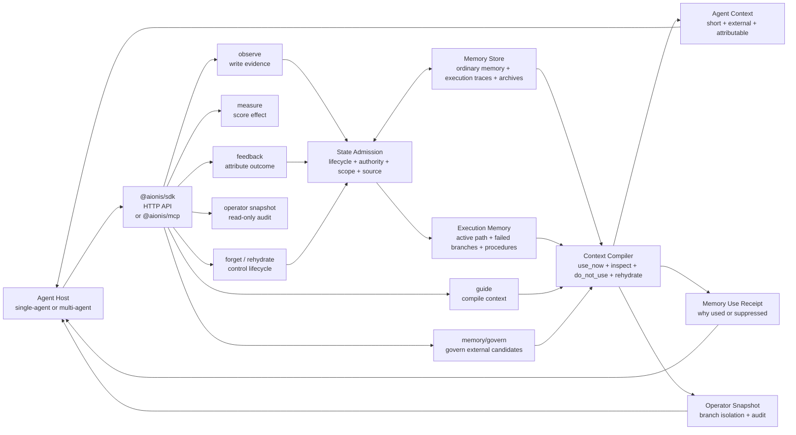

# Aionis

**Execution memory that keeps coding agents on route with far less context.**

Aionis is the state-adjudicated memory runtime that turns plans, decisions,
outcomes, failed attempts, and rehydrate pointers into compact Agent context
that survives sessions, roles, plans, and model boundaries.
Memory is not recall. Memory is state.

Docs: [docs.aionis.work](https://docs.aionis.work)

Current release: **v0.2.1 public beta**. Use it today as a local Runtime,
MCP bridge, TypeScript SDK, Memory Firewall, and managed-server-ready Runtime
for agent execution memory.

Aionis sits between your Agent and its history. It decides whether memory is
current, stale, contested, failed, reusable, or worth rehydrating, then compiles
the admitted execution state into the next Agent context. Failed branches still
matter: they become governed counter-evidence instead of future instructions.

Aionis ships with a local-first Lite Runtime plus SDK, MCP bridge, and Claude
Code lifecycle integration. The Runtime can also be configured for managed
server deployments with API-key/JWT auth and request controls when teams want
remote SDK or MCP clients.

For Claude Code, the strongest path is MCP plus lifecycle hooks: Aionis injects
governed execution context before each user prompt and records Bash/Edit/Write
evidence after tool use. MCP remains available for explicit tools such as
Flight Recorder and operator snapshots.

```bash
npx @aionis/create@latest
```

Docker users can run the Runtime directly:

```bash
docker run --rm \
  -p 127.0.0.1:3001:3001 \
  -v aionis-data:/data \
  ghcr.io/ostinatocc/aionis:v0.2.1
```

Then start the local Runtime from the generated checkout:

```bash
cd Aionis
npm run -s lite:start
```

For the recommended isolated Claude Code path, install Runtime into a side
directory. This uses `http://127.0.0.1:3101` and keeps it separate from any
Runtime you use for Aionis development:

```bash
npx @aionis/create@latest .aionis-runtime --with-claude-code
cd .aionis-runtime
npm run -s lite:start
```

Claude Code plugin path:

```text
/plugin marketplace add https://github.com/ostinatocc/Aionis
/plugin install aionis@aionis
/aionis:onboard
```

The plugin installs user-level Aionis MCP plus lifecycle hooks. It uses stable
workspace scopes without writing hook files into every project. After that, run
`claude` from any project:

```text
UserPromptSubmit -> Aionis guide -> injected execution context
PostToolUse / PostToolUseFailure -> Aionis observe
PostCompact / SessionEnd -> Aionis handoff
```

CLI fallback if you do not want to use Claude Code plugins:

```bash
npx @aionis/claude-code@latest onboard --base-url http://127.0.0.1:3101
```

MCP-only setup is still available for hosts that do not support hooks:

```bash
claude mcp add --transport stdio --scope project aionis -- \
  npx -y @aionis/mcp@latest \
  --base-url http://127.0.0.1:3001 \
  --scope-from workspace
```

Generic MCP clients can run the bridge directly:

```bash
npx @aionis/mcp@latest --base-url http://127.0.0.1:3001 --scope-from workspace
```

The default install runs the no-key first-value demo: raw retrieved history is
turned into governed execution context. Aionis admits the current route, keeps
unsafe or stale history out of direct use, leaves archived evidence
pointer-only, and prints a memory-use receipt.

For Claude Code or Cursor, the first useful loop is:

```text
Claude Code hooks -> Aionis context -> Agent action -> Aionis observe/handoff
```

Start with hooks for Claude Code. Use MCP-only when you want a manual tool
trial or when the host does not support lifecycle hooks. Add feedback, measure,
and snapshot once the host loop is ready.

Already using Mem0, Zep, Supermemory, Pinecone, pgvector, Chroma, Weaviate,
LangGraph Store, markdown memory, logs, or a custom vector store? Keep it for
retrieval. Put Aionis in front of the Agent as the Memory Firewall:

```text
external memory search -> Aionis governMemory / governMem0SearchResults -> safe Agent context
```

In a backend-agnostic local demo, raw retrieval direct-uses failed, stale, and
unknown memory; Aionis keeps the current route in `use_now`, moves failed/stale
memory to `do_not_use`, leaves unknown memory `inspect_before_use`, and keeps
archived evidence pointer-only under `rehydrate`. For Mem0 specifically, a
12-scenario local A/B showed Mem0 retrieved the current route in every case but
also retrieved unsafe memories in 10 cases; Aionis preserved 100% current-route
recall while reducing wrong direct-use from 83.3% to 0%.

External proof paths:

- Claude Code lifecycle hooks:
  [docs/AIONIS_CLAUDE_CODE_INTEGRATION.md](docs/AIONIS_CLAUDE_CODE_INTEGRATION.md)
- Claude Code / Cursor over MCP:
  [docs.aionis.work/integrations/mcp](https://docs.aionis.work/integrations/mcp)
- 3-5 minute Claude Code demo pack:
  [docs/AIONIS_CLAUDE_CODE_MCP_DEMO_PACK.md](docs/AIONIS_CLAUDE_CODE_MCP_DEMO_PACK.md)
- Memory Firewall for existing backends:
  [docs.aionis.work/products/memory-firewall](https://docs.aionis.work/products/memory-firewall)
- Runnable examples and generated proof artifacts:
  [docs.aionis.work/examples](https://docs.aionis.work/examples)

Use Aionis when your Agents must continue real work across sessions, roles,
handoffs, and mistakes.

## Why Teams Use Aionis

Most memory systems retrieve text. Aionis governs state.

| You need | Aionis gives you |
|---|---|
| Shorter context without losing the task | Execution history is compressed into current state, reusable procedures, and rehydrate pointers. |
| Execution continuity across sessions | The next Agent receives the accepted route and action boundary without replaying full history. |
| Safer memory than raw RAG | Memories are gated into `use_now`, `inspect_before_use`, `do_not_use`, or `rehydrate`. |
| Failed-branch governance | Failed branches remain available as counter-evidence instead of future instructions. |
| Admission for any memory backend | Mem0, Zep, Supermemory, Pinecone, pgvector, Chroma, Weaviate, LangGraph Store, markdown, logs, or custom memory candidates can be routed through Aionis before prompt use. |
| Memory Firewall for retrieval systems | Use your memory backend for recall, then prevent failed, stale, contested, unknown, or rehydrate-required memories from becoming Agent instructions. |
| Plans that survive model and session boundaries | Strong planners can create plans; Aionis keeps their decisions, checks, failed branches, and boundaries executable for later workers. |
| Multi-agent execution continuity | Planner, worker, verifier, and reviewer share branch-aware execution memory. |
| Memory that can be controlled | Stale or harmful memory can be suppressed, archived, restored, or rehydrated. |
| Operator confidence | Every guide can produce memory use receipts, decision traces, and read-only snapshots. |

## Architecture Overview

Aionis turns raw history into compact, governed Agent context.



The default product loop is:

```text
observe -> guide -> agent action -> feedback -> measure -> snapshot
```

Full architecture guide:
[docs/AIONIS_RUNTIME_ARCHITECTURE.md](docs/AIONIS_RUNTIME_ARCHITECTURE.md).

Recall Engine roadmap:
[docs/AIONIS_RECALL_ENGINE_ROADMAP.md](docs/AIONIS_RECALL_ENGINE_ROADMAP.md).
Aionis is improving candidate retrieval underneath the product surface while
state admission remains the final control plane for Agent-facing context.

Recall Engine runbook:
[docs/AIONIS_RECALL_ENGINE_RUNBOOK.md](docs/AIONIS_RECALL_ENGINE_RUNBOOK.md).
Use it to diagnose whether a missing or surprising memory outcome came from
candidate retrieval, admission, rehydration, host prompt integration, or Agent
compliance.

## Aionis vs Recall Memory

| Approach | Default behavior | Aionis behavior |
|---|---|---|
| Long context | Pass everything to the model. | Compile only external memory state into Agent context. |
| Vector recall / RAG | Retrieve related text. | Decide whether memory is current, stale, contested, failed, or rehydratable before use. |
| Recall memory | Return relevant memories. | Split memory into `use_now`, `inspect_before_use`, `do_not_use`, and `rehydrate`. |
| Workflow memory | Store successful procedures. | Preserve passed paths and failed branches so mistakes become counter-evidence. |

Full positioning guide:
[docs/AIONIS_PRODUCT_POSITIONING.md](docs/AIONIS_PRODUCT_POSITIONING.md).

## Govern Any Memory Backend

Aionis can sit in front of existing memory systems. Pass candidates from Mem0,
Zep, a vector DB, markdown, logs, or your own store to `POST /v1/memory/govern`,
SDK `governMemory()`, or the Mem0 drop-in helper
`governMem0SearchResults()`. Aionis returns the same four admission surfaces it
uses for native memory:

```text
use_now | inspect_before_use | do_not_use | rehydrate
```

This lets teams keep their current storage while adding a memory firewall layer:
failed, stale, contested, suppressed, blocked, or rehydrate-required candidates
are routed away from direct Agent instructions and kept available as audit or
rehydration evidence.

For any backend, use `governMemory()` with external candidates. For Mem0 users,
the drop-in helper is:

```ts
const mem0Results = await mem0.search("continue the task", { user_id, top_k: 10 });
const governed = await aionis.governMem0SearchResults({
  query_text: "Continue on the verified route and inspect risky history first.",
  mem0_results: mem0Results,
});

await agent.run(governed.agent_context.prompt_text);
```

API details:
[docs/AIONIS_PRODUCT_API_USAGE.md](docs/AIONIS_PRODUCT_API_USAGE.md#post-v1memorygovern).

Security/product packaging:
[docs/AIONIS_MEMORY_FIREWALL.md](docs/AIONIS_MEMORY_FIREWALL.md).

Mem0 A/B evidence:
[docs/AIONIS_MEM0_FIREWALL_AB_REPORT.md](docs/AIONIS_MEM0_FIREWALL_AB_REPORT.md).

Launch copy:
[docs/AIONIS_MEM0_FIREWALL_LAUNCH_POST.md](docs/AIONIS_MEM0_FIREWALL_LAUNCH_POST.md).

## Replay Agent Decisions

Aionis also exposes an Agent Flight Recorder. After a run, call
`POST /v1/audit/flight-recorder` or SDK `flightRecorder()` to reconstruct which
memories entered direct use, which were blocked, which required rehydration, and
how feedback was attributed.

It answers the operator question every production Agent system needs: what did
the Agent know when it made that decision?

Guide:
[docs/AIONIS_AGENT_FLIGHT_RECORDER.md](docs/AIONIS_AGENT_FLIGHT_RECORDER.md).

## Loop Engineering Profile

Aionis can sit beside a loop-engineered Agent without becoming the loop runner.
The host owns plan, action, tools, validation, and retry. Aionis owns the memory
governance around that loop: observed iteration evidence, next-iteration guide,
feedback attribution, effect measurement, operator snapshot, and Flight Recorder
replay.

Run the loop profile:

```bash
npm run -s runtime:e2e:loop-engineering-profile
```

## Plan As Memory Asset

Aionis preserves the decisions made by strong planners and makes them usable by
future workers, reviewers, and cheaper models.

Plans become governed execution memory when they carry:

- resolved decisions
- acceptance checks
- failed branches
- active targets
- execution boundaries
- evidence and feedback attribution

In practice, the planner can be Claude Code, GPT, a human reviewer, or another
Agent. Aionis records the plan as evidence, compiles only the governed state
into the worker context, and lets Flight Recorder show what the worker could see
when it acted.

Run the plan asset profile:

```bash
npm run -s runtime:e2e:plan-as-memory-asset
```

Guide:
[docs/AIONIS_LOOP_ENGINEERING.md](docs/AIONIS_LOOP_ENGINEERING.md).

## Quickstart

Install the Runtime, SDK, and MCP bridge with one command:

```bash
npx @aionis/create@latest
```

This clones the Runtime, installs dependencies, writes `.env`, builds the
workspace packages, and runs the no-key first-value demo.

For full SDK integration with recall-backed guide output:

```bash
OPENAI_API_KEY="your-key" npx @aionis/create@latest --provider openai --quickstart sdk
```

For local development from this repo, install dependencies, then run the
first-value demo without an embedding key:

```bash
npm install

npm run -s runtime:demo:first-value
```

Then configure an embedding provider and run the SDK quickstart:

```bash
export EMBEDDING_PROVIDER="openai"
export OPENAI_API_KEY="your-openai-key"

npm run -s runtime:quickstart:sdk
```

MiniMax is also supported when you prefer it:

```bash
export EMBEDDING_PROVIDER="minimax"
export MINIMAX_API_KEY="your-minimax-key"
npm run -s runtime:quickstart:sdk
```

The SDK quickstart runs a real local Runtime and verifies:

1. a fresh guide starts without actionable history
2. ordinary preference and project memory become reusable context
3. the SDK compiles external execution memory into a contract-style Agent prompt
4. feedback is attributed to the exact memory IDs exposed by the guide
5. `measure` reports whether history changed future context
6. admission dataset JSONL export is produced without prompt payload
7. operator audit surfaces remain read-only

For the dataset export path specifically, see
[docs/AIONIS_ADMISSION_DATASET_EXPORT_QUICKSTART.md](docs/AIONIS_ADMISSION_DATASET_EXPORT_QUICKSTART.md).

For raw HTTP integration without the TypeScript SDK:

```bash
npm run -s runtime:quickstart:http
```

For multi-agent execution memory:

```bash
npm run -s runtime:quickstart:multi-agent
```

That loop writes planner, worker, verifier, and reviewer evidence, then proves
that the reviewer can continue the passed branch while avoiding the failed
branch.

For backend-agnostic Memory Firewall:

```bash
npm run -s runtime:quickstart:memory-firewall
```

That loop passes Mem0/Zep/vector/markdown-style candidates through
`/v1/memory/govern` and proves Aionis routes unsafe external memories away from
direct use.

For the Memory Firewall A/B demo:

```bash
npm run -s runtime:e2e:memory-firewall-ab
```

That loop compares raw retrieved memory against Aionis-governed memory using the
same Mem0/Zep/vector/log-style candidates. It shows unsafe direct-use,
current/procedure recall, and audit coverage side by side. See
[docs/AIONIS_MEMORY_FIREWALL_AB_DEMO.md](docs/AIONIS_MEMORY_FIREWALL_AB_DEMO.md).

For Agent Flight Recorder:

```bash
npm run -s runtime:quickstart:flight-recorder
```

That loop replays what memory the Agent could see at decision time without
including prompt text or mutating Runtime state.

For the Agent Flight Recorder incident demo:

```bash
npm run -s runtime:e2e:flight-recorder-incident
```

That loop replays a healthy run, a blocked-memory misuse incident, and a missing
feedback-attribution case. See
[docs/AIONIS_FLIGHT_RECORDER_INCIDENT_DEMO.md](docs/AIONIS_FLIGHT_RECORDER_INCIDENT_DEMO.md).

For Claude Code over MCP:

```bash
npm run -s runtime:quickstart:claude-code-mcp
```

That loop verifies the same MCP tool path Claude Code uses:
`aionis_health -> aionis_record_step -> aionis_context -> aionis_flight_recorder`.

Before publishing or after changing package entrypoints, run the external package
smoke:

```bash
npm run -s runtime:smoke:external-packages
```

That loop packs `@aionis/sdk`, `@aionis/mcp`, and `@aionis/create`, installs
them into a temporary external Node project, then verifies the SDK product loop,
the MCP stdio tool path, and the installer/MCP CLI entrypoints against a real
Runtime.

Not sure which entrypoint to use? See the
[quickstart matrix](docs/AIONIS_QUICKSTART_MATRIX.md).

## Example Output

The SDK quickstart prints a compact product result like this:

```json
{
  "contract_version": "aionis_sdk_quickstart_result_v1",
  "agent_context": {
    "before_actionable_history_used": false,
    "after_actionable_history_used": true,
    "use_now_memory_ids": ["mem_preference_example", "mem_project_fact_example"]
  },
  "execution_context_compiler": {
    "contract_version": "aionis_execution_agent_context_v1",
    "memory_use_receipt_visible": true
  },
  "memory_admission": {
    "feedback_attributed_memory_count": 1,
    "measure_history_impact": "positive"
  },
  "admission_dataset_export": {
    "row_count": 4,
    "positive_use_count": 1,
    "prompt_payload_excluded": true
  },
  "operator_audit": {
    "memory_use_receipt_visible": true,
    "memory_admission_record_visible": true,
    "snapshot_runtime_mutation": false
  }
}
```

Full example outputs:

1. [First-value demo result](docs/examples/first-value-demo-result.json)
2. [SDK quickstart result](docs/examples/sdk-quickstart-result.json)
3. [HTTP quickstart result](docs/examples/http-quickstart-result.json)
4. [Multi-agent quickstart result](docs/examples/multi-agent-quickstart-result.json)
5. [Golden product loop result](docs/examples/golden-product-loop-result.json)
6. [Judgment calibration product loop result](docs/examples/judgment-calibration-product-loop-result.json)
7. [Memory Firewall quickstart result](docs/examples/memory-firewall-quickstart-result.json)
8. [Memory Firewall A/B demo result](docs/examples/memory-firewall-ab-demo-result.json)
9. [Flight Recorder quickstart result](docs/examples/flight-recorder-quickstart-result.json)
10. [Flight Recorder incident demo result](docs/examples/flight-recorder-incident-demo-result.json)
11. [Loop Engineering profile result](docs/examples/loop-engineering-profile-result.json)
12. [Plan as Memory Asset result](docs/examples/plan-as-memory-asset-result.json)
13. [Claude Code MCP demo result](docs/examples/claude-code-mcp-demo-result.json)

## What The Agent Gets

Aionis compiles raw traces, decisions, and memory state into an Agent-facing
contract:

```text
AIONIS_CTX v2
state role=reviewer history=actionable
current use_now=continue verified checkout branch
avoid do_not_use=failed broad search branch
inspect contested=older route note requires verification
```

The structured context also carries memory IDs for attribution:

```ts
type AgentContext = {
  prompt_text: string;
  use_now: string[];
  inspect_before_use: string[];
  do_not_use: string[];
  rehydrate_hints: string[];
  use_now_memory_ids: string[];
  inspect_before_use_memory_ids: string[];
  do_not_use_memory_ids: string[];
  actionable_history_used: boolean;
};
```

Give the Agent `agent_context.prompt_text` or selected `agent_context` fields.
Keep packets, traces, receipts, raw slots, and operator snapshots for host logs
and observability.

## SDK Usage

```ts
import {
  compileExecutionAgentContext,
  createAionisClient,
  feedbackFromGuide,
} from "@aionis/sdk";

const aionis = createAionisClient({
  baseUrl: process.env.AIONIS_URL ?? "http://127.0.0.1:3001",
  apiKey: process.env.AIONIS_API_KEY,
  tenant_id: "default",
  scope: "checkout-agent",
});

await aionis.remember({
  kind: "preference",
  text: "Prefer concise product updates with concrete next steps.",
  memory_lane: "private",
  owner_agent_id: "agent-1",
});

const guide = await aionis.execution.guideForRole<{
  guide_trace_id: string;
  agent_context: {
    prompt_text: string;
    agent_context_mode: "standard" | "compact_agent";
    use_now_memory_ids: string[];
  };
}>({
  agent_id: "agent-1",
  run_id: "run-001",
  task_signature: "product-update",
  query_text: "Continue the product update.",
  limit: 8,
  include_packets: true,
  context_mode: "compact_agent",
});

const context = compileExecutionAgentContext({
  guide,
  task: {
    run_id: "run-001",
    task_signature: "product-update",
    query_text: "Continue the product update.",
  },
  budget_profile: "balanced",
});

// Your host runs the Agent with context.agent_prompt.

await aionis.feedback(feedbackFromGuide({
  guide,
  reason: "Agent used the exposed memory successfully.",
  run_id: "run-001",
  outcome: "positive",
  used_memory_ids: guide.agent_context.use_now_memory_ids.slice(0, 1),
}));
```

`feedbackFromGuide()` inherits the guide consumer identity when available, so
private Agent memory feedback is attributed to the same Agent that received the
guide. Your host still supplies only the memory IDs the Agent actually used.

Full SDK guide: [docs/AIONIS_SDK_QUICKSTART.md](docs/AIONIS_SDK_QUICKSTART.md).

For token-sensitive Agent calls, opt into compact prompt rendering:

```ts
const compactGuide = await aionis.execution.guideForRole({
  agent_id: "reviewer-1",
  team_id: "checkout-team",
  role: "reviewer",
  run_id: "run-001",
  task_signature: "checkout-migration",
  query_text: "Continue the verified branch with compact execution context.",
  context_mode: "compact_agent",
});

const compactContext = compileExecutionAgentContext({
  guide: compactGuide,
  budget_profile: "compact",
});
```

Compact mode shortens the Agent prompt while preserving external memory
buckets, memory IDs, feedback attribution, receipts, and operator audit surfaces.

## MCP For Claude Code And Cursor

`@aionis/mcp` is the drop-in path for coding agents. It exposes Aionis as MCP
tools without asking the host to implement the full feedback loop on day one.

Claude Code plugin setup:

```bash
npx @aionis/create@latest .aionis-runtime --with-claude-code
cd .aionis-runtime
npm run -s lite:start
```

```text
/plugin marketplace add https://github.com/ostinatocc/Aionis
/plugin install aionis@aionis
/aionis:doctor
```

This plugin path gives Claude Code both Aionis MCP tools and lifecycle hooks.
It defaults to `http://127.0.0.1:3101`. Use the raw MCP command below for
Cursor, Zcode, or MCP-only hosts.

Claude Code / MCP client setup:

```bash
claude mcp add --transport stdio --scope project aionis -- \
  npx -y @aionis/mcp@latest \
  --base-url http://127.0.0.1:3001 \
  --scope-from workspace \
  --workspace-id-store user
```

```json
{
  "mcpServers": {
    "aionis": {
      "command": "npx",
      "args": [
        "-y",
        "@aionis/mcp@latest",
        "--base-url",
        "http://127.0.0.1:3001",
        "--scope-from",
        "workspace",
        "--workspace-id-store",
        "user"
      ],
      "env": {
        "AIONIS_TENANT_ID": "default"
      }
    }
  }
}
```

The main tool is `aionis_context`: it compiles external execution state for the
current run and can optionally record a lightweight observation first. Feedback
is optional; teams can start with context-only use and later add
`aionis_record_step`, `aionis_measure`, and `aionis_snapshot`.
Set `context_mode: "compact_agent"` on `aionis_context` when the Agent needs a
shorter prompt while the host keeps structured IDs and audit fields.

Claude Code walkthrough:
[docs/AIONIS_CLAUDE_CODE_DEMO.md](docs/AIONIS_CLAUDE_CODE_DEMO.md).

3-5 minute demo pack:
[docs/AIONIS_CLAUDE_CODE_MCP_DEMO_PACK.md](docs/AIONIS_CLAUDE_CODE_MCP_DEMO_PACK.md).

Example Claude Code result:
[docs/examples/claude-code-mcp-demo-result.json](docs/examples/claude-code-mcp-demo-result.json).

Real Claude Code transcript:
[docs/examples/claude-code-real-demo-transcript.md](docs/examples/claude-code-real-demo-transcript.md).

Full MCP guide:
[docs/AIONIS_MCP.md](docs/AIONIS_MCP.md).

## Use Aionis In Your Agent

For long-running or multi-agent work, use the execution helpers instead of
hand-writing execution memory payloads:

```ts
import { compileExecutionAgentContext, createAionisClient } from "@aionis/sdk";

const aionis = createAionisClient({
  baseUrl: process.env.AIONIS_URL ?? "http://127.0.0.1:3001",
  scope: "checkout-agent",
});

await aionis.execution.observeStep({
  agent_id: "worker-1",
  run_id: "run-001",
  task_signature: "checkout-migration",
  title: "Implement checkout adapter",
  summary: "Worker implemented the adapter and needs review.",
  outcome: "succeeded",
  target_files: ["src/checkout.ts"],
});

const guide = await aionis.execution.guideForRole({
  agent_id: "reviewer-1",
  team_id: "checkout-team",
  role: "reviewer",
  run_id: "run-001",
  task_signature: "checkout-migration",
  query_text: "Continue from the current verified execution path.",
  context_mode: "compact_agent",
});

const context = compileExecutionAgentContext({
  guide,
  task: {
    run_id: "run-001",
    task_signature: "checkout-migration",
    query_text: "Continue from the current verified execution path.",
  },
  repo_state: {
    existing_files: ["src/checkout.ts"],
  },
  budget_profile: "balanced",
});

// Your host runs the Agent with context.agent_prompt.
```

Full minimal Agent example:
[docs/examples/minimal-agent.ts](docs/examples/minimal-agent.ts).

## Multi-Agent Execution Memory

Execution memory is Aionis's flagship surface.

It is designed for systems where multiple agents need to continue one body of
work without losing branch state:

```text
Planner creates the scoped plan.
Worker tries a branch.
Verifier marks the branch passed or failed.
Reviewer receives compact context and continues the active path.
```

Aionis keeps the useful execution state alive:

1. passed solutions can be reused
2. failed branches stay visible as counter-evidence
3. active path is separated from stale or contested memory
4. handoff state can survive across Agents, sessions, and runs
5. operator snapshots explain what was used, blocked, and measured

Run it:

```bash
npm run -s runtime:quickstart:multi-agent
```

Host integration guide:
[docs/AIONIS_HOST_INTEGRATION.md](docs/AIONIS_HOST_INTEGRATION.md).

## Core Concepts

| Concept | Meaning |
|---|---|
| Ordinary Memory | Preferences, facts, project context, and notes that can guide future work. |
| Execution Memory | Branch-aware memory of actions, outcomes, verifier evidence, handoffs, and reusable workflows. |
| Agent Context | The compact prompt contract given to the Agent. |
| Memory Lifecycle | The external state of memory: active, candidate, contested, suppressed, demoted, archived, or rehydrated. |
| Memory Use Receipt | A read-only record of which memories were used, inspected, blocked, or requested for rehydration. |
| Feedback Attribution | Feedback is applied only to memory IDs actually exposed by a guide and reported as used. |
| Operator Snapshot | Read-only observability for branch isolation, memory use, measured effect, and trace-to-procedure readiness. |

## When To Use Aionis

Aionis is strongest when agents are expected to keep working across time:

1. long-running coding agents
2. multi-agent planner/worker/verifier/reviewer systems
3. support or operations agents that must remember outcomes
4. workflow agents that should avoid repeated discovery
5. products that need auditable memory use
6. systems where stale or failed context is dangerous

If you only need a one-shot chat or a simple vector search over documents,
Aionis is probably more Runtime than you need.

## Product Surface

Aionis exposes a focused product loop:

```text
observe -> guide -> agent action -> feedback -> measure -> snapshot
```

| Step | What happens |
|---|---|
| `observe` | Write real memory, execution evidence, outcomes, or handoff state. |
| `guide` | Compile external memory into Agent-facing context. |
| `agent action` | Your host runs the Agent with only the compiled context. |
| `feedback` | Attribute the outcome to the memories actually used. |
| `forget` | Explicitly suppress, unsuppress, archive, or restore memory lifecycle state. |
| `measure` | Check whether history helped, hurt, or lacked enough evidence. |
| `snapshot` | Inspect memory use, branch isolation, and effect without mutating Runtime state. |

HTTP entrypoints: `/v1/observe`, `/v1/guide`, `/v1/feedback`,
`/v1/forget`, `/v1/measure`, `/v1/rehydrate`, and `/v1/operator/snapshot`.
Controlled forgetting is a core Aionis capability. `/v1/forget` is the explicit
lifecycle-control API; `/v1/feedback` and `/v1/rehydrate` are productized
forgetting/lifecycle paths for common host loops.

API usage guide:
[docs/AIONIS_PRODUCT_API_USAGE.md](docs/AIONIS_PRODUCT_API_USAGE.md).
Install guide:
[docs/AIONIS_INSTALL.md](docs/AIONIS_INSTALL.md).
Release and Docker artifacts:
[docs/AIONIS_RELEASES.md](docs/AIONIS_RELEASES.md).
HTTP quickstart:
[docs/AIONIS_HTTP_QUICKSTART.md](docs/AIONIS_HTTP_QUICKSTART.md).

Output contracts:
[docs/AIONIS_PRODUCT_OUTPUT_CONTRACT.md](docs/AIONIS_PRODUCT_OUTPUT_CONTRACT.md).

## Documentation

Official docs: [https://docs.aionis.work](https://docs.aionis.work)

| Document | Purpose |
|---|---|
| [AIONIS_FIRST_VALUE_DEMO.md](docs/AIONIS_FIRST_VALUE_DEMO.md) | No-key first run that shows unsafe retrieved memory blocked before prompt use. |
| [AIONIS_INSTALL.md](docs/AIONIS_INSTALL.md) | One-command install path for Runtime plus SDK and MCP packages. |
| [AIONIS_RELEASES.md](docs/AIONIS_RELEASES.md) | GitHub release, Docker image, npm package, SDK, and MCP artifact map. |
| [AIONIS_MCP.md](docs/AIONIS_MCP.md) | MCP bridge for Claude Code, Cursor, and other coding-agent clients. |
| [AIONIS_CLAUDE_CODE_MCP_DEMO_PACK.md](docs/AIONIS_CLAUDE_CODE_MCP_DEMO_PACK.md) | 3-5 minute Claude Code + Aionis MCP demo script and proof checklist. |
| [AIONIS_LOOP_ENGINEERING.md](docs/AIONIS_LOOP_ENGINEERING.md) | Memory governance profile for loop-engineered Agents. |
| [AIONIS_OPENROUTER_FUSION.md](docs/AIONIS_OPENROUTER_FUSION.md) | Boundary for optional multi-model plan review without turning Aionis into a model router. |
| [AIONIS_RUNTIME_ARCHITECTURE.md](docs/AIONIS_RUNTIME_ARCHITECTURE.md) | Product architecture, memory layers, execution memory, context compiler, and source map. |
| [AIONIS_HTTP_QUICKSTART.md](docs/AIONIS_HTTP_QUICKSTART.md) | Smallest curl-first product loop. |
| [AIONIS_QUICKSTART_MATRIX.md](docs/AIONIS_QUICKSTART_MATRIX.md) | Which first-run command to use for SDK, HTTP, and multi-agent hosts. |
| [AIONIS_CONTROLLED_FORGETTING_QUICKSTART.md](docs/AIONIS_CONTROLLED_FORGETTING_QUICKSTART.md) | Controlled forgetting with suppress, unsuppress, and measure. |
| [AIONIS_SDK_QUICKSTART.md](docs/AIONIS_SDK_QUICKSTART.md) | Smallest SDK product loop. |
| [AIONIS_OBSERVE_GUIDE_AUDIT_QUICKSTART.md](docs/AIONIS_OBSERVE_GUIDE_AUDIT_QUICKSTART.md) | Short observe, guide, and audit path. |
| [AIONIS_HOST_INTEGRATION.md](docs/AIONIS_HOST_INTEGRATION.md) | Single-agent, multi-agent, and coding-agent host integration. |
| [AIONIS_PRODUCT_CONTRACT.md](docs/AIONIS_PRODUCT_CONTRACT.md) | Product contract, state surfaces, and host loop. |
| [AIONIS_PRODUCT_POSITIONING.md](docs/AIONIS_PRODUCT_POSITIONING.md) | External product positioning, claims, and comparison language. |
| [AIONIS_STATE_MODEL.md](docs/AIONIS_STATE_MODEL.md) | Implemented memory and execution state model. |
| [AIONIS_CONTEXT_COMPRESSION_BASELINE.md](docs/AIONIS_CONTEXT_COMPRESSION_BASELINE.md) | Current state-preserving context compression baseline. |
| [Admission Dataset Batch Baseline](docs/research/2026-06-18-admission-dataset-batch-baseline.md) | First 105-row real Runtime admission dataset and offline policy comparison baseline. |
| [External Agent E2E Five-Arm Full Run](docs/research/2026-06-19-external-agent-e2e-five-arm-full.md) | 40-record, five-arm external-agent evidence for route-safe context compression. |

## Development

Local verification:

```bash
npm install
npm run -s typecheck
npm run -s lite:test
```

Product proof loops:

```bash
npm run -s runtime:quickstart:sdk
npm run -s runtime:quickstart:http
npm run -s runtime:quickstart:multi-agent
npm run -s runtime:e2e:golden-product-loop
npm run -s runtime:e2e:judgment-calibration
```

The judgment calibration loop verifies that supported memory, unused recalled
memory, and operator audit output stay separated without mutating Runtime state
or leaking raw audit fields into the Agent prompt.

The current package is the focused local Runtime. It keeps Runtime kernel,
routes, Lite store contracts, SDK quickstarts, and product e2es in one repo.
Internal architecture notes live in:

1. [docs/FOCUS.md](docs/FOCUS.md)
2. [docs/ARCHITECTURE_BOUNDARY.md](docs/ARCHITECTURE_BOUNDARY.md)
3. [docs/AIONIS_CAPABILITY_DECISION_MATRIX.md](docs/AIONIS_CAPABILITY_DECISION_MATRIX.md)

Deployment notes: Lite is optimized for local developer machines and same-host
Agent clients. Managed Server settings add API-key/JWT auth and request
controls for remote SDK/MCP clients.

## License

Apache-2.0.
