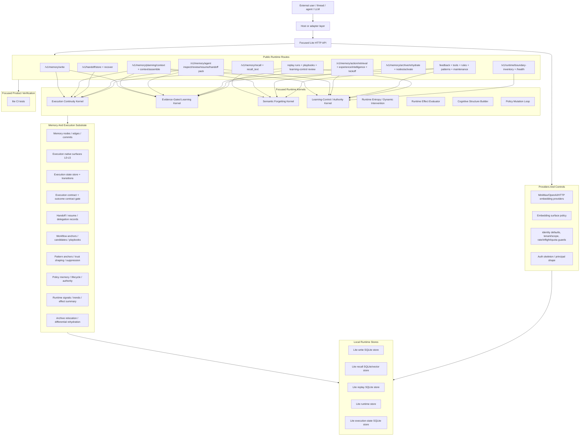

# Aionis Function And Architecture Inventory

Status: implementation inventory from current focused Runtime code

This document inventories implemented AionisRuntime-focused capabilities from source code, route registrations, schemas, stores, product demos, and CI tests. It is not a new architecture proposal and must not be used to add task-specific rules.

## Product Question

Aionis currently contains more capability than its product narrative exposes. The next product decision should be made after separating:

1. user-facing product capabilities
2. internal Runtime mechanisms
3. operator/review/debug surfaces
4. validation-only eval harnesses
5. surfaces that should be deleted or demoted

## Complete Architecture Map

## Capability Inventory

| # | Capability | What It Does In Code | Main Implementation | Current Status | Product Decision |
|---|---|---|---|---|---|
| 1 | Local Lite Runtime daemon | Starts focused local Runtime over Fastify, loopback defaults, SQLite paths, route matrix in health. | `src/index.ts`, `src/runtime-entry.ts`, `src/server/bootstrap.ts`, `src/server/http-server.ts`, `scripts/start-lite.sh` | Implemented. Local developer product, not packaged. | Keep. Needs clean release entry and package boundary. |
| 2 | Tenant/scope isolation | Normalizes `tenant_id`, `scope`, and tenant-derived scope keys. | `src/memory/tenant.ts`, `src/app/request-guards.ts` | Implemented for Lite defaults. | Keep. Product-critical for cross-thread/agent memory. |
| 3 | Agent identity and memory lane | Supports `producer_agent_id`, `owner_agent_id`, `owner_team_id`, `consumer_agent_id`, `consumer_team_id`, `private/shared`. | `src/app/request-guards.ts`, `src/store/lite-write-store.ts`, `src/store/lite-recall-store.ts` | Implemented structurally; default principal is local actor. | Keep. Must become explicit cross-agent feature. |
| 4 | Cross-thread / cross-run handoff | Stores resumable execution handoff and recovers execution-ready next action, target files, acceptance checks. | `src/routes/handoff.ts`, `src/memory/handoff.ts`, `src/execution/*` | Implemented and tested. | Promote to core product headline. |
| 5 | Cross-agent resume/review/handoff packs | Builds agent-facing inspect, review, resume, and handoff packs from continuity + evolution state. | `src/routes/memory-access.ts`, `src/memory/agent-memory-inspect-core.ts` | Implemented; buried in routes. | Promote as product capability. |
| 6 | Cross-LLM continuity substrate | Runtime packets are structured JSON, not model-specific chat history; provider/model is not required for replaying state. | `src/memory/experience-intelligence.ts`, `src/app/planning-summary.ts`, `src/memory/execution-contract.ts` | Architecture-supported, not sufficiently validated. | Keep, but mark as unproven until cross-provider eval. |
| 7 | Execution state transitions | Persists revisioned execution state and idempotent transitions. | `src/execution/state-store.ts`, `src/execution/transitions.ts`, `src/execution/types.ts` | Implemented. | Keep. Important for true continuity. |
| 8 | Execution packet assembly | Builds compact execution packets with active role, stage, constraints, evidence, artifacts. | `src/execution/assemble.ts`, `src/execution/packet.ts`, `src/execution/profiles.ts` | Implemented. | Keep. Should feed external product packet. |
| 9 | Memory write and projection | Writes nodes, edges, commits, workflow projections, execution-native surfaces, idempotency. | `src/routes/memory-write.ts`, `src/memory/write*.ts`, `src/memory/lite-projected-write-commit.ts` | Implemented. | Keep as internal foundation. |
| 10 | Recall with lifecycle/trust | Retrieves scoped memory while filtering by lane, tier, lifecycle, and recall policy. | `src/routes/memory-recall.ts`, `src/memory/recall.ts`, `src/app/recall-policy.ts`, `src/store/lite-recall-store.ts` | Implemented. | Keep. Product should expose simpler guide API. |
| 11 | Planning/context assembly | Builds `planning_summary`, `assembly_summary`, and compact `runtime_context_packet`. | `src/routes/memory-context-runtime.ts`, `src/app/planning-summary*.ts` | Implemented. | Keep. This is current main agent-facing packet. |
| 12 | History-shaped future behavior | Shows whether history changed next run: first action, workflow reuse, learning-control, forgetting impact. | `src/app/planning-summary.ts`, `src/memory/experience-intelligence.ts`, `src/memory/product-output-assembler.ts` | Implemented in Runtime packets and product output assembly. | Core differentiator. Needs focused validation outside product tree. |
| 13 | Action retrieval | Ranks workflows, patterns, continuity carriers, policies; emits recommended tool/path/next action with uncertainty. | `src/memory/action-retrieval.ts` | Implemented. | Keep but avoid making it a semantic repair engine. |
| 14 | Experience intelligence | Combines action retrieval, tool selection, introspection, delegation learning, policy materialization into recommendation. | `src/memory/experience-intelligence.ts` | Implemented. | Keep as internal intelligence layer; expose as `guide`. |
| 15 | Kickoff recommendation | Converts experience intelligence into first-action recommendation with edit-boundary and verifier hints. | `src/memory/experience-intelligence.ts`, `src/app/planning-summary.ts` | Implemented. | Keep. Needs positive-transfer intensity control. |
| 16 | Execution contract and outcome gate | Represents selected tool, file/path, workflow steps, target files, acceptance checks, trust, provenance. | `src/memory/execution-contract.ts`, `src/memory/contract-trust.ts` | Implemented. | Keep. This is key to avoid vague memory. |
| 17 | Trajectory compile | Compiles step traces into continuity/evidence/promotion seed surfaces. | `src/memory/trajectory-compile.ts`, `src/memory/trajectory-compile-runtime.ts` | Implemented and route-backed. | Keep as internal observe/learn input. |
| 18 | Delegation records | Writes, finds, aggregates delegation records for cross-agent collaboration learning. | `src/memory/delegation-records.ts`, `src/memory/delegation-records-find.ts`, `src/memory/delegation-learning.ts` | Implemented; product value underexposed. | Keep and reposition under cross-agent continuity. |
| 19 | Evidence-gated workflow learning | Promotes workflow candidates only through evidence gates and promotion protocol. | `src/kernel/learning-kernel.ts`, `src/memory/learning-loop.ts`, `src/kernel/learning-promotion-kernel.ts`, `src/memory/promotion-evidence-ledger.ts` | Implemented. | Keep. Core self-learning. |
| 20 | Promotion evidence protocol | Separates local reuse from wider generalization; tracks leakage/holdout/interference/growth gates. | `src/memory/promotion-evidence-ledger.ts`, `src/memory/promotion-quality-summary.ts`, `src/memory/schemas.ts` | Implemented. | Keep. Prevents single-task pollution. |
| 21 | Pattern trust and suppression | Handles candidate/trusted/contested patterns and suppress/unsuppress lifecycle. | `src/memory/pattern-trust-shaping.ts`, `src/memory/pattern-operator-override.ts`, `src/memory/lifecycle-signals.ts` | Implemented. | Keep as controlled learning/forgetting. |
| 22 | Policy memory materialization | Builds derived policy surfaces, policy contracts, persisted policy memory, lifecycle states. | `src/memory/policy-memory.ts`, `src/memory/policy-materialization-surface.ts` | Implemented. | Keep, but avoid product overclaim until effect proven. |
| 23 | Policy mutation loop | Represents policy mutation candidates, evidence, authority effects, adjudication. | `src/kernel/policy-mutation-loop.ts` | Implemented as structured mechanism. | Keep internal. Not user-facing yet. |
| 24 | Learning-control providers | Supports deterministic/evidence/model/http providers for semantic review. | `src/memory/learning-control-provider*.ts`, `src/app/learning-control-runtime-providers.ts` | Implemented. | Keep, but make provider use advisory/candidate only. |
| 25 | Authority visibility and consumption | Demotes untrusted authority, reports blocked authority, requires inspection. | `src/memory/authority-*.ts`, `src/kernel/boundary.ts` | Implemented. | Keep. Product value: learned memory cannot silently take over. |
| 26 | Rule feedback/evaluation | Records/evaluates scoped rule state from feedback. | `src/memory/rules*.ts`, `src/memory/rule-policy.ts`, `src/routes/memory-feedback-tools.ts` | Implemented. | Review. May be too rule-like for product API; keep internal if useful. |
| 27 | Tool selection memory | Selects tools from learned memory, stores decisions/runs/feedback. | `src/memory/tools-*.ts`, `src/memory/tool-*.ts` | Implemented. | Keep if framed as tool preference learning, not hard routing. |
| 28 | Replay run lifecycle | Records replay run start, step before/after, run end, results. | `src/memory/replay*.ts`, `src/routes/memory-replay-core.ts` | Implemented. | Keep internal as evidence generator. |
| 29 | Replay playbooks | Compile, inspect, candidate, promote, repair, run, dispatch playbooks through learning control. | `src/memory/replay*.ts`, `src/routes/memory-replay-core.ts`, `src/routes/memory-replay-learning-control.ts` | Implemented. | Keep but product wording should be "workflow reuse", not repair engine. |
| 30 | Controlled semantic forgetting | Scores retain/demote/archive/review from salience, importance, confidence, feedback, lifecycle. | `src/kernel/forgetting-kernel.ts`, `src/memory/semantic-forgetting.ts` | Implemented. | Core product. |
| 31 | Archive relocation | Moves low/retired memory to cold archive and preserves payload refs. | `src/kernel/forgetting-kernel.ts`, `src/memory/archive-relocation.ts` | Implemented. | Keep. Key difference from blind deletion. |
| 32 | Rehydration | Rehydrates archived nodes/anchor payloads on demand with commits and lifecycle metadata. | `src/memory/lifecycle-lite.ts`, `src/memory/rehydrate-anchor.ts`, `src/memory/differential-rehydration.ts` | Implemented. | Core product, but needs better demo. |
| 33 | Node activation feedback | Records memory use and keeps useful memory warm. | `src/memory/lifecycle-lite.ts`, `src/memory/node-feedback-state.ts` | Implemented. | Keep. Necessary for positive transfer. |
| 34 | Runtime maintenance | Runs immediate/daily/long-horizon maintenance over learning, forgetting, authority, signal trends. | `src/memory/runtime-maintenance.ts`, `src/kernel/learning-kernel.ts` | Implemented. | Keep internal; expose simple `maintain` later if needed. |
| 35 | Runtime signal ledger/trends | Aggregates verifier/provider/retry/recovery/token/learning signals and posture recommendations. | `src/memory/runtime-signal-ledger.ts`, `src/memory/runtime-signal-trends.ts` | Implemented. | Keep. Important for dynamic governance. |
| 36 | Runtime effect summary | Measures continuity, verification, learning, forgetting, token context, maintenance effects. | `src/memory/runtime-effect-summary.ts`, `src/kernel/effect-evaluator.ts` | Implemented. | Keep. Product needs human-readable effect report. |
| 37 | Runtime entropy profile | Dynamically balances exploration/control, recall breadth, verification depth, promotion threshold, mutation authority. | `src/memory/runtime-entropy-profile.ts`, `src/memory/runtime-entropy-controls.ts` | Implemented. | Keep, but it should control intensity, not become hard task rules. |
| 38 | Adaptive guidance | Produces decomposed guidance candidates, authority, attribution, uncertainty adjustment. | `src/memory/adaptive-guidance.ts`, `src/memory/schemas.ts` | Implemented. | Keep as candidate producer; avoid hard constraints. |
| 39 | Cognitive structure | Builds evidence graph, workflow memory, policy memory, forgetting state, authority state. | `src/kernel/cognitive-structure.ts`, `src/memory/execution-introspection.ts` | Implemented. | Keep as introspection/reporting layer. |
| 40 | Runtime boundary inventory | Reports Lite product boundary and route-to-capability matrix. | `src/server/lite-runtime-boundary.ts`, `src/routes/runtime-boundary-inventory.ts` | Implemented. | Keep, but rename/simplify if product API changes. |
| 41 | Embedding providers and surface policy | Supports MiniMax/OpenAI/HTTP embeddings and prevents embeddings on forbidden surfaces. | `src/embeddings/*`, `src/embeddings/surface-policy.ts` | Implemented. | Keep. Product needs clean env docs. |
| 42 | Local SQLite stores | Write, recall, replay, runtime, execution-state local stores. | `src/store/*` | Implemented. | Keep. This is local-first product base. |
| 43 | Request guards | Rate limits, inflight gates, quota hooks, identity defaults. | `src/app/request-guards.ts`, `src/util/inflight_gate.ts`, `src/util/ratelimit.ts` | Implemented in Lite posture. | Keep; auth/quota not product-strong yet. |
| 44 | Sandbox executor internals | Internal sandbox support remains for replay execution/backends, but public sandbox routes were removed. | `src/memory/sandbox*.ts`, `src/app/sandbox-budget.ts`, store access | Internal replay dependency. | Keep internal; not a product surface. |
| 49 | CI contract tests | Broad Lite tests cover startup, kernel boundary, learning, forgetting, replay, entropy, effect, source scope. | `scripts/ci/*` | Strong for mechanisms. | Keep; add product smoke once API is simplified. |
| 50 | L0-L5 execution memory levels | Represents raw/distilled/workflow/pattern/policy/cognitive layers through schemas, write projection, policy memory, and cognitive structure. | `src/memory/schemas.ts`, `src/memory/write-execution-native.ts`, `src/memory/workflow-write-projection.ts`, `src/memory/policy-memory.ts`, `src/kernel/cognitive-structure.ts` | Implemented as schema/runtime surfaces. | Keep. This is the product's memory spine. |
| 51 | Runtime verification surface | Converts execution packets into verifier requests/results/evidence and aggregates command evidence. | `src/execution/verification.ts` | Implemented. Mostly internal. | Keep internal. It should measure and constrain evidence, not solve tasks itself. |
| 52 | Execution evidence and provenance | Captures where execution facts came from, whether contract trust exists, and how evidence links to packets. | `src/memory/execution-evidence.ts`, `src/memory/execution-provenance.ts`, `src/memory/contract-trust.ts` | Implemented. | Keep. Needed for trustworthy history-shaped behavior. |
| 53 | Execution agent contract packet | Builds agent-consumable execution contract packet and action-intelligence runtime contract. | `src/memory/execution-agent-contract-packet.ts`, `src/memory/action-intelligence-runtime-contract.ts` | Implemented. | Keep, but hide behind `guide` product facade. |
| 54 | Recall observability and audit | Builds recall observability, recall trajectory URI links, recall debug layer summaries, and recall audit state. | `src/app/recall-observability.ts`, `src/memory/recall-debug-layer-helpers.ts`, `src/store/lite-recall-store.ts` | Implemented. | Keep internal; expose only in product effect report. |
| 55 | Recall ranking and serialization | Ranks/serializes recall results and action packets before they become planning/context surfaces. | `src/memory/recall-ranking.ts`, `src/memory/recall-serialization.ts`, `src/memory/recall-action-packet.ts` | Implemented. | Keep internal. |
| 56 | Recall text embedding | Embeds ad hoc query text for `recall_text`, planning context, and context assembly. | `src/app/recall-text-embed.ts`, `src/routes/memory-context-runtime.ts` | Implemented. | Keep. Product dependency for semantic continuity. |
| 57 | Context optimization profile | Applies balanced/aggressive context optimization for request-level context budgets. | `src/app/context-optimization-profile.ts` | Implemented. | Keep internal; ties to token/context efficiency. |
| 58 | Planning summaries by subdomain | Builds execution, collaboration, routing, instrumentation, forgetting, maintenance, workflow, pattern, policy, authority summaries. | `src/app/planning-summary*.ts` | Implemented. | Keep, but collapse user output to product-readable guide packet. |
| 59 | Cost and importance dynamics | Computes cost signals and importance dynamics used by learning/forgetting/maintenance. | `src/memory/cost-signals.ts`, `src/memory/importance-dynamics.ts`, `src/kernel/forgetting-kernel.ts` | Implemented. | Keep. Required for controlled forgetting and value measurement. |
| 60 | Associative linking substrate | Keeps associative candidates and linking config/types for related memory surfaces and write post-commit integration. | `src/jobs/associative-linking-lib.ts`, `src/memory/associative-*.ts` | Active internal substrate. | Keep internal; not a product surface. |
| 61 | Raw memory find/resolve | Provides low-level find/resolve routes over stored memory. | `src/memory/find.ts`, `src/memory/resolve.ts`, `src/routes/memory-access.ts` | Implemented. | Keep internal/operator only; do not make it the main product API. |
| 62 | Reviewer packs | Builds continuity/evolution review packs for operator or agent inspection. | `src/memory/reviewer-packs.ts`, `src/routes/memory-access.ts` | Implemented. | Keep as review/support surface. |
| 63 | Evolution operators and inspect | Builds evolution review surfaces over candidates, promotions, policy memory, and lifecycle changes. | `src/memory/evolution-operators.ts`, `src/memory/evolution-inspect.ts` | Implemented. | Keep internal; useful for product diagnostics. |
| 64 | Layer policy | Encodes memory layer treatment and tier/lifecycle behavior. | `src/memory/layer-policy.ts` | Implemented. | Keep. Core to L0-L5 behavior. |
| 65 | Node execution surface and slot surface | Normalizes execution node/slot surfaces for execution-native memory. | `src/memory/node-execution-surface.ts`, `src/memory/execution-slot-surface.ts` | Implemented. | Keep internal. |
| 66 | Workflow candidate aggregation | Aggregates workflow candidates before promotion/reuse. | `src/memory/workflow-candidate-aggregation.ts` | Implemented. | Keep internal; must stay evidence-gated. |
| 67 | Passthrough schema registry | Registered passthrough schema names for a standalone boundary test. | `src/memory/passthrough-schema-registry.ts` | Removed. | Deleted because Runtime did not import it. |
| 68 | HTTP observability and runtime error handling | Adds request IDs, health metadata, route hooks, runtime errors, redaction, IP/rate/inflight controls. | `src/app/http-observability.ts`, `src/server/http-server.ts`, `src/util/*` | Implemented. | Keep as product hygiene. |
| 69 | Service lifecycle constraints | Represents service/process lifecycle constraints in execution packets. | `src/execution/types.ts`, `src/execution/assemble.ts` | Implemented. | Keep. Helps real agent handoff. |
| 70 | Config and provider environment | Centralizes Lite mode, DB paths, embedding/LLM provider config, limits, listening posture. | `src/config.ts`, `scripts/start-lite.sh` | Implemented. | Keep; simplify env surface before release. |

## Complete Route Inventory From Code

This table is generated from current route registration files. It separates product facade candidates from internal and validation support.

The executable route matrix now also emits `product_exposure` so retained internal routes are not mistaken for user-facing product entries.

| Route | Current Function | Boundary |
|---|---|---|
| `GET /health` | Runtime health, configured paths, route matrix. | Product support |
| `GET /v1/runtime/boundary-inventory` | Focused Runtime product/kernel boundary inventory. | Product support |
| `POST /v1/memory/write` | Write memory nodes, edges, execution-native projections, workflow candidates. | `observe` core |
| `POST /v1/memory/recall` | Structured recall over scoped memory. | `guide` core |
| `POST /v1/memory/recall_text` | Text query recall with embedding/ranking/context layers. | `guide` core |
| `POST /v1/memory/planning/context` | Planning-time memory context and summary. | `guide` core |
| `POST /v1/memory/context/assemble` | Full runtime context packet assembly. | `guide` core |
| `POST /v1/handoff/store` | Store handoff/resume execution state. | `observe` core |
| `POST /v1/handoff/recover` | Recover handoff/resume packet for another run/thread/agent. | `guide` core |
| `POST /v1/memory/trajectory/compile` | Compile execution trajectory into evidence/workflow surfaces. | `observe` internal |
| `POST /v1/memory/delegation/records` | Write cross-agent delegation records. | `observe` core |
| `POST /v1/memory/delegation/records/find` | Find delegation records. | `guide` internal |
| `POST /v1/memory/delegation/records/aggregate` | Aggregate delegation learning. | `guide` internal |
| `POST /v1/memory/find` | Low-level memory search. | Internal/operator, not product entry |
| `POST /v1/memory/continuity/review-pack` | Continuity review pack. | Review support |
| `POST /v1/memory/agent/inspect` | Agent memory inspect pack. | Review support |
| `POST /v1/memory/agent/review-pack` | Agent memory review pack. | Review support |
| `POST /v1/memory/agent/resume-pack` | Agent resume pack. | `guide` core |
| `POST /v1/memory/agent/handoff-pack` | Agent handoff pack. | `guide` core |
| `POST /v1/memory/execution/introspect` | Execution memory introspection/cognitive structure. | Review support |
| `POST /v1/memory/evolution/review-pack` | Evolution/learning review pack. | Review support |
| `POST /v1/memory/action/retrieval` | Retrieve action/workflow/policy candidates. | `guide` core |
| `POST /v1/memory/experience/intelligence` | Compose experience intelligence. | `guide` core |
| `POST /v1/memory/kickoff/recommendation` | First useful action / kickoff recommendation. | `guide` core |
| `POST /v1/memory/resolve` | Resolve raw memory ids/anchors. | Internal/operator, not product entry |
| `POST /v1/memory/anchors/rehydrate_payload` | Rehydrate anchor payload. | `forget`/`guide` support |
| `POST /v1/memory/archive/rehydrate` | Rehydrate archived memory. | `forget` core |
| `POST /v1/memory/nodes/activate` | Activate/use memory and keep it warm. | `forget` core |
| `POST /v1/memory/feedback` | Record rule/policy feedback. | `observe` internal |
| `POST /v1/memory/rules/state` | Apply rule state. | Internal advisory state, not product rule engine |
| `POST /v1/memory/rules/evaluate` | Evaluate rule policy. | Internal advisory evaluation, not product rule engine |
| `POST /v1/memory/tools/select` | Select tool using learned memory. | `guide` internal |
| `POST /v1/memory/tools/decision` | Read a tool decision. | Internal |
| `POST /v1/memory/tools/run` | Read a tool run. | Internal |
| `POST /v1/memory/tools/runs/list` | List tool runs. | Internal |
| `POST /v1/memory/tools/feedback` | Record tool feedback for learning. | `observe` internal |
| `POST /v1/memory/learning-loop/run` | Run evidence-gated learning loop. | `measure`/internal |
| `POST /v1/memory/runtime-maintenance/run` | Run maintenance profile. | `measure`/internal |
| `POST /v1/memory/runtime-maintenance/immediate` | Immediate maintenance. | `measure`/internal |
| `POST /v1/memory/runtime-maintenance/daily` | Daily maintenance. | `measure`/internal |
| `POST /v1/memory/runtime-maintenance/long-horizon` | Long-horizon maintenance. | `measure`/internal |
| `POST /v1/memory/policies/learning-control/apply` | Apply policy learning-control lifecycle decision. | Internal/governance |
| `POST /v1/memory/patterns/suppress` | Suppress learned pattern. | `forget` core |
| `POST /v1/memory/patterns/unsuppress` | Unsuppress learned pattern. | `forget` core |
| `POST /v1/memory/tools/rehydrate_payload` | Rehydrate learned tool/pattern anchor payload. | `forget` support |
| `POST /v1/memory/replay/run/start` | Start replay/evidence run. | Internal evidence |
| `POST /v1/memory/replay/step/before` | Record replay before-step. | Internal evidence |
| `POST /v1/memory/replay/step/after` | Record replay after-step. | Internal evidence |
| `POST /v1/memory/replay/run/end` | End replay/evidence run. | Internal evidence |
| `POST /v1/memory/replay/runs/get` | Read replay run. | Internal evidence |
| `POST /v1/memory/replay/playbooks/compile_from_run` | Compile workflow/playbook from run evidence. | Internal learning |
| `POST /v1/memory/replay/playbooks/get` | Read playbook. | Internal learning |
| `POST /v1/memory/replay/playbooks/candidate` | Create/evaluate playbook candidate. | Internal learning |
| `POST /v1/memory/replay/playbooks/promote` | Promote playbook with gates. | Internal learning |
| `POST /v1/memory/replay/playbooks/repair` | Record playbook repair evidence. | Internal evidence, not semantic repair product |
| `POST /v1/memory/replay/playbooks/repair/review` | Learning-control review for repair evidence. | Internal learning-control, not semantic repair product |
| `POST /v1/memory/replay/playbooks/run` | Run playbook through learning-control surface. | Internal evidence/control |
| `POST /v1/memory/replay/playbooks/dispatch` | Dispatch playbook through read/dispatch surface. | Internal evidence/control |

## Source Module Boundary Map

| Source Area | Responsibility | Product Boundary |
|---|---|---|
| `src/routes/*` | HTTP route registration and request identity/rate/quota wrapping. | Keep routes, collapse public docs to four verbs. |
| `src/server/*` | Fastify app bootstrap, health, route matrix, product boundary inventory. | Keep as Lite Runtime host. |
| `src/app/planning-summary*` | Converts memory surfaces into compact planning/context summaries. | Core `guide` machinery. |
| `src/app/recall-*` | Recall policy, recall text embedding, recall observability. | Core retrieval support. |
| `src/app/learning-control-*` | Runtime provider wiring for model/evidence learning-control review. | Internal. Provider output must remain candidate/advisory. |
| `src/app/request-guards.ts` | Lite identity defaults, principal skeleton, rate/inflight/quota guards. | Keep; explicit multi-agent identity still needs productization. |
| `src/kernel/*` | Focused kernels: boundary, continuity, learning, promotion, forgetting, effect, cognitive structure, policy mutation. | Product core mechanisms. |
| `src/execution/*` | Execution state, packets, transitions, verification, service lifecycle constraints. | Product core for continuity. |
| `src/memory/write*` | Memory write, distillation, serialization, execution-native projection, post-commit. | Core `observe`. |
| `src/memory/recall*` | Recall, action packet, ranking, serialization, debug helpers. | Core `guide`. |
| `src/memory/handoff*` | Handoff store/recover and resume continuity. | Core cross-thread/cross-agent. |
| `src/memory/agent-memory-*`, `reviewer-packs.ts` | Agent-facing inspect/review/resume/handoff/evolution packs. | Core/support depending on pack. |
| `src/memory/delegation-*` | Cross-agent delegation records and learning. | Core cross-agent substrate. |
| `src/memory/replay*` | Replay evidence lifecycle, playbooks, gates, promotion/repair/dispatch. | Internal evidence and learning substrate. |
| `src/memory/learning-control-*` | Model/evidence/http learning-control review/adjudication operations. | Internal governance; must not become task-specific solver. |
| `src/memory/policy-*`, `pattern-*`, `authority-*` | Policy/pattern lifecycle, authority gates, suppression, visibility. | Core learning-control substrate. |
| `src/memory/runtime-*` | Entropy, maintenance, effect, signal ledger/trends, boundary inventory/tool hints. | Internal `measure` and dynamic intervention support. |
| `src/memory/semantic-forgetting.ts`, `archive-*`, `rehydrate-*`, `lifecycle-*` | Controlled forgetting, archive relocation, rehydration, activation feedback. | Core `forget`. |
| `src/memory/tools-*`, `tool-*`, `rules-*` | Tool preference memory, tool run records, rule advisory state. | Keep internal/advisory. |
| `src/memory/sandbox*`, `src/store/sandbox-access.ts` | Internal sandbox/session/run support used by replay execution/backends, without public product route. | Keep internal; not product-facing. |
| `src/embeddings/*` | Embedding providers and surface policy. | Product support. |
| `src/store/*` | Local SQLite write/recall/replay/runtime/execution state storage. | Product support. |

## Current Product Reality

| Area | Reality From Code | Gap |
|---|---|---|
| Cross-thread continuity | Strong. Handoff store/recover, execution state transitions, resume pack exist. | Not positioned as the primary product value. |
| Cross-agent continuity | Medium-strong substrate. Producer/owner/consumer/team/lane and delegation records exist. | No strong external Agent A -> Agent B validation yet. |
| Cross-LLM continuity | Medium substrate. Structured packets are provider-neutral. | No cross-provider eval proving transfer quality. |
| Self-learning | Strong mechanisms. Workflow/pattern/policy promotion and evidence protocol exist. | Positive transfer not yet stable enough to claim broad success lift. |
| Controlled forgetting | Strong mechanisms. Demotion/archive/rehydrate/activation exist. | Needs user-visible proof that stale memory is suppressed and useful archive rehydrates. |
| Dynamic governance | Strong but heavy. Authority, learning-control, entropy, mutation authority exist. | Must become intervention intensity, not over-governance. |
| Token/context efficiency | Indirect. Recall policies, effect summaries, token signals exist. | No strong context-offload product like Tencent Agent Memory yet. |
| Product UX | Weak. Many routes, no SDK, no single product command. | Needs observe/guide/forget/measure facade. |
| Validation | Good for mechanics; weak for market claims. | Need long-session continuity benchmark and cross-agent handoff benchmark. |

## Recommended Product Positioning Candidates

| Candidate | Fit With Existing Code | Risk | Recommendation |
|---|---|---|---|
| Generic AI memory | Poor. Too broad and crowded. | Competes with memory/offload products where Aionis is less polished. | Do not position this way. |
| Agent success-rate booster | Not yet proven. | Current A/B evidence is mixed and can show negative transfer. | Do not claim yet. |
| Execution Memory and Learning Runtime | Strong. Matches continuity, write/recall/context, learning, forgetting, governance, and history-shaped behavior. | Still needs a simple product facade. | Best total product positioning. |
| Cross-agent execution continuity Runtime | Very strong and differentiated as a proof surface. | Too narrow and cold as the total product positioning. | Use as a flagship proof/demo, not the whole product. |
| Evidence-gated self-learning layer | Strong mechanisms. | Could sound academic unless tied to product effect. | Secondary positioning. |
| Controlled forgetting and governance layer | Strong mechanisms. | Can sound restrictive/heavy. | Use as trust/safety differentiator, not headline. |

## What To Keep, Collapse, Delete, Or Reframe

| Decision | Items | Reason |
|---|---|---|
| Keep as product core | handoff/resume packs, execution state, context assemble, action/experience/kickoff, learning loop, forgetting/rehydration, effect/risk summaries | These directly support continuity, learning, controlled forgetting, and history-shaped future behavior. |
| Keep as internal mechanisms | replay playbooks, policy mutation loop, entropy controls, authority reports, runtime maintenance, cognitive structure | Valuable, but too detailed for product surface. |
| Reframe | rules, tools select, adaptive guidance | Present as learned preferences and advisory guidance, not hard rules or task solvers. |
| Separate from product tree | GitHub issue eval, LLM A/B matrix | They are validation carriers. They should not define Aionis product architecture. |
| Review for deletion | unused debug/operator routes, route groups not mapped to observe/guide/forget/measure | Keep only if a focused product capability uses them. |

## Proposed Product Facade

The internal Runtime can remain rich, but the product should present four verbs:

| Facade Verb | Backing Capabilities | Current Routes To Collapse Behind It |
|---|---|---|
| `observe` | write execution evidence, trajectory compile, replay step evidence, delegation records, tool runs | `/v1/memory/write`, `/v1/memory/trajectory/compile`, replay run/step routes, tool decision/run routes |
| `guide` | context assemble, action retrieval, experience intelligence, kickoff, resume/handoff pack | `/v1/memory/context/assemble`, `/v1/memory/planning/context`, `/v1/memory/action/retrieval`, `/v1/memory/experience/intelligence`, `/v1/memory/kickoff/recommendation`, agent packs |
| `forget` | semantic forgetting, suppress/unsuppress, archive relocation, rehydrate, node activation | `/v1/memory/archive/rehydrate`, `/v1/memory/nodes/activate`, `/v1/memory/patterns/*`, `/v1/memory/tools/rehydrate_payload` |
| `measure` | runtime effect, promotion quality, runtime signal trends, negative-transfer evidence | effect summaries and runtime maintenance reports |

## Next Evaluation To Recover Original Aionis Value

The next decisive eval should not be generic issue success rate. It should directly test the original buried product value without narrowing the whole product to handoff:

1. Thread/Agent/LLM A starts a task and writes execution evidence to Aionis.
2. Thread/Agent/LLM B starts without prior chat history.
3. B receives only Aionis `guide` packet.
4. Measure whether B resumes faster than baseline:
   - first useful action
   - recovered state facts
   - repeated discovery steps
   - target file first touch
   - token/provider token delta
   - verifier outcome
   - negative transfer

This validates cross-thread, cross-agent, and cross-LLM continuity directly, instead of indirectly hoping generic issue success rate improves.

## Immediate Next Work

1. Treat this inventory, `AIONIS_PRODUCT_CONTRACT.md`, and `AIONIS_CAPABILITY_DECISION_MATRIX.md` as the current source-of-truth product map.
2. Do not implement product entrypoints until the capability decision matrix is accepted.
3. Address delete-review items enough to avoid wrapping messy internal surfaces.
4. After acceptance, build product-readable guide/effect output: "what history was used, what changed, what was saved, what was suppressed, what risk appeared".
5. After acceptance, add an execution-trace training-candidate export format for handoff, transfer judgment, workflow selection, and forgetting examples.
6. Keep validation carriers out of product framing so Aionis does not look like an eval harness.
