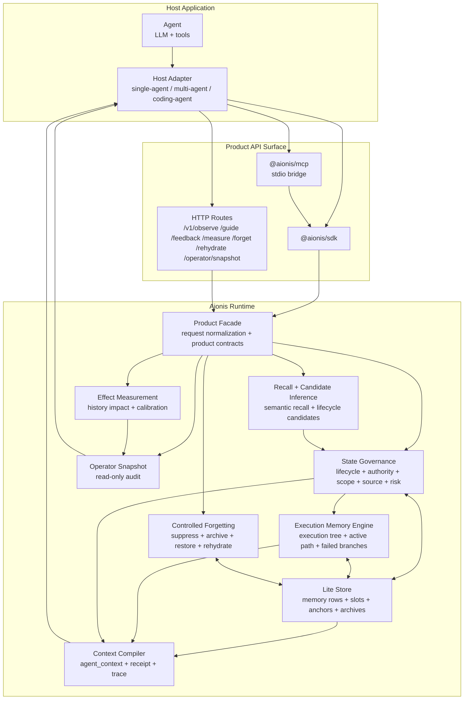

# Aionis Runtime Architecture

Status: implemented product architecture for the focused Runtime

Aionis is a state-adjudicated memory Runtime. It does not treat memory as a
bag of recalled text. It treats memory as governed execution state that must be
judged before it reaches an Agent.

## Product Path

```text
observe -> guide -> agent action -> feedback -> measure -> snapshot
```

| Step | Runtime role | Product output |
|---|---|---|
| `observe` | Store real memory, execution evidence, outcomes, and handoff state. | Structured memory, execution-native metadata, lifecycle candidates. |
| `guide` | Recall, adjudicate, and compile governed context. | `agent_context`, optional packets, memory use receipt, decision trace. |
| `agent action` | Host runs the Agent with only the compiled context. | Host-owned action and tool evidence. |
| `feedback` | Attribute outcomes to memory IDs that were actually exposed and used. | Feedback attribution, activation or negative evidence. |
| `measure` | Compare before/after context and summarize memory effect. | Effect report, calibration, audit surfaces. |
| `snapshot` | Expose read-only operator state. | Branch isolation, memory use, feedback, trace-to-procedure readiness. |

`/v1/forget` and `/v1/rehydrate` are lifecycle-control paths around this loop:
forget suppresses, unsuppresses, archives, or restores memory state; rehydrate
expands archived or anchor payload evidence when compact context is not enough.

## System Diagram



## Product API Surface

| API | Primary caller | Purpose |
|---|---|---|
| `POST /v1/observe` | Host after real work or user memory input | Write ordinary memory, execution evidence, outcomes, or handoff state. |
| `POST /v1/guide` | Host before the next Agent run | Compile governed memory into compact Agent context. |
| `POST /v1/feedback` | Host after the Agent acts | Attribute positive or negative outcomes to exposed memory IDs. |
| `POST /v1/measure` | Host, evaluator, or operator | Report whether memory changed future context or behavior. |
| `POST /v1/forget` | Host or operator | Explicit lifecycle control: suppress, unsuppress, archive, activate, rehydrate. |
| `POST /v1/rehydrate` | Host when compact context points to hidden evidence | Expand archived memory, anchor payload, or colder evidence on demand. |
| `POST /v1/operator/snapshot` | Host or operator | Read-only audit of run state, memory use, feedback, and effect. |

The SDK package is a facade over these product routes. The MCP package is a
stdio bridge over the SDK for Claude Code, Cursor, and other MCP clients. The
Runtime owns memory governance; SDK and MCP only help hosts avoid hand-written
payload drift.

## Memory Layers

Aionis separates ordinary memory from execution memory.

| Layer | Examples | How it reaches the Agent |
|---|---|---|
| Ordinary Memory | Preferences, facts, project notes, user constraints. | Recalled, lifecycle-adjudicated, and placed into `use_now`, `inspect_before_use`, `do_not_use`, or `rehydrate`. |
| Execution Memory | Plans, actions, observations, verifier outcomes, handoffs, failed branches, active paths. | Compiled into execution-state context with plan decisions, passed solutions, failed branches, current active path, and procedures. |
| Archive / Anchor Payloads | Raw traces, long payloads, colder evidence, source anchors. | Kept out of prompt by default; surfaced as rehydrate pointers when needed. |

This lets Aionis compress aggressively without pretending summaries are the same
as evidence. The compact context can say what to do now and what to avoid while
keeping heavier evidence available behind rehydrate pointers.

## Recall Engine Boundary

Recall is candidate generation, not authority.

The Runtime can retrieve memory through semantic similarity, exact recovery,
execution-native anchors, graph neighbors, and future lexical, structured, or
ANN sources. Those sources only answer which memories may matter and why they
were retrieved. State governance still decides whether the memory can become
`use_now`, `inspect_before_use`, `do_not_use`, or `rehydrate`.

The Recall Engine roadmap is tracked in
[AIONIS_RECALL_ENGINE_ROADMAP.md](AIONIS_RECALL_ENGINE_ROADMAP.md). The invariant
is simple: improve candidate retrieval below the governance layer without
weakening lifecycle, authority, scope, source, risk, or rehydration gates.

## State Governance

Before memory enters Agent context, Aionis evaluates state:

- lifecycle: active, candidate, contested, stale, suppressed, demoted, archived
- authority: authoritative, trusted, advisory, candidate, blocked
- scope: private, shared, team, task, project, domain
- source: user, host, Agent, tool, verifier, operator, external evidence
- risk: stale premise, contested memory, do-not-use, inspect-before-use

The result is not a single ranked list. It is a governed context contract:

```text
use_now             memory the Agent can directly use
inspect_before_use  memory the Agent may consider only with caution
do_not_use          memory that must not become instructions
rehydrate           pointer to raw evidence or archived payload
```

## Execution Memory

Execution memory is Aionis's main moat.

Long-running Agents do not only need facts. They need to know:

- which plan decisions are still active
- which acceptance checks define success
- what branch is currently active
- which branch passed verification
- which branch failed and should not be repeated
- which subgoal became reusable procedure
- which raw evidence can be rehydrated if the compact contract is insufficient

The Runtime models this with execution trees, execution-native memory rows,
handoff state, workflow projection, replay playbooks, and product context
compilation. Failed branches remain useful as counter-evidence; they do not
become future instructions.

### Plans As Execution Memory Assets

Aionis is not a model router. A host can use a stronger planner model, a cheaper
worker model, a verifier, or a human reviewer. Aionis records the durable state
that should cross those boundaries: resolved decisions, acceptance checks,
failed branches, active targets, execution boundaries, and evidence pointers.

The planner output is evidence, not Runtime authority. It reaches the Agent only
after the same lifecycle, authority, scope, source, and rehydration gates as
other execution memory. This lets high-quality planning survive session and
model boundaries without turning every plan note into an instruction.

## Context Compiler

`POST /v1/guide` returns the Agent-facing surface:

```text
AIONIS_CTX v2
state role=reviewer history=actionable
current use_now=continue verified checkout branch
avoid do_not_use=failed broad search branch
inspect contested=older route note requires verification
```

The host may pass `agent_context.prompt_text` or selected `agent_context` fields
to the Agent. The host should keep packets, raw slots, receipts, decision traces,
and operator snapshots outside the Agent prompt.

Token-sensitive hosts can request `context_mode: "compact_agent"` on the guide
path. This does not create a new memory decision path; it reuses the governed
context compiler and only changes the Agent-facing prompt rendering.

## Feedback, Measurement, and Learning Control

Aionis does not blindly promote memory just because it was recalled. Feedback is
attributed only when the host reports that an exposed memory ID was actually
used in a run.

Measurement stays read-only:

- it can report positive impact, negative impact, or insufficient evidence
- it can show calibration and decision traces
- it does not mutate Runtime state by itself

This keeps learning evidence separate from authority. A memory can be useful
once without becoming a permanent rule.

## Controlled Forgetting and Rehydration

Forgetting is not deletion by default. Aionis uses lifecycle control:

- suppress memory that should not appear in Agent context
- archive memory that is cold but still evidence
- restore memory when a previous suppression no longer applies
- rehydrate raw payload or archive evidence only when compact context needs it

This is how Aionis can keep prompts short without losing auditability.

## Operator Surfaces

Operators and host systems can inspect memory behavior without changing it:

- memory use receipt: which memory was used, suppressed, or rehydrated
- memory decision trace: why a memory landed in a surface
- operator snapshot: run state, branch isolation, feedback attribution, effect
- output contracts: schemas for agent context, guide packet, effect report, and
  audit outputs

These surfaces make memory decisions inspectable without leaking internal traces
into the Agent prompt.

## Source Map

| Area | Main files |
|---|---|
| Product facade routes | `src/routes/product-facade.ts` |
| SDK facade | standalone package repo [ostinatocc/aionis-sdk](https://github.com/ostinatocc/aionis-sdk); Runtime API-contract mirror at `src/sdk.ts` and bundled compatibility copy at `packages/aionis-sdk/src/index.ts` |
| MCP bridge | standalone adapter repo [ostinatocc/aionis-mcp](https://github.com/ostinatocc/aionis-mcp); bundled compatibility copy at `packages/aionis-mcp/src/index.ts`, `packages/aionis-mcp/src/server.ts`, `packages/aionis-mcp/src/tools.ts` |
| Product output contracts | `src/memory/product-output-contract.ts` |
| Product output assembly | `src/memory/product-output-assembler.ts` |
| Lifecycle adjudication | `src/memory/memory-lifecycle-adjudicator.ts`, `src/memory/lifecycle-candidate-inference.ts` |
| Authority governance | `src/memory/authority-gate.ts`, `src/memory/authority-consumption.ts` |
| Execution tree and state | `src/execution/tree.ts`, `src/execution/tree-store.ts`, `src/execution/tree-auto.ts` |
| Execution continuity | `src/kernel/execution-continuity-kernel.ts` |
| Controlled forgetting | `src/kernel/forgetting-kernel.ts`, `src/memory/semantic-forgetting.ts` |
| Operator snapshot | `src/memory/operator-snapshot.ts`, `src/routes/operator-snapshot.ts` |

## Related Documents

- [AIONIS_PRODUCT_CONTRACT.md](AIONIS_PRODUCT_CONTRACT.md)
- [AIONIS_PRODUCT_OUTPUT_CONTRACT.md](AIONIS_PRODUCT_OUTPUT_CONTRACT.md)
- [AIONIS_STATE_MODEL.md](AIONIS_STATE_MODEL.md)
- [AIONIS_HOST_INTEGRATION.md](AIONIS_HOST_INTEGRATION.md)
- [AIONIS_PRODUCT_API_USAGE.md](AIONIS_PRODUCT_API_USAGE.md)
- [AIONIS_AGENT_CONTEXT_AND_AUDIT_SURFACES.md](AIONIS_AGENT_CONTEXT_AND_AUDIT_SURFACES.md)
