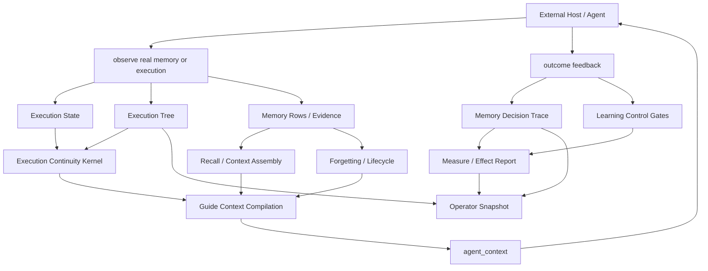

# Aionis State Model

Status: implemented state model for the focused Runtime

This document describes the state machines that exist in the current Aionis
Runtime implementation. It does not propose a new orchestrator, workflow engine,
or core rewrite.

Aionis is a state-adjudicated memory runtime. In code, that means Aionis uses
bounded state reducers and gated transitions to decide what execution history,
memory lifecycle state, learning evidence, and risk can shape the next Agent
context.

## Boundary

Aionis does not own a global Agent orchestration state machine.

External hosts still decide:

1. which Agent acts next
2. which model is called
3. which tool is executed
4. when a task is complete
5. how retries and queues are scheduled

Aionis owns state governance:

1. execution state continuity
2. branch-aware execution tree state
3. memory lifecycle and forgetting state
4. workflow/pattern promotion state
5. learning-control admission state
6. context compilation from governed state
7. operator-readable state projections

## Current State Planes

| State Plane | Current States | Transition Inputs | Primary Reducer / Gate | Persistence / Surface |
|---|---|---|---|---|
| Execution state | `triage`, `patch`, `review`, `resume` plus validation/blocker/rejected-path fields | `execution_transition_v1` | `applyExecutionStateTransition` | Lite execution state store, handoff, execution packets |
| Execution tree | raw/summary nodes with `active`, `failed`, `inactive`; current raw/summary pointers | `grow`, `compress`, `maintain`, `revise` operations | `applyExecutionTreeOperationV1` | Lite execution tree store, guide/context assembly, operator snapshot |
| Memory lifecycle | `active`, `contested`, `retired`, `archived` | forgetting/lifecycle signals, feedback quality, tier profile | `resolveSemanticForgettingDecision` | memory rows, forgetting reports, guide risk/suppression |
| Memory tier | `hot`, `warm`, `cold`, `archive` | demote/archive/rehydrate/review actions | tier helpers in `evolution-operators` | context selection, archive relocation, rehydration |
| Workflow promotion | `candidate`, `stable` | execution write projection, replay evidence, promotion review | workflow promotion learning-control gate | workflow anchors, replay playbooks, guide workflow candidates |
| Pattern credibility | `candidate`, `trusted`, `contested` | tool/use feedback, counter-evidence, revalidation | pattern trust and learning-control gates | tool preferences, policy/pattern memory |
| Learning control | review/admissibility/effect/apply trace stages | semantic review, admissibility result, policy effect | `deriveControlledStateRaisePreview` and runtime apply gate | decision trace, learning packet, effect report |
| Operator projection | read-only claims and readiness summaries | current state surfaces | operator snapshot builder | `operator_snapshot`, memory receipt, trace-to-procedure |

## Runtime Shape

The state model is reducer-oriented:

```text
current_state + transition_or_operation + gates -> next_state_or_read_only_projection
```

The important distinction is:

1. execution state and execution tree can persist transitions
2. learning-control can permit or deny a controlled state raise
3. forgetting can produce lifecycle actions and relocation plans
4. guide/operator surfaces compile state into bounded context or audit output

## Execution State Machine

Execution state tracks the current phase of a task and the facts needed to
resume safely.

Code:

1. `src/execution/types.ts`
2. `src/execution/transitions.ts`
3. `src/execution/state-store.ts`
4. `src/kernel/execution-continuity-kernel.ts`

Core state:

```ts
current_stage: "triage" | "patch" | "review" | "resume";
active_role: "orchestrator" | "triage" | "patch" | "review" | "resume";
pending_validations: string[];
completed_validations: string[];
rejected_paths: string[];
unresolved_blockers: string[];
reviewer_contract: ReviewerContract | null;
resume_anchor: ResumeAnchor | null;
```

Transition types:

| Transition | Effect |
|---|---|
| `stage_started` | Sets `current_stage` and `active_role`. |
| `stage_completed` | Moves completed stage/role back to `resume` when aligned. |
| `validation_added` | Adds pending validation and removes it from completed validation. |
| `validation_completed` | Moves validation from pending to completed. |
| `hypothesis_accepted` | Records the last accepted hypothesis. |
| `path_rejected` | Adds a rejected path. |
| `blocker_recorded` | Adds unresolved blockers. |
| `blocker_cleared` | Removes blockers. |
| `reviewer_contract_updated` | Updates the reviewer contract. |
| `resume_anchor_updated` | Updates the resume anchor. |

Persistence behavior:

1. `LiteExecutionStateStore.applyTransition` validates the transition.
2. Duplicate `transition_id` with the same intent is idempotent.
3. Duplicate `transition_id` with a different intent is rejected.
4. `expected_revision` protects against stale writes.
5. Each accepted transition stores `transition_json` and `state_after_json`.

Product role:

Execution state is the low-level continuity model behind handoff/resume and
state-first execution packets. It is not a host scheduler.

### Handoff vs Resume Semantics

Runtime now exposes execution transition intent as a product projection on
`AionisMemoryPacket.relevant_memories[].execution_state.transition_kind` and in
the compact `AIONIS_CTX v2` prompt contract.

| Transition | State Meaning | Host/Agent Meaning |
|---|---|---|
| `resume_current_state` | The current active path is still usable. | Continue from the active boundary. |
| `handoff_to_actor` | A source actor produced state for a named `handoff_target`. | Route the context or let the target actor accept it. |
| `accept_handoff` | Prompt-level interpretation when the consuming `agent_role` matches `handoff_target`. | The current agent should treat the state as its handoff input, subject to the gate. |
| `inspect_before_use` | Candidate, contested, or demoted execution state exists. | Inspect evidence before direct action. |
| `avoid_failed_branch` | Failed, stale, suppressed, archived, or rejected branch exists. | Preserve as counter-evidence only; do not continue it. |
| `request_rehydrate` | The entry is a compact pointer or rehydration candidate. | Expand the relevant payload before exact execution. |

The lifecycle gate still governs trust. A current handoff can be
`transition_kind=handoff_to_actor` while its prompt line also says
`gate=inspect` if evidence is candidate or contested. Aggressive Agent Context
may render this as short labels such as `tr=accept_handoff` and `gate=inspect`;
the full transition value remains in structured product output.

## Execution Tree State Machine

Execution tree is the branch-aware state machine for long-horizon execution.
It tracks raw action/observation nodes and compressed summary nodes.

Code:

1. `src/execution/tree.ts`
2. `src/execution/tree-store.ts`
3. `src/execution/tree-auto.ts`
4. `src/execution/evidence-context.ts`

Node states:

```ts
status: "active" | "failed" | "inactive";
validated: boolean;
```

Operations:

| Operation | Effect |
|---|---|
| `grow` | Adds or reuses a raw action-observation node on the active path. |
| `compress` | Summarizes raw nodes into a summary node. |
| `maintain` | Marks a summary node validated/active or failed; failed summaries mark covered raw nodes failed. |
| `revise` | Marks a target summary failed, restores the parent summary boundary, and resumes from a prior raw boundary. |

Derived state:

| Derived Field | Meaning |
|---|---|
| `compressed_state` | Active summary path excluding failed branches. |
| `raw_state` | Active raw nodes since the current summary boundary. |
| `execution_hints` | Failed nodes and alternate child branches that should inform context without becoming direct active path. |

Product role:

Execution tree is how Aionis separates:

1. `PASSED_SOLUTIONS`
2. `FAILED_BRANCHES`
3. `CURRENT_ACTIVE_PATH`

This is why a failed attempt can remain visible as counter-evidence without
leaking into direct next-action context.

## Memory Lifecycle And Forgetting State

Memory lifecycle governs whether memory remains active, becomes contested,
retires, archives, or requires rehydration.

Code:

1. `src/kernel/forgetting-kernel.ts`
2. `src/memory/evolution-operators.ts`
3. `src/memory/lifecycle-signals.ts`
4. `src/memory/semantic-forgetting.ts`

Lifecycle states:

```ts
"active" | "contested" | "retired" | "archived"
```

Forgetting actions:

```ts
"retain" | "demote" | "archive" | "review"
```

Memory tiers:

```ts
"hot" | "warm" | "cold" | "archive"
```

Decision inputs:

1. lifecycle state in slots
2. policy memory state
3. credibility state
4. execution contract trust
5. retention score
6. feedback quality
7. current tier

Decision behavior:

| Condition | Result |
|---|---|
| retired policy memory | archive unless already archived |
| very low retention or strong negative feedback | archive |
| contested memory or low retention | demote or review |
| hot tier with weak retention | demote to warm |
| sufficient retention | retain |

Product role:

The forgetting state machine keeps stale, weak, contradicted, or harmful memory
out of direct reuse while preserving evidence for audit, rehydration, and
measurement.

## Learning-Control State

Learning-control is the gate that prevents one trace or one review from
becoming stable authority without evidence.

Code:

1. `src/memory/learning-control-shared.ts`
2. `src/kernel/learning-promotion-kernel.ts`
3. `src/memory/replay-learning-control-helpers.ts`
4. `src/memory/learning-loop.ts`

Trace stages:

```ts
"review_packet_built"
"review_result_received"
"admissibility_evaluated"
"policy_effect_derived"
"runtime_policy_applied"
```

Controlled-state raise shape:

```text
base_state + review + admissibility + guards -> effective_state
```

Examples:

| Domain | Base State | Raised State | Main Gates |
|---|---|---|---|
| Workflow promotion | `candidate` | `stable` | admissible review, authoritative contract, sufficient outcome evidence |
| Replay learning projection | `draft` | `shadow` | admissible review, no explicit target override |
| Pattern credibility | `candidate` | `trusted` | repeated positive evidence and no open counter-evidence |

Product role:

Learning-control makes Aionis self-learning without making it self-overwriting.
It can expose candidate learning, blocked promotion, and stable readiness
without mutating authority unless gates pass.

## Context Compilation State

Guide/context compilation is not a state machine by itself. It is where governed
state becomes Agent-facing context.

Important boundary:

1. `agent_context.use_now` can shape the next Agent action.
2. `agent_context.inspect_before_use` requires verification before reliance.
3. `agent_context.do_not_use` carries failed/stale/blocked counter-evidence.
4. raw rows, raw slots, decision traces, receipts, and operator snapshots do not
   enter the Agent prompt by default.

Product output:

1. `AionisAgentContext`
2. `AionisGuidePacket`
3. `AionisMemoryPacket`
4. `AionisLearningPacket`
5. `AionisEffectReport`
6. `AionisMemoryDecisionTrace`
7. `AionisMemoryUseReceipt`
8. `AionisOperatorSnapshot`

## Operator State Projections

Operator projections make state understandable without adding mutation power.

Current surfaces:

| Surface | Purpose |
|---|---|
| `memory_decision_trace` | Per-memory use/downgrade/block/rehydrate decisions. |
| `memory_decision_audit` | Compact review of memory decisions, risks, and claims. |
| `memory_use_receipt` | Compact receipt of exposed, blocked, rehydrated, attributed, and unattributed memory. |
| `operator_snapshot.execution_state` | Active path, passed solutions, failed branches, branch isolation. |
| `operator_snapshot.trace_to_procedure` | Read-only readiness projection for reusable workflow/procedure memory. |
| `operator_snapshot.learning_control` | Whether learning-control state is visible and whether promotion is blocked. |

These projections must remain read-only.

## State Flow



## Invariants

1. Aionis state transitions must be evidence-scoped.
2. Failed execution branches may be visible as avoidance context but must not
   become direct active path.
3. Candidate workflow memory must not become stable authority without
   learning-control and outcome evidence.
4. General preference/fact memory must not auto-create execution tree state.
5. Operator/debug projections must not enter the Agent prompt.
6. Single-task experience can become scoped evidence or candidate memory, not a
   Runtime rule.
7. State stores must preserve revision and transition identity where transitions
   are persisted.

## What Aionis Does Not Yet Have

Aionis does not currently have:

1. one central `StateMachine` class
2. one global transition registry for every state plane
3. a product UI for visualizing all state planes
4. a host-owned Agent orchestration loop
5. a single formal state graph that covers every memory subsystem

Those are not blockers for the current product path. The implemented model is
already state-adjudicated: state is governed before context is compiled.

## Next Reasonable Hardening

If this state model becomes a formal product contract, the next low-risk work is:

1. add a `state_model` section to `operator_snapshot`
2. add a compact `/v1/operator/state-model` read-only route only if a host needs it
3. add route tests proving state model output excludes raw rows and prompt text
4. add a contract test that every documented state plane maps to an existing source file

Do not add a global orchestrator unless a real host integration proves that
Aionis needs to own scheduling. Today, Aionis should stay the state-governed
memory runtime underneath the host.
