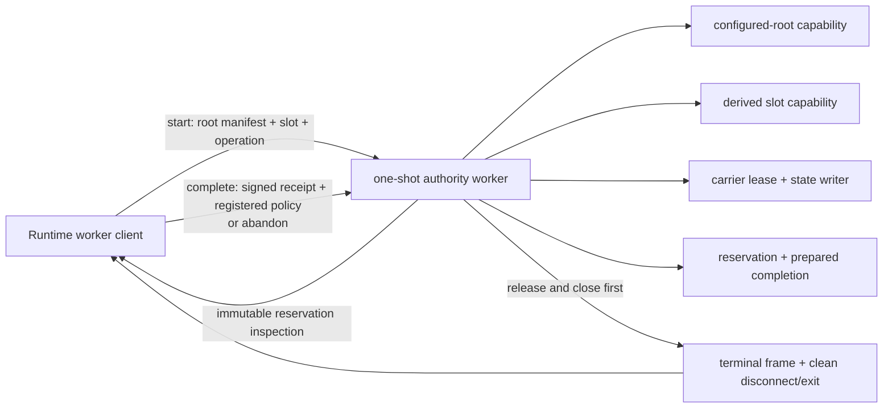

# ADR-0002: Isolate the Deployment-Slot Authority State Machine in a One-Shot Worker

## Status

Proposed; D3a.3b implementation boundary frozen on 2026-07-18. Production
implementation is deferred while the v0.3.10 convergence sprint repairs the
Runtime commit authority, lifecycle admission, local-data permissions, shutdown
semantics, and release evidence. This ADR remains the future isolation design;
it is not part of the convergence release implementation scope.

## Context

The deployment-slot authority kernel already implements a crash-replayable,
append-only state machine in
`tools/runtime-deployment-authority/lite-runtime-deployment-slot-authority.ts`.
One live invocation can:

1. open a configured-root capability and derive one deterministic slot path;
2. acquire a retained SQLite carrier writer lock;
3. append a lease epoch and recover any reservation left by an earlier crash;
4. reserve one generation under `(operation_id, operation_request_sha256)`;
5. verify and commit a launcher-signed database-binding receipt; and
6. append the clean-release carrier witness and close every database and pin.

Lease, reservation, and prepared-completion capabilities are module-private
objects registered in `WeakMap`s. They are intentionally neither serializable
nor transferable. The carrier lock, durable-state writer, and those opaque
capabilities therefore already have to remain in one process.

The missing production boundary is process isolation. The raw lifecycle
functions are exported and can still be called from a large Runtime process.
On Unix, POSIX record locks are process-associated: closing another descriptor
for the carrier inode in that PID can release the lock even while the kernel's
secret SQLite savepoint still appears live. The savepoint detects SQL
`COMMIT`/`ROLLBACK` and transaction restart; it cannot prove that an unrelated
same-PID close preserved the operating-system lock.

The existing CI child is useful evidence but is not a production protocol. It
receives root and operation data in argv, inherits the complete environment,
accepts ad-hoc unversioned IPC objects, has no canonical frame or byte limit,
and leaves cleanup and pending-message rejection to test orchestration. It does,
however, prove that the full acquire/reserve/prepare/commit/release sequence can
run in a child process without transferring any opaque capability.

There is currently no production caller of the five raw lifecycle operations.
This allows the isolation boundary to be introduced before a caller depends on
the unsafe composition. The current Runtime execution contract is source TypeScript
under `node --import tsx`; the repository does not emit a `dist` worker.

## Requirements

### Functional requirements

- One one-shot worker process must exclusively own root open, slot derivation,
  acquire, reserve, prepare, commit, release, and root close.
- The parent may receive only immutable reservation inspection data. It may
  produce a signed receipt, external execution policy, and registered policy
  digest, but it must never receive or reconstruct a lease, reservation, or
  prepared-completion capability.
- An exact completed replay must skip the parent completion callback and return
  the already committed completion.
- Parent abort, callback failure, or callback timeout must request abandonment.
  A confirmed abandonment burns the reserved generation and operation in the
  current durable lineage.
- A worker loss or uncertain commit/release must be reconciled by a fresh worker
  using the exact same slot, operation ID, and operation-request digest.
- The client must never invent a replacement operation ID. A burned operation is
  a determinate result that requires the domain caller to choose the next ID.

### Non-functional requirements

| Concern | Required property |
|---|---|
| Safety | No timeout, EOF, message, or process exit alone is success. A successful result requires a valid terminal frame, IPC disconnect, and exit code 0 after worker cleanup. |
| Durability | A successfully durably committed completion has RPO 0 under the kernel's current SQLite/fsync contract and current non-rolled-back carrier/state lineage, and is returned by exact replay. A commit/fsync error remains uncertain; this does not claim storage anti-rollback. |
| Isolation | Only the one-shot worker imports and invokes the raw production lifecycle API. It contains no unrelated Runtime workload or caller-controlled file descriptor. |
| Boundedness | Every wire string, canonical payload, frame, wait, cleanup attempt, and diagnostic is bounded by a named protocol constant. There is at most one in-flight operation and one parent response. |
| Fail-closed behavior | Invalid/non-canonical/oversized frames, sequence or digest mismatch, spawn failure, signal, uncertain release, and abnormal exit become a typed rejection or indeterminate result, never a completion. |
| Availability | One uncertain worker permits exactly one durable reconciliation; a second uncertainty returns to the caller. No retry storm or silent daemon takeover is allowed. |
| Performance | No latency SLO is claimed before implementation measurement. Production callback/session/cleanup deadlines are module-owned and must be frozen from measured real-process latency with a documented safety margin. |
| Compatibility | The first implementation uses the repository's actual `node --import tsx` source-runtime contract and supported Node floor. It does not invent a `dist` fallback. |
| Secret handling | Root and operation data are sent only on the private inherited IPC channel, not argv. The worker inherits no application environment or secret-bearing stdio. |
| Observability | Errors expose a bounded stable code and phase, not arbitrary stack, SQL, path contents, policy JSON, receipt bytes, or environment data. Loader/startup stderr is captured only to a fixed private diagnostic ceiling. |

## Decision

### Production modules

Add exactly three production modules while retaining the current kernel:

- `lite-runtime-deployment-slot-authority-worker-protocol.ts` owns strict
  runtime schemas, canonical codecs, frame limits, transcript chaining, public
  client result/error types, and no filesystem access.
- `lite-runtime-deployment-slot-authority-worker-entry.ts` is the fixed one-shot
  child entry. It is the only production module outside the kernel allowed to
  import the raw acquire/reserve/prepare/commit/release functions.
- `lite-runtime-deployment-slot-authority-worker-client.ts` owns fixed spawning,
  the parent callback, bounded abort/cleanup, exit verification, and at most one
  automatic fresh-worker reconciliation. It must not import the raw lifecycle
  functions or open the carrier/state databases.

The raw kernel remains in place and its lifecycle exports are marked
`@internal`. Moving the roughly 5,600-line kernel before the boundary is proven
would combine a large mechanical refactor with a safety change.



### Client surface

The production client takes only:

- configured root path;
- expected root-manifest SHA-256;
- deployment slot;
- operation ID;
- operation-request SHA-256;
- an abort signal; and
- an async completion-material callback receiving the frozen reservation
  inspection.

The callback returns a canonical launcher-signed
`LearningRuntimeDatabaseBindingReceiptEnvelopeV1`, an
`ExternalExecutionPolicyV1`, and its registered digest. It may be invoked a
second time only when fresh-worker reconciliation proves that the original
reservation never committed. It must therefore be retry-safe for a newly
issued reservation. It is never invoked for completed replay.

Callers cannot supply state/carrier paths, a worker entry, executable, argv,
environment, clock, randomness, frame limits, timeout limits, or fault hooks.
The client returns the existing immutable
`LiteRuntimeDeploymentSlotBindingCompletion` plus a non-signing worker-session
inspection that records terminal transcript digest, worker count, clean-exit
verification, and the narrow
`carrier_state_machine_one_shot_process_v1` isolation scope.

### Canonical wire model

The OS IPC message is exactly one JavaScript string containing canonical JSON
for this exact-key envelope:

```text
{
  "contract_version": "aionis_lite_runtime_deployment_slot_authority_worker_frame_v1",
  "payload_json": "<canonical JSON string>",
  "payload_sha256": "<lowercase SHA-256 of payload_json UTF-8 bytes>"
}
```

The receiver checks outer-frame byte length before JSON parse, exact keys and
canonical outer bytes, payload length and digest before payload parse, then the
strict discriminated payload schema and canonical payload bytes. Canonical
re-serialization also rejects duplicate keys. TypeScript casts are never a wire
validator.

Every payload carries:

- the protocol version and message kind;
- a CSPRNG session nonce digest;
- the exact sequence number;
- `previous_payload_sha256` (`null` only on sequence 1);
- operation ID and operation-request digest.

The transcript has only these forms:

| Sequence | Sender | Message |
|---:|---|---|
| 1 | client | `start`, including root path, expected manifest digest, and slot |
| 2 | worker | `reservation_ready`, or an early `terminal` for exact replay/rejection/indeterminate cleanup |
| 3 | client | `complete` with canonical receipt/policy material, or `abandon` with a fixed reason code |
| 4 | worker | `terminal` after release and root close |

The transcript/session digest is transport correlation only. Durable
idempotency remains exactly `(operation_id, operation_request_sha256)`; the
operation-request digest is caller-domain input and is not silently redefined
as the worker request digest.

Existing limits are reused rather than copied: operation ID and deployment slot
are at most 256 UTF-8 bytes under their respective current validators, the
canonical signed receipt is at most 16 KiB, and canonical historical policy is
at most 1 MiB. The protocol task must extract or export shared parsers and
constants where they are currently private. It must introduce an explicitly
versioned worker-root-path ceiling and derive each message/frame ceiling from
the exact bounded fields plus canonical JSON overhead. No unrelated journal
limit or unexplained round-number frame cap may be substituted.

### Worker lifecycle

For one valid `start`, the worker:

1. opens the configured root with the expected manifest digest and derives the
   slot capability;
2. acquires the carrier lease;
3. reserves with the supplied operation tuple;
4. on completed replay, releases and closes, then returns the exact completion;
5. otherwise emits `reservation_ready` and accepts exactly one `complete` or
   `abandon` response;
6. on `complete`, canonically parses and re-verifies the receipt/policy, prepares
   and commits it; and
7. in all reachable paths, attempts release and root close before emitting a
   terminal frame and disconnecting.

The worker has a single listener/state machine. Duplicate, reordered, foreign-
session, post-terminal, or oversized messages fail closed. Parent IPC
disconnect and catchable termination begin abandonment/release cleanup through
one `AbortController`. `SIGKILL` cannot be caught and is handled only through
operating-system descriptor close plus fresh-worker reconciliation.

The child is launched through the fixed current Node executable and fixed
source entry with the exact `--import <absolute resolved tsx loader>` contract;
it never uses `npx` or caller `cwd` lookup. It receives no request data in argv,
uses ignored stdin/stdout, bounded private stderr, and one IPC descriptor, is
not detached, and receives a fixed minimal non-secret environment rather than
`process.env`. Because worker execution is now a production dependency rather
than a developer command, D3a.3b moves `tsx` from `devDependencies` to
`dependencies`. A future emitted-JavaScript packaging migration must replace
the whole source-runtime contract rather than add a stale `dist`/source
fallback. Production code exposes no crash observer.

### Client exit and reconciliation rules

The parent accepts a determinate worker terminal only after all of the
following agree:

1. the terminal frame is canonical and completes the exact transcript;
2. its result matches the requested operation tuple;
3. the worker disconnects its IPC channel; and
4. the child closes with code 0 and no signal.

A completion message followed by uncertain or abnormal exit remains
indeterminate. Spawn failure, IPC EOF, protocol failure after mutation may have
started, worker signal, release failure, and a missing clean terminal all start
one fresh worker with the same operation tuple:

- no operation row means the prior reservation did not commit; work may resume;
- an existing completion returns exact completed replay and skips the callback;
- an existing operation without a completion returns
  `operation_generation_burned` and requires a new caller operation ID.

If the reconciliation worker itself becomes indeterminate, the client returns a
typed indeterminate result and does not loop. A normal validation/conflict/
burned result is already determinate and is not retried.

### Crash semantics

| Last possible crash point | Durable interpretation on a fresh worker |
|---|---|
| Acquire transaction before commit | No new lease epoch; acquire again. |
| Acquire commit before IPC | Lease epoch, and any recovery abandonment, exist; append the next epoch. |
| Reserve transaction before commit | Neither operation nor reservation exists; same operation may reserve. |
| Reserve commit before IPC | Operation and active reservation exist; acquire abandons it and the operation is burned. |
| Prepare | Prepared capability was memory-only; committed reservation becomes burned. |
| Completion transaction before commit | No completion; committed reservation becomes burned. |
| Completion commit before IPC | Exact completed replay under the same operation ID. |
| Release witness before commit | Prior state completion/abandonment remains; fresh acquire validates the older witnessed prefix. |
| Release witness commit before close/IPC | Fresh acquire validates the new witness; operation resolves to replay or burn. |

State `COMMIT` followed by fsync/pin failure is deliberately considered
uncertain because the state may already exist. Reconciliation, not an exception
message, decides the outcome.

### Source governance and evidence

A source-scope test will fail if any production module other than the worker
entry imports the five raw lifecycle functions. Tests may import the low-level
kernel to verify its mechanism. The protocol and client modules may import
types and shared validators only and must not open the configured root's
carrier or state paths.

Real subprocess tests use actual SQLite files, locks, IPC, process exit, and
`SIGKILL`. Transaction-edge tests may instrument the test child around the real
`DatabaseSync.prototype.exec("COMMIT")` call after fixture setup, pause before
or after that exact call, and let the parent send `SIGKILL`; they do not add a
production fault hook or replace SQLite behavior.

## Scope and claims

This decision establishes only isolation of the carrier/state lifecycle inside
this composition. It does not establish:

- verified local-filesystem SQLite locking;
- isolation of the separate provisioning bootstrap lock process;
- trusted production launcher selection of the single configured root;
- non-rollback provisioning journal or carrier/state authority;
- managed Runtime-writer quiesce, writer fence, or live revision policy;
- a private launcher signer, D2 aggregate, tracked holds, publication, release
  verdict, multi-host consensus, or the disabled external-head command.

The existing low-level reservation inspection therefore continues to report
`filesystem_locking_verification` and
`same_process_carrier_fd_isolation` as `required_not_established`. The wrapper's
session inspection records only that this one-shot composition completed and
cleanly exited; it does not rewrite durable authority facts.

## Consequences

### Positive

- Unrelated Runtime descriptor closes cannot release the live carrier lock,
  because the worker contains only this authority lifecycle.
- Opaque capability ownership stays aligned with the operating-system lock and
  durable-state writer.
- Crash uncertainty is resolved from durable operation state instead of timing
  or child messages.
- The parent cannot choose internal paths, transport hooks, worker code, clocks,
  or random sources.
- The boundary is testable with real processes before any product caller adopts
  it.

### Negative

- Each authority transition pays process startup and `tsx` loader cost.
- Completion callbacks must tolerate one safe reinvocation when no reservation
  committed.
- A callback failure after reservation normally burns a generation and operation
  ID; this is intentional evidence, not transparent retry.
- The current source-runtime contract retains `tsx` as a production dependency;
  emitted-package worker packaging remains a later release concern.
- Exact protocol parsers duplicate some shape knowledge unless current private
  validators and byte limits are first extracted into shared contracts.

### Neutral

- Durable SQLite schemas and operation idempotency keys do not change.
- The kernel remains exported for tests and internal composition, but source
  governance—not TypeScript visibility alone—enforces the production caller
  boundary.
- A long-lived daemon could amortize startup later, but is not required for the
  present authority frequency or trust boundary.

## Alternatives Considered

**A child that holds only the carrier lock**

Rejected. If the holder dies while the parent continues a state write, lock
ownership and state ownership diverge and the crash race remains.

**`worker_threads`**

Rejected. Worker threads share one PID, so they do not fix the same-process
POSIX descriptor-close rule.

**A long-lived authority daemon**

Deferred. It can amortize startup but adds socket authentication, multi-client
scheduling, lifetime supervision, secret/config rotation, and a much larger
operational surface before one-shot correctness is proven.

**Move the whole authority kernel into a new module first**

Rejected for this batch. A large move obscures the small security boundary and
raises review and regression risk without changing process ownership.

**Keep direct in-process calls and rely on the SQLite savepoint**

Rejected. The savepoint checks SQL transaction continuity, not the survival of
the process-associated POSIX lock after an unrelated descriptor close.

## Implementation and acceptance

1. Freeze protocol schemas, shared validators/limits, canonical codecs, and
   golden/negative vectors.
2. Implement the one-shot entry with complete `finally` cleanup and no
   production fault hooks.
3. Implement the client, exact exit predicate, abort path, and one automatic
   fresh-worker reconciliation.
4. Add source-import governance and replace the ad-hoc CI composition with the
   production client/worker.
5. Add real subprocess contention, disconnect, callback failure, timeout,
   malformed/oversized transcript, and before/after-commit `SIGKILL` matrices.
6. Run focused tests, typecheck, complexity governance, the complete serialized
   Lite suite, and commit the batch atomically.

Acceptance requires zero mock filesystem/SQLite/process behavior, exact replay
bytes after completion uncertainty, explicit burned-operation results after a
committed reservation without completion, no callback on replay, no raw
production imports outside the worker, bounded cleanup of every child, and no
new authority claim outside the scope above.

## References

- `tools/runtime-deployment-authority/lite-runtime-deployment-slot-authority.ts`
- `tools/runtime-deployment-authority/lite-runtime-deployment-slot-path-authority.ts`
- `src/memory/learning-runtime-database-binding.ts`
- `scripts/ci/support/lite-runtime-deployment-slot-lease-child.ts`
- `scripts/ci/lite-runtime-deployment-slot-authority.test.ts`
- `docs/architecture/AIONIS_LEARNING_EPISODE_LEDGER_DESIGN.md`
- `docs/plans/2026-07-13-learning-episode-ledger.md`
