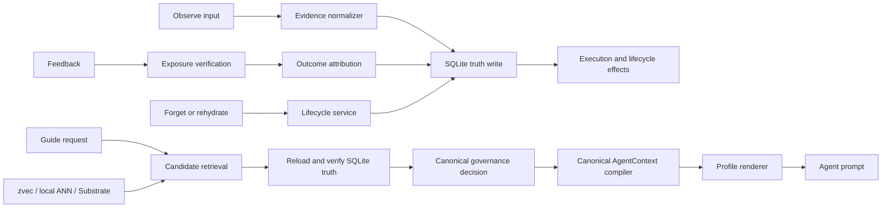

# Runtime Complexity Reduction Implementation Plan

> **For Claude:** REQUIRED SUB-SKILL: Use `executing-plans` to implement this plan task-by-task.

**Goal:** Reduce accidental complexity in the focused Aionis Runtime without weakening execution continuity, evidence-gated learning, controlled forgetting, negative-transfer blocking, scope isolation, feedback attribution, or auditability.

**Architecture:** Keep Aionis as a modular monolith with SQLite as the Runtime truth store and zvec/Substrate as optional candidate or evidence adapters. Converge Runtime behavior onto one evidence-to-decision-to-AgentContext pipeline, move internal composition from HTTP routes to typed services, and delete replaced paths at the end of each phase.

**Tech Stack:** TypeScript, Node.js 22/24, Fastify, Zod, `node:sqlite`, optional `@zvec/zvec`, optional `@aionis/substrate`, Node test runner, `tsx`.

---

Status: proposed implementation plan; no Runtime behavior change has been authorized by this document alone

Date: 2026-07-10

Scope owner: `AionisRuntime-focused`

Supporting repositories: `aionis-sdk`, `aionis-cli`, `aionis-create`, `aionis-mcp`, `aionis-aifs`, `aionis-claude-code`, `AionisSubstrate`

## 1. Executive Decision

Aionis has necessary product complexity and removable implementation
complexity.

Necessary product complexity includes:

- execution continuity across sessions, Agents, models, and handoffs;
- tenant, scope, owner, team, and visibility isolation;
- authority, lifecycle, admission, and negative-transfer decisions;
- feedback attribution to memory actually exposed by a guide;
- controlled forgetting, archive, and explicit rehydration;
- SQLite truth verification after ANN or Substrate candidate retrieval;
- audit receipts and decision traces that do not become Agent instructions.

This plan must preserve those capabilities.

Removable implementation complexity includes:

- multiple representations of the same memory-use decision;
- multiple context assembly and rendering paths;
- internal capabilities exposed as HTTP routes when only Runtime composition
  uses them;
- repeated normalization of trust, outcome, lifecycle, and Agent surfaces;
- large files that own unrelated stages of the product loop;
- configuration expressed as hundreds of independent fields instead of
  cohesive runtime profiles and typed sections;
- manually synchronized release versions and mutable-main installation.

The chosen architecture is a **modular monolith**. Do not split Runtime Core
into microservices and do not add a message broker, a second authority store,
or a second final Agent context.

## 2. Current Measured Baseline

Baseline observed on 2026-07-10:

| Measure | Current value |
|---|---:|
| Runtime TypeScript source | 123,756 lines |
| Runtime source modules | 284 |
| Route capability matrix | 72 entries |
| Environment schema fields | 220 |
| Static import strongly connected components | 3 |
| `product-output-assembler.ts` | 7,405 lines |
| `product-output-contract.ts` | 2,670 lines |
| `schemas.ts` | 5,218 lines |
| `product-facade.ts` | 4,786 lines |
| `sdk.ts` | 3,405 lines |
| Runtime CI files | 143 |
| Runtime Lite suite | 787 tests: 783 pass, 0 fail, 4 zvec skips |

Current repository state at plan creation:

- Runtime HEAD is `ca4725d`, twenty commits after tag `v0.3.3`.
- Runtime has existing uncommitted changes in product output, execution
  contract, Product Facade, observe structuring, and their tests.
- Those changes belong to the owner and must not be overwritten, stashed,
  reset, or folded into this refactor without explicit review.
- MGBench also has existing modified report files and is outside the source
  mutation scope of this plan.

The implementation must begin from a clean, owner-approved checkpoint in a
dedicated worktree. Creating this plan in the existing workspace does not
authorize implementation in the dirty Runtime checkout.

## 3. Capability Invariants

Every phase must preserve the following invariants through real Runtime,
SQLite, HTTP, SDK, or end-to-end verification. Static tests may enforce source
boundaries, but they do not count as product validation.

### 3.1 Continuity

- A later run can recover current state, target files, verified facts, failed
  branches, and the next admissible action.
- Exact task and workflow scope remain stronger than family-only similarity.
- Failed branches never become the active route.
- Handoff recovery remains isolated by tenant, scope, owner, and team.

### 3.2 Learning

- Observations remain evidence until promotion gates pass.
- A single successful or failed task cannot create global authority.
- Repeated, scoped, outcome-backed evidence can still produce workflow,
  pattern, tool-preference, policy-memory, and skill candidates.
- Learning continues to mutate scoped memory, not Runtime source code.

### 3.3 Learning Control

- Stable or authoritative writes still require Runtime-owned authority gates
  and verifiable receipts.
- Candidate readiness remains distinct from direct-use authority.
- Blocked authority remains visible in operator/audit output without becoming
  Agent guidance.
- Provider and protocol failure remains quarantined from promotion.

### 3.4 Controlled Forgetting

- Suppression, demotion, archive, retirement, activation, and rehydration keep
  their present semantics.
- Forgetting remains a lifecycle transition, not blind deletion.
- Archived evidence can still be selectively rehydrated.
- Positive evidence continues to protect useful recent memory from premature
  decay.

### 3.5 Agent Context

- `POST /v1/guide -> agent_context.prompt_text` remains the low-level HTTP
  contract.
- `guideAgentContext().agent_prompt` and
  `execution.guideAgentContextForRole().agent_prompt` remain the primary SDK
  contracts.
- `use_now`, `inspect_before_use`, `do_not_use`, and `rehydrate_hints` remain
  disjoint and conservatively ordered.
- Raw slots, raw payloads, debug traces, and operator packets remain outside
  the default Agent prompt.
- Prompt budgets and task-context profiles continue to be enforced.

### 3.6 Storage and Retrieval

- SQLite remains the Runtime source of truth.
- Local ANN, zvec, and Substrate remain candidate sources only.
- Every non-SQLite candidate used by Runtime must be reloaded and verified
  against Runtime truth and governance.
- Optional candidate providers may fail according to their existing fail-open
  or fail-closed contract, but cannot bypass governance.

## 4. Non-Functional Requirements

- Public product contracts remain backward-compatible within the v0.3 train
  unless a separately approved release decision says otherwise.
- Runtime-only P50/P95 latency must not regress by more than 10% on the same
  local baseline workload without an explained trade-off.
- No new runtime large-model call is introduced.
- No new network hop is introduced between Product Facade and Runtime Core.
- No temporary dual implementation may remain at a phase exit.
- No fallback path may silently preserve removed legacy behavior.
- New modules must have acyclic imports.
- Runtime startup, shutdown, store closure, and readiness behavior must remain
  deterministic.

## 5. Non-Goals

- Do not rewrite Aionis from scratch.
- Do not split Runtime into microservices.
- Do not replace SQLite, zvec, or Substrate.
- Do not merge Substrate authority into Runtime authority.
- Do not introduce a Dashboard or control-plane product.
- Do not add Agent-framework-specific concepts to Runtime Core.
- Do not change admission thresholds to fit one dataset.
- Do not convert one failed task, repository, benchmark item, or Agent run into
  a Runtime rule.
- Do not broaden EvoSeed or introduce runtime large-LLM dependence.
- Do not preserve redundant legacy code merely for internal compatibility.
- Do not count file splitting alone as complexity reduction.

## 6. Target Architecture



### 6.1 Canonical Runtime Objects

The internal product loop should converge on five conceptual objects:

1. `EvidenceRecord`: normalized observation or external candidate evidence.
2. `ExecutionState`: current path, verified state, failed branches, handoff,
   and resumable action state.
3. `MemoryState`: persisted memory plus authority, lifecycle, scope, and
   provenance.
4. `GovernanceDecision`: the single decision for how one memory may affect the
   current Agent request.
5. `AgentContext`: the only default Agent-facing compiled result.

MemoryPacket, GuidePacket, use receipts, decision traces, admission rows,
learning packets, effect reports, and operator snapshots remain valid public
or operator projections. They must be generated from canonical state and
decisions rather than becoming independent decision sources.

### 6.2 Canonical Governance Decision

The implementation should expose one internal decision type with one row per
memory candidate:

```ts
export type GovernedMemorySurface =
  | "use_now"
  | "context"
  | "inspect_before_use"
  | "do_not_use"
  | "rehydrate"
  | "not_agent_facing";

export type GovernanceDecisionV1 = {
  memory_id: string;
  surface: GovernedMemorySurface;
  authority: "trusted" | "advisory" | "candidate" | "blocked" | "none";
  lifecycle_state: string;
  actionable: boolean;
  reason_codes: string[];
  target_files: string[];
  requires_rehydrate: boolean;
};
```

The exact schema names may reuse existing public names, but there must be only
one canonical vocabulary and precedence implementation.

### 6.3 Canonical Guide Pipeline

`guide` must have one ordered pipeline:

```text
request identity
-> candidate retrieval
-> SQLite truth reload
-> lifecycle and authority adjudication
-> one GovernanceDecision row per memory
-> execution-state merge
-> AgentContext compilation
-> profile rendering
-> exposure ledger write
-> public response
```

`standard`, `full_power`, `compact_agent`, and task-context profiles are
compiler/render profiles. They must not create separate governance semantics.

## 7. Complexity Budgets

Budgets are guardrails, not permission to delete behavior. If a target cannot
be reached without capability loss, stop and review the design rather than
forcing the number.

| Measure | Baseline | Target at plan exit |
|---|---:|---:|
| Runtime source lines | 123,756 | <= 95,000 |
| Route matrix entries | 72 | <= 35, after consumer audit |
| Environment schema fields | 220 | <= 120 first-class fields |
| Static import cycles | 3 | 0 |
| Largest source file | 7,405 | <= 1,500 lines |
| `product-output-assembler.ts` | 7,405 | <= 800-line public facade/barrel |
| `product-facade.ts` | 4,786 | <= 800-line HTTP adapter |
| Default Agent context compilers | multiple | 1 |
| Governance surface classifiers | multiple | 1 |
| Runtime test failures | 0 | 0 |

Any compatibility adapter introduced during migration must have an owner,
deletion task, and phase-local deadline. A phase cannot close while its
temporary adapter remains in the runtime path.

## 8. Stop/Go Gates

### Gate A: Clean Starting Point

Do not start implementation until:

- the current six modified Runtime files are committed, reverted by their
  owner, or otherwise resolved explicitly;
- a dedicated worktree is created from the approved checkpoint;
- `git status --short` is empty in that worktree;
- Runtime baseline tests pass there.

### Gate B: Behavior Characterization

Do not move governance or AgentContext logic until the real SQLite/HTTP parity
tests in Task 2 exist and pass.

### Gate C: No Dual Runtime Path

Test-only old/new comparison is allowed during a task. Production runtime code
must have one path at every commit boundary that closes a phase.

### Gate D: Delete Before Proceeding

Each extraction phase must delete the replaced implementation before the next
phase begins. Moving code and leaving wrappers, alternate assemblers, or hidden
fallbacks does not satisfy the phase.

### Gate E: Full Product Verification

No phase is complete until relevant focused tests, full Runtime tests, SDK
sync, and the real product loop pass.

## 9. Implementation Tasks

### Task 0: Establish the Approved Worktree and Baseline

**Files:**

- Read: `package.json`
- Read: `runtime-manifest.json`
- Read: `src/server/lite-runtime-boundary.ts`
- Read: `docs/performance/AIONIS_RUNTIME_PERFORMANCE_BASELINE.md`
- Do not modify source files in this task.

**Step 1: Confirm the source checkout is clean**

Run:

```bash
git status --short --branch
```

Expected: approved branch/worktree with no modified or untracked files.

If it is dirty, stop. Do not stash, reset, or overwrite owner changes.

**Step 2: Record the baseline commit and tag distance**

Run:

```bash
git rev-parse HEAD
git describe --tags --always
git rev-list --count v0.3.3..HEAD
```

Expected: values recorded in the execution log for this plan.

**Step 3: Verify Runtime baseline**

Run:

```bash
npm run -s typecheck
npm run -s sdk:check
npm run -s lite:test
```

Expected: typecheck and SDK check pass; Lite suite has zero failures. zvec skips
are acceptable only when the optional dependency is intentionally absent and
must be recorded.

**Step 4: Verify product loops**

Run:

```bash
npm run -s runtime:e2e:golden-product-loop
npm run -s runtime:e2e:ordinary-memory
npm run -s runtime:e2e:multi-agent
```

Expected: all three real Runtime/SQLite product loops pass.

**Step 5: Create the implementation checkpoint**

No commit is required if the approved worktree already points at an immutable
checkpoint. Record the commit hash in the implementation log.

### Task 1: Add a Non-Product Complexity Budget Check

This is a structural guard only. It must never be reported as Aionis product
validation.

**Files:**

- Create: `scripts/ci/runtime-complexity-budget.mjs`
- Create: `scripts/ci/runtime-complexity-budget.test.mjs`
- Create: `docs/architecture/runtime-complexity-budget.json`
- Modify: `package.json`

**Step 1: Write the failing structural test**

The test must execute the budget collector and assert this output shape:

```ts
{
  source_files: number,
  source_lines: number,
  route_matrix_entries: number,
  env_schema_fields: number,
  import_cycles: string[][],
  largest_files: Array<{ path: string; lines: number }>
}
```

It must read tracked source only and ignore `node_modules`, `.tmp`, `dist`,
docs, generated reports, and eval workspaces.

**Step 2: Run the test and verify failure**

Run:

```bash
node --test scripts/ci/runtime-complexity-budget.test.mjs
```

Expected: FAIL because the collector does not exist.

**Step 3: Implement the collector**

The collector must:

- use `git ls-files 'src/**/*.ts'` as the source inventory;
- count route entries from `LITE_ROUTE_CAPABILITY_MATRIX`;
- count uppercase fields inside `EnvSchema`;
- resolve relative TypeScript imports and report strongly connected
  components;
- emit deterministic JSON with paths relative to Runtime root;
- support `--check <budget-json>` and `--write-report <path>` modes.

Initial thresholds must equal the approved baseline. They prevent growth but
do not claim the final reduction target has been achieved.

**Step 4: Add package scripts**

Add:

```json
"complexity:report": "node scripts/ci/runtime-complexity-budget.mjs",
"complexity:check": "node scripts/ci/runtime-complexity-budget.mjs --check docs/architecture/runtime-complexity-budget.json"
```

**Step 5: Run verification**

Run:

```bash
node --test scripts/ci/runtime-complexity-budget.test.mjs
npm run -s complexity:check
```

Expected: PASS and deterministic baseline metrics.

**Step 6: Commit**

```bash
git add package.json scripts/ci/runtime-complexity-budget.mjs scripts/ci/runtime-complexity-budget.test.mjs docs/architecture/runtime-complexity-budget.json
git commit -m "test: add runtime complexity budget"
```

### Task 2: Freeze Real Product Behavior Before Refactoring

**Files:**

- Create: `scripts/ci/lite-runtime-simplification-parity.test.ts`
- Modify: `scripts/ci/lite-product-facade-route.test.ts`
- Modify: `scripts/ci/lite-sdk-runtime-agent-context-scope.test.ts`

**Step 1: Write a real SQLite/HTTP product-loop test**

Use a temporary real SQLite database, real Fastify route registration, and the
real SDK client. Do not mock Runtime services.

The test must execute:

```text
observe ordinary memory
-> observe execution memory and handoff
-> guide exact task
-> guide different task
-> feedback from exact guide exposure
-> measure
-> suppress
-> guide again
-> rehydrate
-> guide again
```

Assert semantic invariants rather than timestamps or generated ids:

- exact-task passed execution memory can appear in `use_now`;
- unrelated task execution memory cannot become direct-use guidance;
- failed evidence appears only in `do_not_use` or inspect/audit surfaces;
- feedback rejects memory not exposed by the guide;
- suppression removes direct-use influence;
- rehydrate does not directly promote authority;
- measure reports only evidence available from the real loop;
- raw slots never appear in `agent_prompt`.

**Step 2: Run the test against current behavior**

Run:

```bash
npx tsx --test scripts/ci/lite-runtime-simplification-parity.test.ts
```

Expected: PASS before refactoring. If current behavior cannot satisfy a stated
invariant, stop and review the invariant rather than encoding a new rule.

**Step 3: Add deterministic parity helpers**

Add test-only normalization for request ids, timestamps, generated ids, and
temporary paths. Compare normalized public response shapes for:

- `/v1/observe`;
- `/v1/guide`;
- `/v1/feedback`;
- `/v1/measure`;
- `/v1/forget`;
- `/v1/rehydrate`.

Do not add normalization to Runtime source.

**Step 4: Run focused verification**

```bash
npx tsx --test \
  scripts/ci/lite-runtime-simplification-parity.test.ts \
  scripts/ci/lite-product-facade-route.test.ts \
  scripts/ci/lite-sdk-runtime-agent-context-scope.test.ts
```

Expected: all pass with real SQLite and HTTP paths.

**Step 5: Commit**

```bash
git add scripts/ci/lite-runtime-simplification-parity.test.ts scripts/ci/lite-product-facade-route.test.ts scripts/ci/lite-sdk-runtime-agent-context-scope.test.ts
git commit -m "test: freeze runtime simplification behavior"
```

### Task 3: Audit Runtime Surface Consumers

**Files:**

- Create: `docs/architecture/AIONIS_RUNTIME_SURFACE_INVENTORY.md`
- Modify: `src/server/lite-runtime-boundary.ts`
- Test: `scripts/ci/lite-runtime-boundary-inventory.test.ts`

**Step 1: Inventory every route**

For each of the 72 matrix entries, record:

- product entry, stable support, operator, internal evidence, internal
  guidance, or internal control;
- Runtime source caller;
- SDK caller;
- MCP, AIFS, CLI, Claude Code, Manifest, Substrate, docs, and eval caller;
- whether the route is required as public HTTP;
- replacement typed service when public HTTP is not required;
- deletion phase.

Use read-only searches from `/Volumes/ziel/new.aionis`:

```bash
rg -n '(/v1/observe|/v1/guide|/v1/memory/)' \
  AionisRuntime-focused aionis-sdk aionis-mcp aionis-aifs aionis-cli \
  aionis-create aionis-claude-code AionisManifest AionisSubstrate \
  -g '!**/node_modules/**' -g '!**/dist/**' -g '!**/runs/**'
```

**Step 2: Make exposure classification explicit**

Add a required `exposure` field directly to each route matrix entry rather
than deriving it from path strings.

Allowed values:

```ts
"product_entry" | "product_support" | "operator_support" |
"internal_evidence" | "internal_guidance" | "internal_control"
```

**Step 3: Write the failing matrix test**

Require:

- every route has an explicit exposure;
- only documented product/operator routes may be marked non-internal;
- internal routes name a replacement service before they may be removed;
- route keys remain unique.

**Step 4: Run the test**

```bash
npx tsx --test scripts/ci/lite-runtime-boundary-inventory.test.ts
```

Expected: PASS after the matrix and inventory document are aligned.

**Step 5: Commit**

```bash
git add docs/architecture/AIONIS_RUNTIME_SURFACE_INVENTORY.md src/server/lite-runtime-boundary.ts scripts/ci/lite-runtime-boundary-inventory.test.ts
git commit -m "docs: classify runtime HTTP surfaces"
```

### Task 4: Stabilize Release and Installation Before Structural Refactoring

**Files:**

- Create: `release-train.json`
- Modify: `runtime-manifest.json`
- Modify: `scripts/ci/release-version-docs.test.mjs`
- Modify: `RELEASE_NOTES.md`
- Modify: `docs/AIONIS_RELEASES.md`
- Modify: `/Volumes/ziel/new.aionis/aionis-create/src/index.ts`
- Modify: `/Volumes/ziel/new.aionis/aionis-create/test/create-aionis.test.ts`
- Modify: `/Volumes/ziel/new.aionis/aionis-cli/src/index.ts`
- Modify: `/Volumes/ziel/new.aionis/aionis-cli/test/aionis-cli.test.ts`

**Step 1: Write failing release-manifest tests**

`release-train.json` must be the single checked-in source for:

- Runtime source tag;
- Docker tag;
- CLI, create, SDK, MCP, AIFS, Claude Code, Substrate, and Manifest versions;
- default installer Runtime ref;
- release status: `stable`, `candidate`, or `development`.

Tests must read the manifest rather than repeat version constants.

**Step 2: Run the tests and verify failure**

```bash
node --test scripts/ci/release-version-docs.test.mjs
```

Expected: FAIL until the manifest and docs are connected.

**Step 3: Implement manifest-driven checks**

Remove `CURRENT_RELEASE_TRAIN` hard-coded package versions from the test.
Validate `runtime-manifest.json`, release docs, and installer default ref against
`release-train.json`.

**Step 4: Pin default installation**

Change `@aionis/create` so the default clone includes an explicit stable tag:

```text
git clone --depth 1 --branch <release-train.runtime.source_tag> ...
```

Installing mutable `main` must require explicit `--branch main` or an explicit
development channel.

**Step 5: Verify CLI delegation**

Ensure top-level `aionis setup` preserves the pinned default and only forwards
`--branch` when the user explicitly requests an override.

**Step 6: Run tests**

```bash
node --test scripts/ci/release-version-docs.test.mjs
(cd ../aionis-create && npm test)
(cd ../aionis-cli && npm test)
```

Expected: all pass; default installation is immutable and explicit overrides
still work.

**Step 7: Commit per repository**

Create separate commits in Runtime, create, and CLI repositories. Do not mix
cross-repository changes into one undocumented release operation.

### Task 5: Fix Docker and Claude Code Release Drift

**Files:**

- Modify: `Dockerfile`
- Modify: `docker-compose.yml`
- Modify: `README.md`
- Modify: `docs/AIONIS_INSTALL.md`
- Create: `scripts/ci/docker-listen-contract.test.mjs`
- Modify: `/Volumes/ziel/new.aionis/aionis-claude-code/claude-plugins/aionis/.claude-plugin/plugin.json`
- Create: `/Volumes/ziel/new.aionis/aionis-claude-code/.github/workflows/ci.yml`

**Step 1: Write the failing Docker contract test**

Require container process bind to `0.0.0.0` while published host examples bind
the host port to `127.0.0.1`.

Expected secure topology:

```text
host 127.0.0.1:3001 -> container 0.0.0.0:3001
```

**Step 2: Fix container defaults and docs**

Set Docker image `AIONIS_LISTEN_HOST=0.0.0.0`. Keep direct host install default
at `127.0.0.1`. Document why container bind and host publish addresses differ.

**Step 3: Add a real container smoke**

Run:

```bash
docker build -t aionis:complexity-plan-smoke .
docker run --rm -d --name aionis-complexity-plan-smoke \
  -p 127.0.0.1:3301:3001 \
  aionis:complexity-plan-smoke
curl --fail http://127.0.0.1:3301/healthz
docker stop aionis-complexity-plan-smoke
```

Expected: health request succeeds from the host.

**Step 4: Align Claude Code versions**

Generate or validate plugin metadata version from
`packages/aionis-claude-code/package.json`. Do not maintain two manually
independent current-version values.

**Step 5: Add Claude Code CI**

The workflow must run:

```bash
npm ci
npm run -s typecheck
npm test
npm run -s plugin:validate
```

**Step 6: Verify**

```bash
node --test scripts/ci/docker-listen-contract.test.mjs
(cd ../aionis-claude-code && npm test)
```

Expected: Docker contract passes; Claude repository root and package tests
both pass.

### Task 6: Extract the Canonical Governance Contract

**Files:**

- Create: `src/memory/governance-contract.ts`
- Modify: `src/memory/product-output-contract.ts`
- Modify: `src/memory/product-output-assembler.ts`
- Create: `scripts/ci/lite-governance-contract.test.ts`
- Modify: `scripts/ci/lite-product-output-contract.test.ts`

**Step 1: Write failing contract tests**

Test exact accepted values and strict rejection for:

- Agent decision surfaces;
- guidance authority;
- actionable versus read-only decisions;
- rehydrate state;
- reason-code and target-file bounds.

**Step 2: Extract existing schemas without changing values**

Move the existing decision-surface and authority schemas from
`product-output-contract.ts` into `governance-contract.ts`. Re-export them from
the old module so public imports remain stable during this task.

This task is a move, not a redesign. The old definitions must be deleted from
`product-output-contract.ts` in the same commit.

**Step 3: Run focused tests**

```bash
npx tsx --test \
  scripts/ci/lite-governance-contract.test.ts \
  scripts/ci/lite-product-output-contract.test.ts \
  scripts/ci/lite-product-output-assembler.test.ts
```

Expected: all pass with unchanged public schemas.

**Step 4: Run typecheck and commit**

```bash
npm run -s typecheck
git add src/memory/governance-contract.ts src/memory/product-output-contract.ts src/memory/product-output-assembler.ts scripts/ci/lite-governance-contract.test.ts scripts/ci/lite-product-output-contract.test.ts
git commit -m "refactor: extract governance contract"
```

### Task 7: Implement One Governance Decision Engine

**Files:**

- Create: `src/memory/governance-decision.ts`
- Create: `scripts/ci/lite-governance-decision.test.ts`
- Modify: `src/memory/product-output-assembler.ts`
- Modify: `src/memory/memory-lifecycle-adjudicator.ts`
- Modify: `src/memory/authority-consumption.ts`

**Step 1: Derive a decision table from current behavior**

The table must cover at least:

- blocked/suppressed/failed memory;
- archived or explicit request-rehydrate memory;
- contested/candidate/advisory memory;
- authoritative or trusted passed execution memory;
- exact task, workflow-only, family-only, and unrelated scope;
- premise conflict;
- trusted workflow conflict;
- verified recovered handoff;
- positive and negative feedback posture.

Do not invent precedence from this plan. Encode the behavior already proven by
Task 2 and existing Runtime tests.

**Step 2: Write failing pure decision tests**

Use concrete domain records, not mocks. Each case must assert exactly one
surface and stable reason codes.

**Step 3: Implement `decideGovernedMemory`**

Required shape:

```ts
export function decideGovernedMemory(input: {
  memory: MemoryStateInput;
  request: GovernanceRequestContext;
  lifecycle: LifecycleDecisionInput;
  authority: AuthorityConsumptionStateV1;
  feedback: FeedbackPostureInput;
}): GovernanceDecisionV1;
```

The function must be deterministic, side-effect free, and unable to grant
more authority than its inputs.

**Step 4: Replace assembler surface classification**

Make `compileAgentContextSurfaces` consume canonical decision rows. Remove its
duplicated surface precedence logic in the same task. Do not leave the old
classifier behind a fallback flag.

**Step 5: Run focused and parity tests**

```bash
npx tsx --test \
  scripts/ci/lite-governance-decision.test.ts \
  scripts/ci/lite-product-output-assembler.test.ts \
  scripts/ci/lite-runtime-simplification-parity.test.ts
```

Expected: all pass and normalized public output remains equivalent.

**Step 6: Commit**

```bash
git add src/memory/governance-decision.ts src/memory/product-output-assembler.ts src/memory/memory-lifecycle-adjudicator.ts src/memory/authority-consumption.ts scripts/ci/lite-governance-decision.test.ts
git commit -m "refactor: centralize memory governance decisions"
```

### Task 8: Create One AgentContext Compiler and Renderer

**Files:**

- Create: `src/memory/agent-context-compiler.ts`
- Create: `src/memory/agent-context-renderer.ts`
- Create: `scripts/ci/lite-agent-context-compiler.test.ts`
- Modify: `src/memory/product-output-assembler.ts`
- Modify: `src/memory/product-output-contract.ts`
- Modify: `src/routes/product-facade.ts`
- Modify: `src/sdk.ts`
- Modify: `/Volumes/ziel/new.aionis/aionis-sdk/src/index.ts`

**Step 1: Write compiler contract tests**

The compiler accepts:

- canonical governance decisions;
- current execution state;
- claim projection;
- task/role context;
- prompt budget and rendering profile.

It returns one `AionisAgentContext` before rendering.

Test compact, standard, full-power, role-aware, and budget-constrained output
against real decision and execution records.

**Step 2: Implement one compiler**

Required API:

```ts
export function compileAionisAgentContext(input: AgentContextCompilerInput): AionisAgentContext;
```

Profiles may filter detail and change rendering limits. They may not change
the underlying governance decision for a memory.

**Step 3: Implement one renderer**

Required API:

```ts
export function renderAionisAgentPrompt(input: {
  context: AionisAgentContext;
  profile: AgentContextRenderProfile;
}): string;
```

The renderer must not reclassify memory surfaces.

**Step 4: Replace current assembly paths**

Move behavior from `buildAionisAgentContext`, prompt builders, full-power
merges, and SDK execution compiler into the canonical compiler/renderer.
Retain public wrapper names only where they are part of the supported API.

At task exit:

- Runtime has one surface classifier;
- Runtime has one AgentContext compiler;
- Runtime has one prompt renderer;
- SDK wrappers call or mirror the same contract;
- old private compiler and renderer functions are deleted.

**Step 5: Verify SDK source sync**

```bash
npm run -s sdk:sync
npm run -s sdk:check
```

Review the standalone SDK diff before committing. The sync must not include
unrelated package changes.

**Step 6: Run focused tests**

```bash
npx tsx --test \
  scripts/ci/lite-agent-context-compiler.test.ts \
  scripts/ci/lite-product-output-assembler.test.ts \
  scripts/ci/lite-sdk-guide-agent-context.test.ts \
  scripts/ci/lite-sdk-runtime-agent-context-scope.test.ts \
  scripts/ci/lite-runtime-simplification-parity.test.ts
```

Expected: zero failures; prompt budgets and all four governance surfaces are
preserved.

**Step 7: Commit Runtime and SDK separately**

Use one Runtime commit for the canonical compiler and one SDK commit for the
generated/synchronized client source.

### Task 9: Reduce Product Output Files to Projection Modules

**Files:**

- Create: `src/memory/product-output/memory-packet.ts`
- Create: `src/memory/product-output/guide-packet.ts`
- Create: `src/memory/product-output/decision-trace.ts`
- Create: `src/memory/product-output/learning-effect.ts`
- Create: `src/memory/product-output/operator-projections.ts`
- Modify: `src/memory/product-output-assembler.ts`
- Modify: `src/memory/product-output-contract.ts`
- Modify: relevant `scripts/ci/lite-product-output-*.test.ts`

**Step 1: Move one projection family at a time**

For each family:

1. move existing tests or add direct tests;
2. move implementation without copying it;
3. update imports;
4. delete old private functions;
5. run focused tests;
6. commit.

**Step 2: Preserve a narrow public facade**

`product-output-assembler.ts` may re-export supported builders but must not
retain private duplicate implementations. Target <= 800 lines.

**Step 3: Split contracts by consumer boundary**

Move schemas into domain files only when doing so removes import cycles or
clarifies public/operator boundaries. Keep `product-output-contract.ts` as a
stable barrel during v0.3.

**Step 4: Verify complexity reduction**

```bash
npm run -s complexity:report
npm run -s typecheck
npx tsx --test scripts/ci/lite-product-output-*.test.ts
```

Expected: no duplicated implementation; assembler size decreases materially;
tests remain green.

### Task 10: Extract Product Services from Fastify Routes

**Files:**

- Create: `src/product/observe-service.ts`
- Create: `src/product/guide-service.ts`
- Create: `src/product/lifecycle-service.ts`
- Create: `src/product/measure-service.ts`
- Create: `src/product/product-services.ts`
- Create: `scripts/ci/lite-product-services.test.ts`
- Modify: `src/routes/product-facade.ts`
- Modify: `src/server/http-server.ts`
- Modify: `src/runtime-entry.ts`

**Step 1: Define service contracts**

Each service must accept typed Runtime dependencies and product input, then
return a typed product result or typed product error. Services must not depend
on Fastify request/reply objects.

Fastify route responsibilities become:

```text
authenticate -> apply identity -> parse -> rate/quota/inflight guard
-> call service -> send product response
```

**Step 2: Write real service and HTTP parity tests**

Use the same SQLite stores for direct service calls and HTTP calls. Normalize
volatile fields and require equivalent product output.

**Step 3: Extract observe**

Move write structuring, memory commit, handoff commit, claim ledger commit, and
source-map construction into `observe-service.ts`. Delete replaced helpers
from `product-facade.ts`.

**Step 4: Extract guide**

Move candidate assembly, execution-state merge, canonical context compilation,
claim projection, admission projection, and exposure ledger commit into
`guide-service.ts`.

The guide service must call the canonical compiler from Task 8 and may not
implement surface precedence itself.

**Step 5: Extract lifecycle and measure**

Move feedback, forget, rehydrate, skill/effect measurement, and product error
mapping into their services without changing public endpoint contracts.

**Step 6: Reduce Product Facade**

At task exit `product-facade.ts` must be an HTTP adapter targeted at <= 800
lines. No `app.inject`, no service-to-HTTP recursion, and no raw internal error
body passthrough may remain.

**Step 7: Run verification**

```bash
npx tsx --test \
  scripts/ci/lite-product-services.test.ts \
  scripts/ci/lite-product-facade-route.test.ts \
  scripts/ci/lite-runtime-simplification-parity.test.ts
npm run -s typecheck
```

Expected: direct service and HTTP results are equivalent.

### Task 11: Remove Unneeded Internal HTTP Routes

**Files:**

- Modify: `src/server/http-server.ts`
- Modify: `src/server/lite-runtime-boundary.ts`
- Modify: route modules identified as internal in
  `docs/architecture/AIONIS_RUNTIME_SURFACE_INVENTORY.md`
- Modify: `scripts/ci/lite-source-scope.test.mjs`
- Modify: `scripts/ci/lite-runtime-boundary-inventory.test.ts`
- Modify: public docs that mention removed internal routes

**Step 1: Select only proven internal routes**

A route may be removed only when:

- the inventory marks it internal;
- no SDK, MCP, AIFS, CLI, Claude Code, Manifest, Substrate, or documented custom
  host contract consumes it;
- Product Facade or operator services retain the capability;
- real product parity tests pass without it.

**Step 2: Write a failing registration test**

The test must assert:

- supported product/operator routes register;
- selected internal routes are not registered;
- equivalent services remain callable by Runtime composition;
- unsupported routes return a stable not-found/unsupported response rather
  than invoking a hidden fallback.

**Step 3: Remove one route family at a time**

Candidate families, subject to inventory proof:

- planning/context assembly routes used only by Product Facade;
- execution context assembly routes used only by guide composition;
- internal action retrieval and tool-selection routes;
- internal learning-loop and maintenance trigger routes;
- internal replay evidence routes not documented as advanced public/operator
  contracts.

Do not remove a route merely to hit the numeric budget.

**Step 4: Delete route-only adapters**

When a module contains only removed Fastify glue, delete it. When it also owns
domain logic, move that logic to a typed service and delete the route adapter.

**Step 5: Verify external integrations**

```bash
npm run -s runtime:smoke:external-packages
(cd ../aionis-sdk && npm test)
(cd ../aionis-mcp && npm test)
(cd ../aionis-aifs && npm test)
(cd ../aionis-cli && npm test)
(cd ../aionis-claude-code && npm test)
```

Expected: all supported external integrations pass without internal routes.

**Step 6: Update route budget and commit**

Run `npm run -s complexity:report`, record the new route count, lower the
budget to the achieved value, and commit each removed route family separately.

### Task 12: Replace Flat Runtime Wiring with Typed Configuration Sections

**Files:**

- Create: `src/config/runtime-config.ts`
- Create: `src/config/runtime-profiles.ts`
- Create: `scripts/ci/lite-runtime-config.test.ts`
- Modify: `src/config.ts`
- Modify: `src/runtime-entry.ts`
- Modify: `src/app/runtime-services.ts`
- Modify: `src/app/request-guards.ts`
- Modify: `.env.example`
- Modify: `docs/AIONIS_INSTALL.md`

**Step 1: Define typed internal configuration sections**

Target shape:

```ts
export type RuntimeConfig = {
  runtime: RuntimeIdentityConfig;
  storage: RuntimeStorageConfig;
  recall: RuntimeRecallConfig;
  governance: RuntimeGovernanceConfig;
  limits: RuntimeLimitConfig;
  sandbox: RuntimeSandboxConfig;
  replay: RuntimeReplayConfig;
  providers: RuntimeProviderConfig;
};
```

`loadEnv()` remains the process boundary. Internal services consume only the
section they need.

**Step 2: Write profile-resolution tests**

Cover existing supported postures:

- local core;
- local with zvec;
- local with Substrate candidate sidecar;
- full-local composition;
- authenticated server development;
- production server fail-closed posture.

Tests must prove explicit advanced settings still override profile defaults.

**Step 3: Introduce internal sections without dual semantics**

Parse env once, resolve profiles once, and pass typed config sections. Do not
let services continue reading `process.env` after construction.

**Step 4: Remove unused or impossible fields**

Use `rg` and TypeScript references to prove each removed field has no Runtime
consumer. Remove stale control-plane, placeholder backend, and superseded
profile fields rather than keeping aliases in the focused copy.

**Step 5: Simplify public configuration**

`.env.example` should show the normal local path first, optional zvec and
Substrate sections second, and advanced server/sandbox/replay settings in
explicit advanced sections.

**Step 6: Verify**

```bash
npx tsx --test \
  scripts/ci/lite-runtime-config.test.ts \
  scripts/ci/lite-config-posture.test.ts \
  scripts/ci/server-config-posture.test.ts
npm run -s typecheck
npm run -s complexity:report
```

Expected: supported postures pass and first-class env field count decreases.

### Task 13: Eliminate Import Cycles

**Files:**

- Modify: `src/app/planning-summary*.ts`
- Modify: `src/memory/authority-*.ts`
- Modify: `src/memory/execution-contract.ts`
- Modify: `src/memory/product-output-contract.ts`
- Modify: `src/memory/schemas.ts`
- Modify: `src/memory/write*.ts`
- Modify: `scripts/ci/runtime-complexity-budget.test.mjs`

**Step 1: Re-run the import graph**

Expected baseline cycles involve:

- planning summary modules;
- authority/product contract/schema modules;
- write prepare/serialization/post-commit modules.

Record the actual graph after earlier phases; do not assume unchanged edges.

**Step 2: Break cycles by dependency direction**

Use these rules:

- contracts and pure types import no services;
- domain decisions import contracts, not route or app modules;
- services import domain decisions and stores;
- routes import services;
- barrels may re-export but must not be imported internally when a direct
  module import is available.

Do not solve cycles with dynamic imports, global registries, or duplicated
types.

**Step 3: Make zero cycles an enforced budget**

Update complexity budget expectation to `import_cycles: []`.

**Step 4: Verify**

```bash
npm run -s complexity:check
npm run -s typecheck
npm run -s lite:test
```

Expected: zero static import cycles and zero test failures.

### Task 14: Consolidate SDK and Contract Ownership

**Files:**

- Modify: `scripts/sdk-source.mjs`
- Modify: `src/sdk.ts`
- Modify: `/Volumes/ziel/new.aionis/aionis-sdk/src/index.ts`
- Create: `scripts/ci/sdk-contract-ownership.test.mjs`
- Modify: `/Volumes/ziel/new.aionis/AIONIS_PRODUCT_SURFACE_MATRIX.md` if the
  documented ownership changes

**Step 1: Keep Runtime as contract authority**

The Runtime remains authoritative for product API and AgentContext semantics.
The standalone SDK remains the distribution package.

**Step 2: Separate generated contract from handwritten client behavior**

Update sync tooling so it can report and sync explicit regions or generated
artifacts instead of requiring a permanent whole-file mirror when practical.
Do not add a new package unless it removes more code and release work than it
adds.

**Step 3: Write ownership tests**

Require:

- one canonical AgentContext schema source;
- one canonical prompt format contract;
- SDK public methods remain compatible;
- Runtime/SDK generated artifacts are clean after sync;
- no reverse dependency from Runtime Core to the published SDK package.

**Step 4: Verify**

```bash
npm run -s sdk:sync
npm run -s sdk:check
node --test scripts/ci/sdk-contract-ownership.test.mjs
(cd ../aionis-sdk && npm test)
```

Expected: all pass and sync produces no unexpected diff.

### Task 15: Full Real Validation and Complexity Exit Review

**Files:**

- Modify: `docs/architecture/runtime-complexity-budget.json`
- Create: `docs/research/2026-07-10-runtime-complexity-reduction-verification.md`
- Modify: `CHANGELOG.md`
- Modify: `RELEASE_NOTES.md` only when a release is actually prepared

**Step 1: Run full Runtime verification**

```bash
npm run -s typecheck
npm run -s sdk:check
npm run -s complexity:check
npm run -s lite:test
npm run -s lite:smoke
npm run -s runtime:e2e:golden-product-loop
npm run -s runtime:e2e:ordinary-memory
npm run -s runtime:e2e:multi-agent
npm run -s runtime:e2e:multi-agent-negative
npm run -s runtime:e2e:judgment-calibration
```

Expected: zero failures. Skips must be listed and justified.

**Step 2: Run zvec verification on a supported platform**

```bash
npm install --no-save @zvec/zvec@0.5.0
npx tsx --test scripts/ci/ann-index-contract.test.ts
npm run -s runtime:e2e:zvec-ann-write-through
```

Expected: zvec tests run rather than skip, and every candidate is still
verified through SQLite/governance.

**Step 3: Run all external package tests**

```bash
(cd ../AionisSubstrate && npm run -s typecheck && npm test)
(cd ../AionisManifest && npm run -s verify)
(cd ../aionis-sdk && npm test)
(cd ../aionis-cli && npm test)
(cd ../aionis-create && npm test)
(cd ../aionis-mcp && npm test)
(cd ../aionis-aifs && npm test)
(cd ../aionis-claude-code && npm run -s typecheck && npm test)
```

Expected: all pass.

**Step 4: Re-run performance baseline**

```bash
npm run -s runtime:perf:baseline
```

Compare on the same machine/profile with the pre-refactor baseline. Runtime
P50/P95 regression above 10% requires investigation and an explicit review.

**Step 5: Verify Aionis-owned effects**

The report must separately state evidence for:

- continuity recovery;
- repeated-discovery reduction;
- context/token reduction;
- evidence-gated learning;
- controlled forgetting and rehydration;
- negative-transfer blocking;
- history-shaped future behavior.

Do not use external repository final pass rate as the Runtime refactor's
primary success claim.

**Step 6: Publish final complexity measurements**

Record:

- source lines and modules;
- route count by exposure class;
- environment field count;
- import cycles;
- largest files;
- deleted files and deleted code paths;
- any target not reached and why.

**Step 7: Confirm deletion completeness**

Search for old compiler names, removed routes, fallback flags, legacy profile
aliases, and duplicate governance vocabulary. The verification report must
state that no temporary migration path remains.

**Step 8: Final commit**

```bash
git add docs/architecture/runtime-complexity-budget.json docs/research/2026-07-10-runtime-complexity-reduction-verification.md CHANGELOG.md
git commit -m "docs: verify runtime complexity reduction"
```

## 10. Phase Checkpoints

### Phase 0: Safety and Release Reproducibility

Includes Tasks 0-5.

Exit criteria:

- clean dedicated worktree;
- real behavior parity tests exist;
- every route has explicit exposure classification;
- default installer pins an immutable Runtime release;
- Docker direct run is reachable through the documented host binding;
- Claude Code and release manifests are version-aligned.

### Phase 1: Canonical Governance and AgentContext

Includes Tasks 6-9.

Exit criteria:

- one canonical governance decision engine;
- one AgentContext compiler;
- one prompt renderer;
- `product-output-assembler.ts` is a narrow facade;
- no duplicate classifier or renderer remains;
- Runtime/SDK parity is green.

### Phase 2: Product Services and Surface Reduction

Includes Tasks 10-11.

Exit criteria:

- Product Facade is a thin HTTP adapter;
- Runtime composition uses typed services;
- proven internal routes are unregistered and deleted;
- all external integrations remain green;
- route budget is lowered to the achieved count.

### Phase 3: Configuration and Dependency Cleanup

Includes Tasks 12-14.

Exit criteria:

- services consume typed config sections;
- stale fields are deleted;
- zero import cycles;
- SDK contract ownership is explicit;
- no new package or compatibility layer remains without justification.

### Phase 4: Verification and Release Readiness

Includes Task 15.

Exit criteria:

- full real Runtime and integration validation passes;
- zvec is exercised on a supported platform;
- performance is within the agreed budget;
- Aionis-owned effects remain supported;
- final complexity report shows actual deletions and any remaining debt.

## 11. Failure Modes and Mitigations

| Failure mode | Mitigation |
|---|---|
| Refactor changes authority precedence | Task 2 parity tests and Task 7 decision table must pass before deletion. |
| File splitting increases total indirection | Complexity report tracks source size, cycles, and duplicate paths; moves alone do not close a phase. |
| Temporary dual compiler becomes permanent | Gate C forbids dual runtime paths at phase exit. |
| Removing routes breaks integrations | Task 3 consumer inventory and Task 11 external package verification are mandatory. |
| Profile simplification hides advanced capability | Advanced overrides remain typed and tested before old fields are removed. |
| SDK drifts from Runtime | SDK sync/check and standalone package tests run in every AgentContext phase. |
| ANN/Substrate bypasses truth | Real zvec/Substrate tests require SQLite reload and governance. |
| Performance regresses under cleaner abstractions | Same-machine Runtime performance baseline with 10% review threshold. |
| One eval becomes a Runtime rule | Non-goals and Aionis-owned effect criteria forbid task-specific behavior changes. |
| Dirty worktree loses owner changes | Gate A stops execution before any source edit. |

## 12. Required Review Decisions Before Execution

The owner must approve these decisions before Task 4 or later begins:

1. Public compatibility window: preserve all v0.3 public product and SDK
   contracts, or allow a new minor release for intentional removals.
2. Which advanced replay/tool routes are public advanced surfaces versus
   internal implementation details.
3. Final stable Runtime tag to embed in `@aionis/create`.
4. Whether environment variable removals require one documented deprecation
   release or may be deleted immediately in the focused Runtime copy.
5. Whether the <= 35 route and <= 120 first-class env-field targets remain
   realistic after the consumer inventory.

Until these decisions are approved, Tasks 0-3 may proceed, but destructive
route or configuration removal must not begin.

## 13. Execution Handoff

Implement this plan with the `executing-plans` skill in a clean, dedicated
worktree. Execute one task at a time, run the stated verification before each
commit, and stop at every phase checkpoint for review.

Do not use sub-agent delegation unless the owner explicitly requests it.
