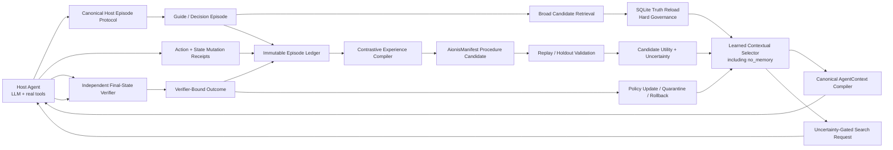

# Aionis Adaptive Execution Memory Correctness-Learning Implementation Plan

> **Execution note:** Implement this plan in phase order. Do not encode a target
> task, repository, benchmark item, package quirk, verifier answer, or fixed
> repair recipe in Runtime source. Every phase acceptance that exercises Agent
> behavior must use a real LLM, real tools, a real task environment, and a
> verifier bound to the exact final state. Deterministic contract checks must
> use real Runtime and SQLite implementations; mock LLMs, mock tool outcomes,
> mock verifiers, and synthetic success labels cannot satisfy a phase or
> product-effect gate.

**Goal:** Make Aionis learn from verified execution experience which memory,
procedure, or search intervention should influence a future Agent decision—or
when no memory should be used—so that held-out real-task verified correctness
improves over both a no-Aionis baseline and a continuity-only Aionis baseline.

**Product outcome:** Aionis remains an Execution Memory Runtime. It evolves from
state-preserving continuity plus fixed retrieval/governance into adaptive
Execution Memory that converts verified experience into reusable executable
capabilities and learns when each capability helps, harms, or should be
withheld.

**Architecture:** Keep one local TypeScript modular monolith, one SQLite
authority store, one canonical AgentContext pipeline, and one canonical Host
Episode Protocol. Keep semantic, lexical, structured, graph, ANN, and Substrate
retrieval as broad candidate generation. Add verifier-bound task reward,
complete intervention logging, a contrastive experience compiler, a
conservative contextual selector with an explicit no-memory arm, and automatic
candidate quarantine/rollback. Use AionisManifest as the executable procedure
contract rather than inventing a second skill format in Runtime.

**Tech stack:** TypeScript, Node.js 22/24, Fastify, Zod, `node:sqlite`, existing
Runtime ledger and product services, optional local ANN/zvec/Substrate candidate
providers, AionisManifest, the canonical Aionis SDK, real host adapters, real
LLM providers, executable task environments, and deterministic or independently
executed verifiers.

---

Status: proposed effect-first implementation plan; this document does not
authorize Runtime behavior changes by itself

Date: 2026-07-27

Scope owner: `AionisRuntime`

Supporting repositories:

- `AionisManifest`
- `aionis-sdk`
- `aionis-claude-code`
- `aionis-mcp`
- `AionisRuntime-evals`
- `AionisSubstrate` as an optional candidate/evidence backend only
- `aionis-aifs` as a read-only continuity/delivery surface only
- `aionis-cli` and `aionis-create` for installation and operator workflow only

## 1. Executive Decision

Aionis should continue.

The product should not be repositioned as a governance engine, a benchmark
runner, a general Agent framework, or another recall database. Its durable
identity remains Execution Memory.

The next product milestone is not another memory surface. It is one measurable
capability:

> After observing real verifier-bound execution outcomes, Aionis increases the
> probability that a future Agent completes a held-out real task correctly
> within a fixed budget.

The present Runtime already contains valuable foundations:

- execution continuity and resumable state;
- exact-task, task-family, workflow, and repository identity;
- immutable exposure, use, outcome, feedback, and effect evidence;
- lifecycle, authority, quarantine, controlled forgetting, and rehydration;
- semantic, lexical, structured, graph, ANN, and optional external candidate
  retrieval;
- Agent-facing `use_now`, `inspect_before_use`, `do_not_use`, and rehydrate
  surfaces;
- Manifest-compatible procedure and evidence concepts.

The missing correctness-learning kernel has three parts:

1. **Truth:** objective task reward bound to the exact final execution state.
2. **Credit:** a complete record of which intervention was available, selected,
   exposed, used, and followed by which outcome.
3. **Policy:** a learned state-to-intervention decision function with
   uncertainty, abstention, cost awareness, and negative-transfer control.

Until all three are connected, Aionis may preserve continuity or reduce unsafe
reuse, but it cannot truthfully claim that it automatically improves solving
correctness.

## 2. Plan-Creation Baseline

This plan was created against:

- repository: `/Volumes/ziel/new.aionis/AionisRuntime`
- branch: `product-main`
- HEAD: `6f3557014117af85c19f1589a48173e87bd84b70`
- package version: `0.3.12`
- source budget: 339 Runtime source files and 171,284 source lines
- Runtime-entry closure budget: 285 files and 140,330 lines
- product routes: 21
- environment schema fields: 177
- Runtime import cycles: 0

The working tree already contains owner changes in:

- `src/memory/agent-context-compiler.ts`
- `src/memory/agent-context-renderer.ts`
- `src/memory/governance-decision.ts`
- `src/memory/product-output/guide-packet.ts`
- `src/memory/product-output/memory-packet.ts`
- `src/sdk.ts`

Those changes refine current-state context, actionability, unresolved-state
verification, blocked/inspect/current precedence, and acceptance checks. They
sit directly beside the future selector and serving path.

Creating this plan does not authorize overwriting, stashing, resetting,
reformatting, or silently folding those changes into implementation. Phase 0
must review and preserve their intended behavior before any serving or SDK
contract is changed.

## 3. Current Runtime Truth

### 3.1 What currently changes a future Agent decision

The current product loop is approximately:

```text
host observe
-> SQLite and embedding write
-> static hybrid candidate retrieval
-> fixed governance and context compilation
-> external Agent execution
-> host-submitted used-memory/outcome/verifier fields
-> feedback posture or narrow tool-pattern update
-> next static recall and guide
```

Current behavior that can affect a later prompt includes:

- exact task, workflow, repository, and family continuity;
- fixed hybrid retrieval and graph propagation;
- hard lifecycle and authority boundaries;
- feedback-driven contested/candidate posture;
- narrow positive tool-pattern reuse;
- explicit archive, suppression, restoration, and rehydration.

These are real mechanisms, but they do not constitute a learned
correctness-maximizing policy.

### 3.2 The three empty algorithm positions

#### Objective reward is not connected

The present effect evaluator scores internal mechanism proxies such as context
precision, recovered facts, workflow reuse, promotions, and authority blocking.
Those remain useful diagnostics, but they are not equivalent to final task
correctness.

The Host can submit a verifier status and evidence digest, but Runtime generally
proves that the Host submitted a bound receipt; it does not independently prove
that the task truly succeeded. A final-state verifier contract must become the
reward authority.

#### Cross-episode credit is incomplete

The episode ledger can represent task identity, exposure, use, outcome, and
effect. Product integrations do not consistently populate that chain.

Today:

- SDK outcome feedback can disappear when `used_memory_ids` is empty;
- exposure-only ITT learning is therefore incomplete;
- adapters do not consistently bind verifier success to the final workspace or
  artifact state;
- a later mutation may leave an earlier successful validation semantically
  stale;
- current optional context can affect the Agent prompt without being represented
  as a learnable exposure.

#### The decision policy is fixed

The present next-memory and next-action selection is dominated by fixed source
weights, lexical overlap, fixed thresholds, fixed RRF, fixed graph propagation,
and fixed tool-template preference. Feedback mostly changes posture or blocks
future direct use. It does not train a contextual value model that predicts
which intervention will improve task success.

### 3.3 Disconnected or diagnostic-only learning surfaces

- The general learning loop exists as a kernel API but is not part of the
  daemon's normal product execution path.
- L1-to-L2 workflow promotion uses fixed observation/evidence gates and fixed
  confidence values.
- Pattern learning is narrow and mostly tool-template reuse.
- Association workers produce shadow candidates without a consumer that changes
  recall or Agent behavior.
- Fixed admission experiments and internal effect scores provide governance or
  research evidence, not a general solver-learning algorithm.
- L5 has schema/recognition concepts but no general writer or learned meta-policy.

### 3.4 Task-derived behavior in Core

Runtime currently includes benchmark- or engineering-task-derived behavior such
as:

- a synthetic focused execution tool registry;
- pytest/npm/pnpm/curl/pip/service command recognition;
- fixed task-family names for code/CI, external artifacts, database recovery,
  and service publication;
- fixed next-step templates for validation and repair workflows.

These paths must not be expanded. They may remain temporarily to preserve
current behavior, but they are replacement targets only after the general
compiler and learned selector pass real holdout gates.

## 4. Current Real-Evidence Baseline

The latest same-model, real-Runtime, real-embedding, real-repository,
independently verified Playwright repair cell produced:

| Arm | Steps | Total tokens | Final verifier result |
|---|---:|---:|---|
| Aionis | 30 | 522,148 | failed |
| No memory | 30 | 439,625 | failed |
| Full history | 27 | 826,210 | failed |

In the Aionis arm:

- the Agent reached a concrete edit substantially earlier;
- final completion was correctly rejected;
- `actionable_history_used` was false;
- `use_now` was empty;
- the learned-history path did not execute.

This is one diagnostic task, not a statistical product result. It supports only
the following current claim:

> Aionis continuity can expose the current work state and preserve truthful
> completion boundaries, but the current adaptive-learning path has not yet
> demonstrated higher task correctness or token efficiency.

Raw evidence:

- `/Volumes/ziel/aionis-truth-runs/playwright-sync-hooks-aionis-live-governed-20260727-v1/summary.json`
- `/Volumes/ziel/aionis-truth-runs/playwright-sync-hooks-aionis-live-governed-20260727-v1/verification/aionis/verification-report.json`
- `/Volumes/ziel/aionis-truth-runs/playwright-sync-hooks-live-harness-baselines-20260727-v1/summary.json`

These artifacts are a Phase 0 diagnostic baseline. They are not the
correctness-learning benchmark defined later in this plan.

## 5. Problem Definition

### 5.1 Product problem

For a host Agent operating on a real task, Aionis must decide:

1. which historical evidence is relevant;
2. whether any relevant evidence is trustworthy and applicable now;
3. whether to provide current state only, an episodic case, an executable
   procedure, or no memory;
4. whether uncertainty justifies additional diagnosis, verification, or search;
5. whether an intervention improved or harmed the final verified outcome;
6. how that evidence should update future decisions without overfitting one
   task.

### 5.2 Formal learning target

For task state \(x\), intervention \(a\), model/environment \(m\), and budget
\(b\), learn a policy that approximately maximizes:

```text
expected verified correctness
- lambda_token * token cost
- lambda_latency * latency
- lambda_harm * negative-transfer risk
- lambda_uncertainty * verifier/decision uncertainty
```

The primary product objective is verified correctness. Token, latency, and
harm are explicit secondary costs; they must never be mixed into the truth label
itself.

### 5.3 What “automatically improves correctness” means

It does not mean:

- the base model's weights necessarily change;
- every task improves;
- the LLM can declare its own reflection correct;
- more memory is always better;
- a successful task proves every exposed memory caused success;
- a fixed benchmark skill is promoted into Runtime source.

It means:

- after verified episodes accumulate, the adaptive arm's held-out
  `verified pass@budget` rises relative to a frozen continuity-only arm;
- the improvement transfers beyond exact replay;
- harmful interventions are detected, withheld, quarantined, or rolled back;
- the effect persists across predeclared task families and more than one model;
- cost per verified success remains bounded.

## 6. Product Hypotheses

### H1: Truth-bound episodes are learnable

When every task outcome is bound to the exact final workspace, artifact, or
environment state and an independent verifier, successful and failed execution
episodes form a reliable training/evaluation substrate.

### H2: Procedural experience transfers better than free-form tips

An executable procedure with applicability, non-applicability, preconditions,
postconditions, verifier, source evidence, counterexamples, and rollback will
transfer more reliably than a free-form summary or reflection.

### H3: Selection is more important than retrieval alone

A learned selector that includes `no_memory` and `current_state_only` arms will
outperform always injecting the most similar memory because static or
misapplied skills can increase tokens and cause negative transfer.

### H4: Failure-success contrast improves diagnosis

Comparing structurally similar successful and failed episodes will produce
better procedure candidates than summarizing a successful trace in isolation.

### H5: Uncertainty-gated search converts compute into future skill

For high-uncertainty, high-value tasks, bounded verifier-guided search can
increase immediate correctness. Compiling the verified winning branch into a
procedure candidate should reduce repeated search cost on later related tasks.

### H6: Non-parametric learning should precede model training

A reversible Runtime policy and executable skill memory should produce
measurable held-out gains before Aionis exports traces for SFT, process-reward,
or reinforcement learning.

## 7. Functional Requirements

### FR-1: Canonical Host Episode Protocol

One high-level SDK protocol must represent:

```text
begin episode
-> request decision/context
-> record actions and state mutations
-> record exact verifier receipt
-> close episode
```

All official adapters use the same protocol and canonical workspace identity.

### FR-2: Exact final-state reward

A positive primary reward requires:

- exact task/run/episode identity;
- exact final workspace, artifact, database, or environment digest;
- verifier kind, version, configuration digest, and evidence digest;
- verifier execution status and final result;
- no mutation after the verified state;
- no provider/protocol-only signal masquerading as task success.

### FR-3: Complete decision exposure

Every decision episode records:

- all eligible candidates;
- candidate source and feature vector;
- hard-boundary exclusions;
- selected intervention;
- Agent-visible surface;
- prompt inclusion;
- policy identifier/version;
- selection probability or propensity;
- token budget and rendered token estimate;
- optional context and state-only context as first-class interventions.

### FR-4: Exposure-level outcome

The product must preserve an intention-to-treat outcome even when actual use is
unknown or empty. Actual-use attribution is recorded separately and may refine
diagnostics; it cannot be required for the primary policy reward.

### FR-5: Contrastive procedure candidates

A procedure candidate may be generated only from real episodes. It must retain
the differences between supporting success and relevant failures, plus the
evidence that justifies each step and boundary.

### FR-6: Executable Manifest procedure

The candidate procedure format must support:

- inputs and environment requirements;
- applicability and non-applicability;
- preconditions;
- ordered or partially ordered actions;
- expected state transitions;
- postconditions and acceptance checks;
- exact verifier contract;
- source episodes and evidence;
- counterexamples and known failure modes;
- model/environment compatibility;
- version, supersession, quarantine, and rollback.

### FR-7: Learned intervention selector

The selector must choose among at least:

- `no_memory`;
- `current_state_only`;
- `episodic_case`;
- `verified_procedure`;
- `search_or_verify_escalation`.

It must support abstention, uncertainty, cost, policy versioning, and replay.

### FR-8: Conservative online update

Online evidence may update a candidate or selector posterior without changing
Runtime source. Weak, missing, or contaminated evidence cannot create broad
authority.

### FR-9: Automatic harm response

Strong negative verified evidence must be able to:

- lower estimated utility;
- stop direct serving;
- move a candidate to inspect-only or quarantine;
- preserve counter-evidence;
- trigger re-evaluation;
- roll back to the last known policy version.

### FR-10: Cross-scope generalization

The system distinguishes:

- exact-task replay;
- task-family transfer;
- repository transfer;
- ecosystem transfer;
- cross-model transfer;
- global behavior.

Evidence for one level cannot silently authorize a wider level.

### FR-11: Reproducible policy evaluation

Every policy decision and update can be replayed from:

- immutable episode records;
- canonical features;
- candidate snapshots;
- policy artifact and configuration digest;
- logged propensity;
- verifier-bound outcomes.

### FR-12: No second decision brain

Runtime is the only learning and intervention authority. SDK, Claude/MCP
adapters, Manifest, Substrate, AIFS, CLI, and Create may collect, execute,
store, or deliver data, but they cannot implement a competing final selection
policy.

## 8. Non-Functional Requirements

### 8.1 Correctness and evidence integrity

- Primary positive labels require final-state verifier binding.
- Episode, decision, action, mutation, verifier, and close records are
  immutable or append-only.
- Exact retry returns the same identity; conflicting retry fails closed.
- Missing reward remains missing, not negative.
- Outcome contamination is explicit and excluded from promotion/effect claims.
- A policy artifact must be replayable against its recorded feature schema.

### 8.2 Generalization

- No project name, repository path, package quirk, test answer, or task-family
  solution may enter Core selection logic.
- Candidate scope begins at the narrowest valid level.
- Wider serving requires distinct-task or holdout evidence.
- Exact replay, family transfer, and cross-repository transfer are reported
  separately.

### 8.3 Runtime cost

- Candidate retrieval may remain broad, but final Agent-facing selection is
  token-budgeted.
- The learned selector should add no network call in the normal decision path.
- Initial local selector inference target: less than 10 ms p95 excluding
  embedding/candidate retrieval.
- Additional Agent-context tokens are measured per decision and per verified
  success.
- Uncertainty-gated search has an explicit per-task compute budget and remains
  off for low-value or low-uncertainty decisions.

### 8.4 Reliability

- SQLite remains the authority store.
- ANN, zvec, and Substrate remain candidate providers only.
- A selector or compiler failure falls back to the last validated policy and
  current continuity behavior.
- Policy update, candidate lifecycle transition, and evidence linkage are
  atomic where they share one Runtime decision.
- Restart and replay cannot duplicate reward or apply one outcome twice.

### 8.5 Maintainability

- Keep the modular monolith; do not introduce microservices or a broker.
- Add no parallel AgentContext compiler.
- Add no parallel HTTP route family for learning experiments.
- Replace fixed decision paths after measured parity/effect rather than keeping
  permanent dual implementations.
- New effect-path code must be offset by removal of replaced fixed policy,
  synthetic registry, or dormant research-path code before the final phase.

### 8.6 Product truthfulness

- Internal mechanism scores remain diagnostics.
- `verified pass@budget` is the primary correctness outcome.
- No benchmark result is generalized beyond its frozen model/task/environment
  population.
- No one-task result is used as a product-effect claim.
- No mock, fixture label, static contract test, or LLM judge alone counts as
  evidence of improved correctness.

## 9. Capability Invariants

Every implementation phase must preserve:

### 9.1 Execution continuity

- current state, accepted route, failed branches, unresolved decisions,
  acceptance checks, target files, and next admissible action remain recoverable;
- exact task/workflow evidence stays stronger than family similarity;
- handoff remains isolated by tenant, scope, owner, team, and task;
- current-state context is not falsely presented as a verified executable
  instruction.

### 9.2 Memory truth and lifecycle

- SQLite is authoritative;
- external/ANN candidates are reloaded and adjudicated before use;
- failed evidence cannot become stable positive authority;
- suppression, archive, restore, rehydrate, supersession, and counter-evidence
  remain reversible and auditable.

### 9.3 Agent context

- one canonical governance decision feeds one canonical AgentContext compiler;
- `use_now`, `inspect_before_use`, `do_not_use`, optional current state, and
  rehydrate remain semantically distinct;
- raw traces, operator packets, candidate internals, policy features, and
  outcome labels remain outside the default Agent prompt.

### 9.4 Learning

- project experience changes runtime memory and learned policy artifacts, not
  Runtime source;
- an LLM may propose a semantic/procedural candidate but cannot certify it;
- candidate generation, validation, serving, and authority remain distinct;
- `no_memory` is always a valid intervention;
- counter-evidence can lower or remove authority;
- exact-task success alone cannot authorize global behavior.

## 10. Non-Goals

This plan does not:

- redesign Aionis as a general Agent framework;
- replace the base model or claim to create new base-model knowledge;
- build a model router, dashboard, cloud control plane, marketplace, or HA
  platform;
- add task-specific source rules;
- add benchmark-specific tools to Runtime Core;
- treat ANN similarity as learning;
- treat an LLM reflection as verified skill;
- require automatic model fine-tuning;
- enable unverified automatic authority;
- make governance the product headline;
- expand routes, environment fields, or deployment machinery for their own
  sake;
- prioritize GitHub, CI orchestration, release packaging, or publication over
  the real product-effect loop;
- remove current working capabilities before the replacement path passes real
  parity and effectiveness gates.

## 11. Relationship to Existing Plans and Contracts

This is the single master plan for correctness-learning. It extends existing
assets; it does not create another parallel learning architecture.

### 11.1 Learning episode ledger

Inherited:

- append-only evidence;
- stable task/run/episode identity;
- exposure/use/outcome/effect linkage;
- deterministic assignment and replay;
- operation-id and transaction invariants;
- per-memory evidence and counter-evidence.

Not inherited as universal product policy:

- fixed 384-pair experiment sizes;
- fixed 768-namespace designs;
- fixed 96/96/192 activation waves;
- any single statistical protocol hard-coded as the only learning algorithm.

Those values may describe one versioned experiment. They must not define
general online selection behavior.

### 11.2 Trace-derived skill memory

Inherited:

- candidates are not automatically trusted memory;
- procedure evidence, applicability, acceptance, counterexamples, and source
  traces;
- explicit candidate/review/materialization separation;
- normal admission and lifecycle boundaries.

Extended:

- automatic candidate generation from verified episodes;
- automatic executable replay and holdout verification;
- conservative evidence-backed experimental serving;
- learned utility and automatic quarantine.

Still prohibited:

- unverified automatic authority;
- direct prompt injection of raw candidates;
- treating operator approval as correctness evidence.

### 11.3 Ordinary recall and ANN roadmaps

Semantic, lexical, structured, graph, ANN, zvec, and Substrate retrieval remain
candidate-generation layers. They do not determine final use. Fixed RRF or
similarity remains a baseline and fallback, not the learned decision policy.

### 11.4 Breakthrough evidence roadmap

Historical continuity, route-safety, compression, and admission evidence remain
valid within their frozen evaluations. This plan changes the primary learning
outcome to real verifier-bound `pass@budget` and isolates continuity value from
learning value with a three-arm design.

### 11.5 Runtime complexity reduction

Inherited:

- modular monolith;
- one SQLite authority;
- one canonical decision and AgentContext pipeline;
- no internal route-to-route composition;
- no second authority database;
- downward replacement of duplicate or dormant paths.

### 11.6 Learning-control principles

The prohibition on task-specific Core rules remains binding. One task can
produce local memory or expose a general mechanism defect. It cannot directly
write its solution into Runtime source.

### 11.7 Product positioning

The current public positioning remains unchanged while this plan is being
implemented. “Adaptive Execution Memory” becomes a validated product claim only
after the real three-arm gate passes. Until then, it is the target architecture,
not a released effect claim.

## 12. Research Basis

This plan adopts the following evidence-supported principles:

1. Episodic reflection can improve retry, but free-form self-reflection without
   external feedback is unreliable.
2. Successful and failed trajectory contrast is more useful than isolated
   success summarization.
3. Verified executable skills transfer more reliably than static prose tips.
4. Static skill injection often provides little gain, increases tokens, and can
   cause negative transfer.
5. External tools, hidden tests, and executable verifiers are more reliable
   truth sources than intrinsic LLM judgment.
6. Test-time search can improve hard-task correctness but is expensive and must
   be selectively invoked.
7. Logged propensities, conservative contextual bandits, and doubly robust
   evaluation provide an appropriate first policy-learning layer.
8. Parameter training is a slower, less reversible layer and should follow
   verified non-parametric gains.

The practical synthesis is:

```text
verified episode
-> contrastive procedure candidate
-> executable validation
-> conservative contextual selection including abstention
-> exact task reward
-> posterior update
-> promote, revise, quarantine, forget, or roll back
```

## 13. Target Product Architecture



### 13.1 Component ownership

| Component | Correctness-learning responsibility | Explicit non-responsibility |
|---|---|---|
| Runtime | Evidence authority, candidate adjudication, selector, policy update, candidate lifecycle, rollback | Does not execute arbitrary host tools or become a general Agent framework |
| Canonical SDK | Host Episode Protocol, identity, automatic instrumentation, exact contract transport | Does not own a second selector |
| Claude Code adapter | Real prompt/tool/edit/validation episode collection | Does not infer success from old validation or file-touch heuristics |
| MCP adapter | Exposes the same canonical SDK episode flow | Does not implement trace-id-only feedback semantics that diverge from SDK |
| AionisManifest | Executable procedure, input/output/evidence/verifier/rollback contract | Does not decide candidate authority |
| Substrate | Optional candidate/evidence storage and retrieval | Does not become Runtime truth or a second learning brain |
| AIFS | Read-only continuity and state delivery | Does not mutate selector policy |
| CLI/Create | Install, configure, inspect, and launch | Does not embed correctness-learning rules |
| Evals | Real tasks, real models, frozen arms, verifier execution, statistical reports | Does not patch Runtime to make a task pass |

### 13.2 Authority ownership matrix

The generic execution stream and existing learning/product records are linked
projections, not competing sources of truth:

| Fact | Sole authority | Other records may contain |
|---|---|---|
| task/run/episode start and initial state | generic execution episode stream | stable foreign key/digest only |
| Agent action order and state transitions | generic execution episode stream | referenced action IDs |
| final-state verifier invocation and receipt | generic execution episode stream | verifier receipt ID/digest |
| episode close and eligible task reward | generic execution episode stream | reward ID/digest |
| exact guide response and rendered AgentContext | guide receipt | guide trace ID/digest |
| experiment assignment, candidate exposure, memory/tool attribution | existing learning ledger | execution episode/decision foreign keys |
| memory posture mutation | lifecycle/feedback authority rows | source feedback/reward references |
| operational continuity/context/reuse diagnostics | measurement records | episode/reward references |
| selector parameters and policy activation | policy artifact store | training cutoff/dataset references |
| procedure hypothesis/capability content | candidate/capability store plus Manifest artifact | source episode references |

No service may independently restate a different final success value. Learning
and measurement records join the generic execution reward by ID; they do not
own or override it.

### 13.3 Online path

The normal online path must remain local and bounded:

```text
guide request
-> retrieve broad candidates
-> reload SQLite truth
-> apply hard lifecycle/authority boundaries
-> compute canonical features
-> at the episode's first eligible decision, freeze one treatment assignment;
   later guides reuse that assignment and cannot choose a new learned treatment
-> compile one AgentContext
-> persist decision exposure and propensity
-> return context
```

No LLM call is required to rank candidates on the normal path.

### 13.4 Asynchronous learning path

Candidate compilation, replay, holdout validation, and expensive policy
evaluation run outside the latency-sensitive guide transaction:

```text
closed verifier-bound episodes
-> candidate mining
-> contrastive LLM proposal
-> deterministic validation
-> policy artifact update proposal
-> atomic activation or rejection
```

The asynchronous path may fail without blocking continuity. It cannot silently
activate an unvalidated policy.

## 14. L0–L5 Learned Memory Model

The existing layer taxonomy is retained but made operational:

| Layer | Target meaning | Authority and use |
|---|---|---|
| L0 | Immutable raw events, tool outputs, diffs, environment state, verifier evidence | Evidence only; never direct instruction by itself |
| L1 | Verified episode capsule: state, intervention, actions, final state, outcome | Episodic retrieval and training/evaluation input |
| L2 | Contrastively induced procedure candidate | Candidate only; not direct authority |
| L3 | Executably validated Manifest capability | Eligible for conservative experimental serving within proven scope |
| L4 | Learned contextual value/selection memory | Predicts use/no-use/escalation utility with uncertainty |
| L5 | Meta-policy for retrieve, abstain, search, budget, forget, and roll back | Versioned policy; only after broader evidence |

### 14.1 L0 requirements

L0 stores facts that later abstraction cannot rewrite:

- exact tool request and result digest;
- workspace/artifact/environment state digest before and after mutation;
- process exit status;
- verifier stdout/stderr or evidence bundle digest;
- model/provider/protocol identity;
- prompt and token accounting;
- contamination and infrastructure-failure classification.

### 14.2 L1 requirements

An L1 episode must answer:

- what task state existed;
- what alternatives were available;
- what intervention Aionis selected;
- what the Agent actually saw;
- what the Agent did;
- what state changed;
- what exact verifier ran;
- whether the task passed;
- what evidence was missing or contaminated.

### 14.3 L2 requirements

An L2 candidate contains a hypothesis, not a truth:

- minimal reusable procedure;
- supporting success episodes;
- contrast failures;
- inferred applicability and non-applicability;
- proposed preconditions, actions, postconditions, and verifier;
- evidence confidence and unresolved assumptions.

### 14.4 L3 requirements

An L3 capability requires:

- executable Manifest;
- replay success;
- at least one distinct-task or holdout validation for family-wide serving;
- exact verifier evidence;
- negative-transfer evaluation;
- version, scope, rollback target, and expiry/revalidation condition.

### 14.5 L4 requirements

L4 is not another prose memory. It is a policy artifact containing:

- feature schema/version;
- arm/candidate identities;
- estimated utility and uncertainty;
- task/model/environment scope;
- cost estimates;
- update history and supporting episode cutoffs;
- activation, shadow, quarantine, and rollback state.

### 14.6 L5 requirements

L5 controls:

- whether retrieval is worth its token cost;
- whether current state alone is enough;
- whether evidence uncertainty requires inspection;
- whether bounded search is justified;
- when to request stronger verification;
- when to stop exploring;
- when drift requires revalidation;
- when a candidate or policy should be retired or forgotten.

No L5 behavior is released before L4 produces reproducible held-out benefit.

## 15. Canonical Data and Decision Contracts

Exact names may reuse existing ledger contracts. The semantics below are
required even if the implementation extends current v1 records rather than
introducing new tables.

### 15.0 Content-addressed evidence and state snapshots

Digests prove identity but cannot reconstruct an episode. Every replay-bearing
digest must have a resolvable content-addressed reference retained under the
episode's data policy:

```ts
type EvidenceArtifactRefV1 = {
  artifact_id: string;
  kind:
    | "state_snapshot"
    | "feature_vector"
    | "prompt"
    | "tool_request"
    | "tool_result"
    | "workspace_diff"
    | "verifier_input"
    | "verifier_output"
    | "candidate_set"
    | "training_dataset"
    | "policy_parameters"
    | "policy_calibration"
    | "procedure_candidate"
    | "manifest";
  sha256: string;
  storage_ref: string;
  byte_length: number;
  media_type: string;
  encoding: string;
  redaction_policy: string;
  retention_policy: string;
};
```

Hosts never choose `artifact_id` or `storage_ref`. They submit bytes through a
bounded ingest contract:

```ts
type EvidenceArtifactInputV1 = {
  kind: EvidenceArtifactRefV1["kind"];
  declared_sha256: string;
  declared_byte_length: number;
  media_type: string;
  encoding: string;
  ingest:
    | { mode: "bounded_inline_base64"; data: string }
    | {
        mode: "finalized_runtime_upload";
        upload_id: string;
        finalize_receipt_digest: string;
      };
};
```

For inline evidence, Runtime decodes, bounds, hashes, and writes the content.
For larger evidence, SDK uses explicit artifact-ingest branches of the existing
observe transport:

```ts
type ArtifactUploadStartV1 = {
  operation_id: string;
  episode_id: string;
  kind: EvidenceArtifactRefV1["kind"];
  declared_sha256: string;
  declared_byte_length: number;
  media_type: string;
  encoding: string;
  redaction_policy: string;
  retention_policy: string;
};

type ArtifactUploadStartReceiptV1 = {
  upload_id: string;
  expires_at: string;
  max_chunk_bytes: number;
};

type ArtifactUploadChunkV1 = {
  operation_id: string;
  upload_id: string;
  sequence: number;
  byte_offset: number;
  data_base64: string;
  chunk_sha256: string;
};

type ArtifactUploadFinalizeV1 = {
  operation_id: string;
  upload_id: string;
  expected_chunk_count: number;
  declared_sha256: string;
  declared_byte_length: number;
};

type ArtifactUploadAbortV1 = {
  operation_id: string;
  upload_id: string;
  reason: string;
};
```

Runtime mints the upload ID. Chunk retry with the same operation ID and bytes is
idempotent; a conflicting retry, gap, overlap, wrong offset, wrong chunk digest,
wrong final digest, wrong total length, expired upload, or cross-episode use
fails. Finalize atomically seals the object and returns the server-owned
`EvidenceArtifactRefV1` plus `finalize_receipt_digest`; only then may an episode
event reference it. Abort or expiry makes it unreferenceable, and bounded
cleanup removes its uncommitted chunks. Runtime never dereferences an arbitrary
Host path or accepts a Host-selected storage reference.

`storage_ref` may resolve to the existing SQLite/anchor payload path or another
Runtime-owned local content-addressed artifact store. Substrate/AIFS may mirror
or retrieve artifacts but cannot become truth authority.

The first implementation must name one authoritative local artifact adapter,
write artifact content before committing the referencing event, verify digest
and length on read, and garbage-collect only after every referencing retention
policy permits it. A crash may leave an unreferenced artifact for later cleanup;
it must never leave a committed replay-eligible event pointing to missing
content.

State identity uses a versioned canonical algorithm:

```ts
type StateSnapshotV1 = {
  snapshot_id: string;
  algorithm_id: string;
  algorithm_version: string;
  state_kind: "workspace" | "artifact" | "database" | "service" | "data";
  environment_digest: string;
  content_digest: string;
  artifact_ref: EvidenceArtifactRefV1;
  captured_at: string;
};
```

Replay-eligible episodes require resolvable state, feature, action, result, and
verifier evidence. A digest without retained content may remain an integrity
receipt but is ineligible for compiler training or replay claims.

### 15.1 `DecisionEpisodeV1`

```ts
type DecisionEpisodeV1 = {
  episode_id: string;
  tenant_id: string;
  public_scope: PublicScope;
  store_scope: StoreScope;
  task_id: string;
  task_envelope_digest: string;
  task_envelope_ref: EvidenceArtifactRefV1;
  task_cluster_id: string;
  task_cluster_policy_version: string;
  run_id: string;
  model_id: string;
  model_config_digest: string;
  environment_digest: string;
  initial_state_snapshot_id: string;
  budget: {
    max_steps: number;
    max_tokens: number;
    max_cost_micros?: number;
    deadline_ms?: number;
  };
  opened_at: string;
  closed_at?: string;
};
```

`PublicScope` and `StoreScope` reuse the existing branded Runtime contracts.
Adapters do not invent their own scope string. `task_cluster_id` is produced by
a versioned Runtime/evaluator clustering policy from the canonical Host task
envelope; a Host-provided label is evidence, not authority.

### 15.2 `EpisodeTreatmentAssignmentV1`

The first selector assigns one treatment to one episode:

```ts
type EpisodeTreatmentAssignmentBaseV1 = {
  assignment_id: string;
  episode_id: string;
  assignment_unit_kind: "episode";
  assignment_unit_id: string;
  eligible_arm_ids: string[];
  selected_arm_id: string;
  selected_candidate_ids: string[];
  policy_id: string;
  policy_version: string;
  assignment_input_digest: string;
  frozen_at: string;
};

type EpisodeTreatmentAssignmentV1 =
  | (EpisodeTreatmentAssignmentBaseV1 & {
      assignment_owner:
        | "none"
        | "admission_gate_v1"
        | "correctness_selector_v1";
      assignment_mode: "deterministic";
      causal_eligibility: "ineligible_deterministic";
      propensity_by_arm: Record<string, 0 | 1>;
      selected_propensity: 1;
    })
  | (EpisodeTreatmentAssignmentBaseV1 & {
      assignment_owner: "admission_gate_v1" | "correctness_selector_v1";
      assignment_mode: "randomized";
      causal_eligibility: "eligible_randomized";
      propensity_by_arm: Record<string, number>;
      selected_propensity: number;
      randomization_algorithm: string;
      random_draw_hex: string;
      random_draw_digest: string;
    });
```

The propensity map must cover every eligible arm and sum to one. Owner and mode
are orthogonal: the existing admission gate's `fixed_non_randomized_v1` remains
an admission-owned deterministic assignment rather than being relabeled
ownerless or randomized. Any deterministic assignment has no fabricated random
draw and is causally ineligible for randomized effect estimation. A randomized
assignment stores the canonical random draw needed for replay, while its digest
binds the assignment receipt. Every assignment is immutable, unique by episode,
and created before any outcome. Every guide exposure references it; later guide
calls cannot redraw it.

### 15.3 `DecisionCandidateV1`

```ts
type DecisionCandidateV1 = {
  candidate_id: string;
  candidate_kind:
    | "no_memory"
    | "current_state_only"
    | "episodic_case"
    | "verified_procedure"
    | "search_or_verify_escalation";
  source_refs: string[];
  feature_schema_version: string;
  feature_vector_digest: string;
  feature_vector_ref: EvidenceArtifactRefV1;
  estimated_prompt_tokens: number;
  hard_boundary_status: "eligible" | "ineligible";
  hard_boundary_reasons: string[];
};
```

`no_memory` and `current_state_only` are explicit candidates, not absence of a
record.

### 15.4 `DecisionExposureV1`

```ts
type DecisionExposureV1 = {
  episode_id: string;
  decision_id: string;
  treatment_assignment_id: string;
  candidate_set_digest: string;
  candidate_set_ref: EvidenceArtifactRefV1;
  selected_candidate_ids: string[];
  delivered_candidate_ids: string[];
  selected_intervention: DecisionCandidateV1["candidate_kind"];
  delivery_status:
    | "delivered_as_assigned"
    | "withheld_hard_ineligible"
    | "withheld_quarantined"
    | "state_only_fallback"
    | "no_memory_fallback";
  delivery_deviation_reasons: string[];
  policy_id: string;
  policy_version: string;
  policy_artifact_digest: string;
  surface:
    | "none"
    | "current_state"
    | "use_now"
    | "inspect_before_use"
    | "optional_context"
    | "search_request";
  prompt_included: boolean;
  prompt_digest?: string;
  prompt_ref?: EvidenceArtifactRefV1;
  rendered_token_count: number;
  created_at: string;
};
```

`optional_context` must be represented in exposure and feedback projection.
Before every later guide, Runtime re-runs hard eligibility and lifecycle truth.
If the frozen candidate has become ineligible or quarantined, Runtime must not
serve it and must not redraw the assignment. It records the safe fallback as an
assignment-delivery deviation, preserves the original ITT assignment, and
keeps assigned-versus-delivered identities separate for diagnostics.

### 15.5 `ActionMutationReceiptV1`

```ts
type ActionMutationReceiptV1 = {
  episode_id: string;
  action_id: string;
  sequence: number;
  action_kind: string;
  tool_name?: string;
  request_digest: string;
  request_ref: EvidenceArtifactRefV1;
  result_digest: string;
  result_ref: EvidenceArtifactRefV1;
  state_before_snapshot_id: string;
  state_after_snapshot_id: string;
  mutation: boolean;
  occurred_at: string;
};
```

Any receipt with `mutation: true` invalidates a verifier receipt for a previous
state digest.

### 15.6 `VerifierOutcomeReceiptV1`

```ts
type VerifierOutcomeReceiptV1 = {
  verifier_receipt_id: string;
  episode_id: string;
  verifier_kind:
    | "hidden_test"
    | "environment_assertion"
    | "database_constraint"
    | "independent_executable"
    | "process_verifier"
    | "llm_judge_diagnostic";
  verifier_version: string;
  verifier_issuer_id: string;
  verifier_runner_instance_id: string;
  verifier_invocation_id: string;
  attestation:
    | {
        kind: "runtime_launched";
        runtime_launch_receipt_digest: string;
      }
    | {
        kind: "trusted_runner_signature";
        principal_id: string;
        key_id: string;
        signed_payload_digest: string;
        signature: string;
      };
  verifier_program_digest: string;
  verifier_config_digest: string;
  verifier_environment_digest: string;
  verified_state_snapshot_id: string;
  verified_state_snapshot_algorithm_version: string;
  verifier_input_ref: EvidenceArtifactRefV1;
  verifier_output_ref: EvidenceArtifactRefV1;
  evidence_digest: string;
  execution_exit_code: number | null;
  status: "passed" | "failed" | "infrastructure_error" | "inconclusive";
  completed_at: string;
};
```

`llm_judge_diagnostic` can never create the primary positive reward by itself.
Neither can a Host-populated issuer/runner string. Runtime accepts a primary
reward only when it launched the verifier through its configured runner
boundary or validated a signature from a preconfigured verifier principal over
the canonical invocation, exact state, verifier program/configuration/environment,
input/output, and result payload. The Host may transport the receipt but cannot
mint a trusted verifier principal.

### 15.7 `EpisodeRewardV1`

```ts
type EpisodeRewardV1 = {
  reward_id: string;
  episode_id: string;
  reward_contract_version: string;
  verified_success: 0 | 1 | null;
  outcome_class:
    | "verified_pass"
    | "verified_failure"
    | "arm_caused_incomplete"
    | "arm_independent_infrastructure"
    | "diagnostic_only";
  reward_authority:
    | "deterministic"
    | "independent_executable"
    | "process"
    | "protocol_itt_failure"
    | "diagnostic_only"
    | "missing";
  final_state_snapshot_id?: string;
  verifier_receipt_id?: string;
  token_count: number;
  tool_call_count: number;
  elapsed_ms: number;
  outcome_reasons: string[];
  contamination_reasons: string[];
};
```

The selector trains on `verified_success` only when it is non-null and the
reward authority is eligible. Verifier pass is `1`; verifier failure is `0`.
An arm-caused crash, timeout, cancellation, or missing verifier is
`0 + protocol_itt_failure`. Only an independently attributed, arm-blind
infrastructure failure is `null + missing`; a Host enum alone cannot mint that
exception. LLM-judge-only outcomes are `null + diagnostic_only`. Negative
transfer is derived only from paired or randomized comparison outcomes; it is
not a property declared by one episode.

`outcome_reasons` records timeout, cancellation, verifier failure, or the
independently attributed infrastructure condition. `contamination_reasons`
records protocol contamination only. Selector eligibility always requires an
empty contamination list, including for `protocol_itt_failure`.
The close event owns the canonical reward payload and digest; learning,
measurement, and lifecycle projections reference `reward_id` and that digest
instead of restating success independently.

### 15.8 `ProcedureHypothesisV1` and `ValidatedCapabilityV1`

Phase 3 persists an L2 hypothesis before a Manifest exists:

```ts
type ProcedureHypothesisV1 = {
  candidate_id: string;
  candidate_payload_ref: EvidenceArtifactRefV1;
  scope: "exact_task" | "task_family" | "repository" | "ecosystem" | "global";
  source_success_episode_ids: string[];
  source_failure_episode_ids: string[];
  applicability: string[];
  non_applicability: string[];
  counterexamples: string[];
  required_verifier: {
    kind: string;
    version: string;
    config_digest: string;
  };
  model_environment_compatibility: string[];
  status: "candidate" | "rejected" | "quarantined";
  supersedes_candidate_id?: string;
};
```

Phase 4 creates an L3 capability only after producing and executing a Manifest:

```ts
type ValidatedCapabilityV1 = {
  capability_id: string;
  source_candidate_id: string;
  manifest_digest: string;
  manifest_ref: EvidenceArtifactRefV1;
  validation_episode_ids: string[];
  negative_neighbor_episode_ids: string[];
  validated_scope:
    | "exact_task"
    | "task_family"
    | "repository"
    | "ecosystem"
    | "global";
  status:
    | "replay_validated"
    | "shadow"
    | "experimental"
    | "stable"
    | "quarantined"
    | "retired";
  rollback_capability_id?: string;
};
```

### 15.9 `SelectorPolicyArtifactV1`

```ts
type SelectorPolicyArtifactV1 = {
  policy_id: string;
  policy_version: string;
  feature_schema_version: string;
  algorithm:
    | "fixed_baseline"
    | "contextual_logistic_thompson"
    | "offline_candidate";
  training_cutoff_global_event_rowid: number;
  training_episode_set_digest: string;
  training_dataset_digest: string;
  training_dataset_ref: EvidenceArtifactRefV1;
  parameters_digest: string;
  parameters_ref: EvidenceArtifactRefV1;
  calibration_digest: string;
  calibration_ref: EvidenceArtifactRefV1;
  supported_candidate_kinds: string[];
  scope: string;
  status: "shadow" | "experimental" | "active" | "quarantined" | "retired";
  previous_policy_version?: string;
};
```

## 16. Canonical Host Episode Protocol

The official SDK exposes one opinionated flow:

```ts
const episode = await aionis.execution.beginEpisode({
  task,
  workspace,
  model,
  budget,
});

const decision = await episode.guide({
  current_state,
  query,
});

await host.runAgent(decision.agent_prompt, {
  onToolResult: episode.recordAction,
  onStateMutation: episode.recordMutation,
});

const verifierReceipt = await episode.runVerifier({
  verifier,
  expected_current_state_snapshot_id: episode.currentStateSnapshotId,
});

const result = await episode.close({ verifier_receipt_id: verifierReceipt.verifier_receipt_id });
```

### 16.1 Required behavior

- `beginEpisode` creates a stable episode/task/run identity.
- the first eligible `guide` records the full candidate set and freezes the
  episode treatment before returning context;
- later `guide` calls record exposure under that same treatment and cannot
  select another learned candidate in v1;
- SDK automatically records prompt inclusion; the Host does not re-declare it.
- tool and state-mutation receipts are ordered and idempotent.
- every mutation updates the current state digest.
- Runtime persists an immutable verifier invocation before launching the real
  verifier outside the SQLite transaction, then persists its directly captured
  output and state in a later transaction.
- verifier success must bind the current final state digest.
- `close` rejects stale verifier receipts.
- closing with no actual-use evidence still records the exposure-level ITT
  outcome.
- arm-caused crash, timeout, cancellation, or missing verifier closes as
  `protocol_itt_failure`; only independently attributed arm-blind
  infrastructure failure is inconclusive/missing.
- duplicate close is idempotent; conflicting close fails.

### 16.2 Canonical identity

All adapters derive the same:

- workspace identity;
- repository identity;
- task identity;
- task-cluster identity;
- model/configuration identity;
- final state digest.

Scope mismatches across SDK, MCP, Claude Code, Runtime, AIFS, or Substrate must
fail visibly rather than create split memories.

### 16.3 Adapter requirements

#### Claude Code

- every edit invalidates previous successful validation;
- SessionEnd cannot infer success from “files touched” plus any earlier
  validation command;
- success requires a verifier receipt for the exact final state;
- prompt exposure and tool/action sequence are recorded automatically.

#### MCP

- no trace-id-only shortcut that cannot satisfy canonical SDK attribution;
- context, action, feedback, and verifier closure use the same episode identity;
- `feedback_required` reflects the actual episode contract.

#### Other hosts

Hosts may implement the protocol directly, but official SDK validation must
reject incomplete reward or identity contracts.

## 17. Verifier-Bound Reward Contract

### 17.1 Verifier hierarchy

Primary reward authority, in descending order:

1. hidden deterministic tests or environment assertions;
2. database constraints or exact state invariants;
3. independent executable verifier;
4. process verifier with frozen configuration;
5. LLM judge for diagnostics only.

Multiple independent evidence sources may be combined, but a weaker source
cannot override a stronger deterministic failure.

Current verifier trust boundary:

- a registered primary verifier is a trusted Runtime process, not an
  adversarial sandbox guest;
- Runtime binds the executable, declared program material, and declared
  immutable file/directory inputs, and revalidates all of them before and after
  launch;
- path-like argv inputs must exist when the verifier is registered, and
  absolute filesystem inputs referenced by environment values must be declared
  as immutable inputs;
- Runtime does not yet provide an OS-level filesystem/read sandbox or network
  isolation for the verifier process. Therefore this phase must not claim
  malicious-verifier isolation, and an unarchived network oracle cannot serve
  as independently reproducible primary truth.

### 17.2 Final-state binding

The verifier runner—not the Agent—captures the verified state snapshot after
the Agent has stopped mutating the task environment. Episode close captures the
state again and requires an exact match with the verifier snapshot.

This catches:

- unreported Agent/Host mutations;
- pass receipts from an earlier workspace state;
- verifier execution against the wrong checkout/artifact/environment;
- post-verifier mutation before close.

The verifier receipt records issuer, runner instance, invocation, verifier program,
configuration, environment, state-snapshot algorithm, input, output, and
evidence identities. A Host transport digest alone is not independent truth.

For code tasks, bind at least:

- repository tree/base commit;
- final working-tree digest;
- relevant untracked artifact digest;
- verifier command/configuration digest;
- exit code and evidence bundle digest.

For operations tasks, bind:

- service/database/environment identity;
- relevant configuration and data-state digest;
- externally observed state;
- verifier transaction or observation evidence.

For data tasks, bind:

- input dataset digest;
- transformation/configuration digest;
- output artifact digest;
- schema and value invariant evidence.

### 17.3 Missing and contaminated outcomes

Infrastructure missing is allowed only when a predeclared, arm-blind
root-cause review establishes that the failure was external to the assigned
intervention, such as a cohort-wide provider outage or verifier infrastructure
failure.

The following default to ITT task failure once an arm has started, because the
intervention may have caused them:

- Host/Agent crash;
- timeout or cancellation;
- malformed Agent/tool behavior;
- missing final-state digest;
- rate-limit exhaustion caused by the arm's additional calls;
- failure to run the required verifier.

When a genuinely arm-independent infrastructure event occurs:

- classify it before unblinding task success;
- record the root-cause evidence;
- rerun the entire affected randomized task block at most once under the
  predeclared rule;
- use the replacement block as the sole primary-analysis observation and retain
  the original missing block in the integrity and sensitivity ledger;
- if the replacement is also arm-independently missing, keep that base task
  missing in the primary analysis, perform no second rerun, and include its
  best/worst-case bounds;
- never average, pool, or selectively choose between original and replacement;
- exclude it from selector reward while preserving it as operational evidence.

An incomplete episode is never silently converted into a positive label.

### 17.4 Reward vector

Primary:

- `verified_success`.

Secondary:

- tokens;
- cost;
- latency;
- tool calls;
- time/step to first correct hypothesis;
- repeated failed branch count;
- negative transfer;
- harmful direct-use;
- verifier uncertainty/disagreement.

No scalar composite replaces the primary binary outcome in public effect
claims. A composite utility may be used internally for policy selection only if
its weights are versioned and each component remains reportable.

## 18. Contrastive Experience Compiler

The compiler converts closed, verifier-bound L1 episodes into L2 procedure
candidates. It does not directly create trusted memory or edit Runtime source.

### 18.1 Inputs

Only episodes meeting all applicable conditions are eligible:

- real task and real tool execution;
- final-state verifier outcome available;
- no unresolved infrastructure/provider contamination;
- complete initial/final state binding;
- complete decision exposure;
- source artifacts available for replay or inspection;
- task identity and split assignment frozen before candidate extraction.

Failed episodes are first-class inputs. They are not discarded and are not
treated as positive procedures.

### 18.2 Pair and cohort construction

The compiler should compare:

- success versus failure from similar initial states;
- success versus success to find stable shared structure;
- failure versus failure to identify recurring attractors;
- applicable versus negative-neighbor tasks;
- different models solving the same mechanism;
- old versus new tool/environment versions.

Similarity proposes comparison cohorts; it does not prove causal equivalence.
Exact state, task structure, tool capability, and verifier contracts remain
visible to the compiler.

### 18.3 Programmatic evidence extraction

Before any LLM abstraction, extract:

- failing assertion and diagnostic anchors;
- commands and tools that changed state;
- state diffs associated with verified progress;
- repeated actions with no state change;
- failed branches and their verifier consequences;
- successful precondition/postcondition transitions;
- acceptance checks actually required by the verifier;
- environment and version constraints;
- actions that occurred after a valid pass and invalidated it.

Programmatic evidence is authoritative. LLM text may organize and generalize it,
but cannot contradict it.

### 18.4 LLM candidate generation

The LLM receives a bounded evidence packet, not an uncontrolled full history.
It produces:

- proposed mechanism;
- minimal ordered/conditional steps;
- applicability and non-applicability;
- expected intermediate states;
- verifier and acceptance conditions;
- counterexamples;
- uncertainty and unresolved assumptions.

The prompt must contain no information from sealed holdout outcomes.

### 18.5 Candidate minimization

Prefer the smallest procedure that preserves the verified effect:

1. remove incidental commands, exploration, and prose;
2. remove task-specific file names or values unless they are explicit inputs;
3. parameterize environment-dependent values;
4. preserve evidence-producing diagnostic steps;
5. preserve final verification and rollback;
6. reject a candidate whose useful content is only the exact patch or answer.

### 18.6 Candidate validation ladder

Candidates advance through:

1. schema and evidence validation;
2. source-episode replay;
3. counterexample/negative-neighbor replay;
4. distinct-task development holdout;
5. shadow selection;
6. conservative randomized experimental serving;
7. confirmatory holdout;
8. broader scope only after cross-repository/model evidence.

Failure at a wider level does not erase legitimate narrow-scope value.

### 18.7 Compiler output rule

The compiler may output:

- a new candidate;
- a revision of an existing candidate;
- a counterexample;
- a supersession relationship;
- a request for more evidence;
- no candidate.

“No candidate” is a valid and expected result. The compiler must not manufacture
a lesson from every task.

## 19. Contextual Selector and Abstention

### 19.1 Separation of retrieval and selection

Retrieval answers:

> Which historical items or procedures might be relevant?

The selector answers:

> Which intervention, if any, has positive expected marginal utility for this
> Agent in this state under this budget?

Hard lifecycle, authority, tenant, scope, source, and safety boundaries run
before the learned selector. A learned policy cannot make an ineligible
candidate eligible.

### 19.2 Initial candidate set

For each decision:

- always add `no_memory`;
- add `current_state_only` when current state is available;
- add bounded episodic candidates;
- add bounded validated procedure candidates;
- add `search_or_verify_escalation` when the Host supports it.

The first active implementation should choose at most one learned episodic or
procedural intervention per decision. This limits prompt cost and makes
attribution identifiable. Multi-candidate set selection is deferred until
single-intervention value is proven.

### 19.3 Feature groups

Use versioned, general features only:

#### Task and state

- task-cluster embedding/identity;
- domain and capability requirements;
- execution phase;
- error/verifier evidence type;
- current uncertainty and unresolved-state count;
- remaining step/token/time budget.

#### Candidate

- candidate kind and scope;
- task/state similarity;
- applicability and non-applicability match;
- counterexample proximity;
- source diversity;
- verifier strength;
- age and environment/model compatibility;
- prior helpful/harmful outcomes;
- uncertainty and sample size;
- estimated prompt and execution cost.

#### Interaction

- task-candidate feature crosses;
- current model/candidate compatibility;
- environment/version compatibility;
- prior exact-task, family, repository, and cross-repository evidence;
- recent drift and quarantine signals.

Forbidden features include benchmark item IDs, expected answers, target patch
content, repository-specific rules promoted as global signals, or outcome data
from the current/holdout task.

### 19.4 First policy algorithm

Use a regularized contextual logistic policy with Thompson-style uncertainty
sampling and a conservative baseline gate.

Rationale:

- binary delayed reward matches verified task success;
- contextual features support transfer beyond exact candidate counts;
- uncertainty supports abstention and bounded exploration;
- a conservative gate can fall back to state-only when the learned action does
  not have sufficient evidence;
- logged propensities permit offline policy evaluation.

Do not start with deep RL. The data volume, reward sparsity, and need for
replay/rollback make a versioned contextual policy the appropriate first step.

### 19.5 Selection rule

Conceptually:

```text
eligible = hard_governance(all_candidates)

for candidate in eligible:
  utility_distribution[candidate] =
    predicted_success_gain
    - token_cost
    - latency_cost
    - negative_transfer_risk
    - verifier_uncertainty

if no learned candidate clears conservative evidence and utility thresholds:
  choose current_state_only or no_memory
else:
  sample/select the highest bounded utility candidate
```

The exact utility coefficients are policy configuration, not source constants.
They must be predeclared, versioned, and reported.

### 19.6 Shadow before active

The first policy artifact runs in shadow:

- receives the exact production candidate set;
- records its proposed action and nominal policy probability;
- does not change AgentContext;
- receives the real outcome;
- is checked for feature, replay, calibration, budget, and obvious boundary
  defects.

Shadow operation cannot estimate the causal outcome of an action that was not
served. When the serving baseline is deterministic or has weak overlap, IPS/DR
results are model-dependent diagnostics only. No correctness-effect conclusion
or active-policy promotion can come from shadow data alone.

Active experimental serving begins only after:

- feature/replay parity passes;
- propensity logging is correct;
- shadow decisions respect every hard boundary;
- a randomized Phase 6 design and rollback path are ready;
- rollback to state-only is proven.

### 19.7 Offline policy evaluation

Use:

- direct-model estimates for diagnostics;
- inverse-propensity estimates only when overlap is sufficient;
- doubly robust estimates as the preferred offline comparison;
- effective sample size and propensity distribution reports;
- sensitivity analysis when overlap is weak.

Offline estimates may screen out an obviously poor policy. They cannot establish
benefit or independently approve active serving. Phase 6 begins only through
the predeclared bounded randomized experiment and harm controls.

### 19.8 Calibration

Report:

- Brier score;
- reliability curve;
- expected versus observed success by probability bin;
- abstention calibration;
- helpful/harmful probability calibration;
- calibration by model/domain/scope.

Poor calibration should increase abstention, not encourage broader serving.

## 20. Credit Assignment

### 20.1 Primary ITT effect

The primary causal unit is the selected branch/intervention:

```text
Aionis selected intervention X
-> Agent received the corresponding context/request
-> complete task outcome observed
```

This intention-to-treat effect remains valid when the Agent's internal use of a
specific phrase or memory cannot be proven.

### 20.2 Actual-use diagnostics

Actual use may be inferred from:

- explicit procedure-step execution;
- tool/action mapping;
- structured Host acknowledgment;
- memory-linked action receipt;
- generated output attribution;
- procedure pre/postcondition transition.

Actual use helps diagnose mechanism and candidate quality. It is not required
for exposure-level reward, and it does not by itself prove causal credit.

### 20.3 Procedure-level credit

Procedure-level causal claims require one of:

- randomized enable/disable;
- paired ablation;
- valid logged-propensity analysis;
- counterfactual replay with an executable verifier;
- controlled single-candidate serving.

Do not assign success to every retrieved or prompt-visible candidate.

### 20.4 Delayed and partial reward

Final verifier success is delayed until episode close.

Intermediate signals such as:

- correct diagnostic;
- acceptance-check completion;
- state transition;
- failed-branch avoidance;
- tool success;

may train auxiliary process models or guide search, but they cannot replace
final task reward. Their relationship to final success must be measured.

### 20.5 Repeated exposure

Repeated decisions inside one base task are correlated. The episode/base task,
not each tool call or guide request, is the independent effect unit. Selector
updates must avoid counting repeated within-task exposures as independent task
successes.

For the first active selector version, each episode has exactly one randomized
learned-intervention opportunity at the first predeclared eligible guide point.
Later guide calls in that episode follow the already assigned episode policy and
cannot be independently re-randomized or counted as new reward observations.

The A/B/C experiment therefore estimates the effect of the complete assigned
episode policy. Single-decision contextual IPS/DR is used only for that one
eligible decision. Sequential multi-decision off-policy evaluation and
trajectory-level credit are deferred until the single-intervention system is
proven.

## 21. Promotion, Quarantine, Forgetting, and Rollback

### 21.1 Candidate state machine

```text
candidate
-> replay_validated
-> shadow
-> experimental
-> stable

candidate/replay_validated/shadow/experimental/stable
-> quarantined
-> revised or retired

stable
-> superseded
-> retired or archived
```

### 21.2 Promotion evidence

Promotion considers:

- distinct verified success episodes;
- verifier authority;
- helpful versus harmful paired outcomes;
- scope and source diversity;
- negative-neighbor behavior;
- model/environment compatibility;
- cost per verified success;
- calibration and uncertainty;
- drift and counter-evidence.

Simple observation counts are insufficient.

### 21.3 Automatic quarantine

Quarantine is triggered by predeclared evidence such as:

- an online randomized window crosses its one-sided harm boundary, or a
  dedicated paired evaluation shows harmful transfer exceeding helpful
  transfer with the predeclared evidence floor and confidence rule;
- applicability repeatedly fails;
- candidate causes a previously passing paired task to fail;
- verifier or environment contract no longer matches;
- strong counter-evidence invalidates a precondition;
- two independent windows show negative net utility;
- evidence or policy integrity cannot be replayed.

Quarantine removes direct serving while preserving evidence and allowing
explicit revalidation.

### 21.4 Rollback

Every active policy and stable procedure has:

- previous known-good version;
- activation episode cutoff;
- policy/candidate artifact digest;
- rollback reason and evidence;
- deterministic state-only fallback.

Rollback is an atomic authority change. It does not delete the evidence that
caused it.

### 21.5 Forgetting

Forgetting applies to:

- stale environment/model compatibility;
- superseded procedures;
- persistent negative utility;
- unused candidates with no supporting evidence;
- low-value raw detail after safe abstraction;
- policy artifacts outside retention/replay requirements.

Raw verifier evidence required to reproduce an effect remains retained or
content-addressed even when the Agent-facing candidate is archived.

## 22. Uncertainty-Gated Search

Search is a secondary capability. It must not delay the first closed learning
loop.

### 22.1 Trigger

The selector may request bounded search when:

- no candidate has sufficiently positive expected utility;
- estimated task value justifies additional cost;
- uncertainty is high and remaining budget is sufficient;
- current diagnosis conflicts with verifier evidence;
- repeated attempts remain on the same failed attractor.

### 22.2 Host-owned execution

Runtime issues a structured search/escalation request. The Host owns:

- model calls;
- branching;
- tool execution;
- isolation;
- verifier invocation.

Aionis records branches, evidence, outcomes, and later procedure candidates. It
does not become a general Agent orchestrator.

### 22.3 Search strategies

Initial bounded strategies:

- diagnostic Best-of-N;
- independent repair hypotheses;
- verifier-guided branch pruning;
- stronger-model reviewer or solver;
- targeted evidence acquisition.

MCTS or deeper tree search is introduced only if bounded branching shows
incremental value.

### 22.4 Skill compression

A verified winning branch becomes an L2 candidate only after:

- losing branches and their evidence remain available;
- incidental exploration is removed;
- the minimal useful transition is identified;
- replay and negative-neighbor validation pass.

The product value is not merely spending more test-time compute. It is reducing
the need to spend the same compute again on future related tasks.

## 23. Complexity and Architecture Budget

### 23.1 Budget rule

This plan is allowed to add a correctness-learning path, but it must not add a
second permanent implementation of:

- candidate retrieval;
- governance decisions;
- AgentContext compilation;
- feedback/outcome storage;
- procedure representation;
- experiment statistics;
- SDK identity.

### 23.2 Replacement targets

After the new path passes its real gates, remove or demote:

- synthetic focused execution tools from Core;
- task-derived categories and fixed engineering recipes;
- fixed final-use scorers superseded by the learned selector;
- dormant production-inaccessible general learning paths;
- proxy effect scores presented as product correctness;
- duplicated SDK contract regions or obsolete source paths;
- hard-coded universal experiment sizes in the production policy core.

### 23.3 Ratchet

Intermediate source growth is allowed only for an explicit phase and must be
recorded. By final completion:

- no new route family;
- no second authority store;
- no import cycle;
- no second AgentContext pipeline;
- new effect-path code is offset by removal of replaced fixed/dormant paths;
- Runtime-entry line growth has a reviewed explanation tied to a measured
  correctness capability;
- task-specific source-rule count decreases rather than grows.

### 23.4 Complexity/value test

Every retained module must answer at least one:

- Does it improve `verified pass@budget`?
- Does it make the improvement attributable/reproducible?
- Does it prevent measured negative transfer?
- Does it reduce cost per verified success?
- Does it preserve essential continuity needed by those effects?

If not, it is not part of the correctness-learning critical path.

## 24. Implementation Strategy

The implementation uses vertical effect slices. A phase is complete only when
its real product behavior is observable through the next phase's required
evidence.

Order:

```text
Phase 0  preserve and freeze the measured baseline
Phase 1  close truth-bound Host Episode Protocol
Phase 2  record complete interventions, propensity, and ITT reward
Phase 3  compile verifier-grounded procedure candidates
Phase 4  execute and validate Manifest procedures
Phase 5  build/replay selector infrastructure and screen in shadow
Phase 6  collect randomized reward, train, and serve conservatively
Phase 8  run the real three-arm learning benchmark
Phase 7  only after the search-disabled core gate, test search separately
Phase 9  replace fixed/task-derived paths after effect proof
Phase 10 update product claims only after the confirmatory gate
```

No phase is authorized to patch Runtime for the current benchmark answer.

### 24.1 Planned durable deliverables

| Deliverable | Path |
|---|---|
| mechanism baseline/inventory | `docs/research/2026-07-27-correctness-learning-baseline.json` and `.md` |
| accepted architecture decisions | next numbered file(s) under `docs/adr/` |
| real task catalog | `AionisRuntime-evals/benchmarks/truth-benchmark-v1/task-catalog.jsonl` |
| frozen split | `AionisRuntime-evals/benchmarks/truth-benchmark-v1/split-manifest.json` |
| verifier catalog/calibration | `AionisRuntime-evals/benchmarks/truth-benchmark-v1/verifier-manifest.json` |
| collection contract | `AionisRuntime-evals/benchmarks/truth-benchmark-v1/episode-collection-manifest.json` |
| confirmatory benchmark manifest | `AionisRuntime-evals/benchmarks/truth-benchmark-v1/correctness-learning-manifest.json` |
| final statistical analysis plan | `AionisRuntime-evals/benchmarks/truth-benchmark-v1/STATISTICAL_ANALYSIS_PLAN.md` |
| raw run evidence | content-addressed directory under the existing external truth-run root |
| aggregate result | versioned `summary.json`, `summary.md`, and per-task JSONL under the run directory |

The Evals package should expose one local command for each real gate:

- truth transport;
- episode collection;
- online calibration;
- paired Alpha;
- Beta;
- confirmatory.

Those commands must all reuse the canonical executable pilot runner and evidence
contracts. Local TypeScript/store checks remain supporting verification, not
substitutes for the real commands.

## 25. Phase 0 — Baseline Preservation and Effect Contract

**Purpose:** Preserve the current product behavior and evidence before changing
the serving or learning path.

**Duration estimate:** 1–2 working days.

### Task 0.1: Review the current owner changes

**Files:**

- Review: `src/memory/agent-context-compiler.ts`
- Review: `src/memory/agent-context-renderer.ts`
- Review: `src/memory/governance-decision.ts`
- Review: `src/memory/product-output/guide-packet.ts`
- Review: `src/memory/product-output/memory-packet.ts`
- Review: `src/sdk.ts`

**Steps:**

1. Record the intended semantics of current state, optional context,
   actionability, unresolved verification, and acceptance checks.
2. Identify every downstream exposure/feedback projection affected by those
   changes.
3. Confirm that the new correctness path will extend rather than overwrite the
   intended semantics.
4. Preserve the exact diff and do not mix it with selector/compiler work until
   its owner-approved checkpoint exists.

**Exit evidence:**

- one reviewed current-state semantic map;
- no existing owner changes lost;
- optional context attribution gap explicitly assigned to Phase 2.

### Task 0.2: Freeze the mechanism baseline

**Read and record:**

- `docs/architecture/runtime-complexity-budget.json`
- `src/product/guide-service.ts`
- `src/product/lifecycle-service.ts`
- `src/product/measure-service.ts`
- `src/kernel/effect-evaluator.ts`
- `src/kernel/learning-kernel.ts`
- `src/memory/learning-loop.ts`
- `src/memory/recall-ranking.ts`
- `src/memory/recall-hybrid-merge.ts`
- `src/memory/trajectory-compile.ts`
- `src/memory/tool-registry.ts`
- `src/sdk.ts`

Produce a machine-readable inventory that classifies each decision mechanism as:

- `preserve`;
- `candidate_generation_only`;
- `diagnostic_only`;
- `replace_after_effect_gate`;
- `remove_after_parity`;
- `dormant_or_unconnected`.

This inventory prevents a later rewrite from silently deleting continuity or
mistaking a dormant mechanism for working learning.

### Task 0.3: Freeze the real diagnostic baseline

Record:

- exact Runtime and SDK source revisions;
- model/provider/configuration digest;
- embedding provider/model/configuration digest;
- task repository/base commit;
- agent harness version;
- tool and budget contract;
- verifier version/config/evidence;
- Aionis/no-memory/full-history raw summaries.

Do not rerun the task to tune Runtime. The current run remains a diagnosis of
the pre-plan state.

### Task 0.4: Pre-register the effect claim

Before implementation, write the benchmark manifest defined in Phase 8 with:

- one hierarchical confirmatory family: first adaptive Aionis versus state-only
  Aionis, then—only if the first comparison passes—adaptive Aionis versus
  no-Aionis, then—only if both pass—the final learned policy versus the frozen
  initial adaptive-policy checkpoint at the same familywise alpha;
- one primary endpoint: `verified pass@budget`;
- frozen missing-data rules;
- frozen task split rules;
- frozen cost and harm guardrails;
- separately frozen minimum effect, target power, and sample/subset size for
  C-versus-B, C-versus-A, and Pfinal-versus-P0;
- pilot/confirmatory separation;
- no post-hoc task exclusions.

### Phase 0 verification

Mechanism checks:

```bash
cd /Volumes/ziel/new.aionis/AionisRuntime
npm run -s typecheck
npm run -s complexity:report
```

These commands protect the implementation baseline. They are not product-effect
evidence.

### Phase 0 exit gate

- current dirty semantics are reviewed and preserved;
- real diagnostic artifacts are frozen;
- the correctness reward and benchmark claim are pre-registered;
- no Runtime behavior has changed;
- no benchmark answer has entered Core.

## 26. Phase 1 — Truth-Bound Host Episode Protocol

**Purpose:** Close the real task-to-verifier outcome chain before implementing
any learning algorithm.

**Duration estimate:** 3–5 working days.

### Task 1.1: Version the episode and verifier contracts

**Primary files:**

- Reuse/link: `src/memory/learning-episode-ledger.ts`
- Create: `src/memory/execution-episode.ts`
- Create or adapt: `src/store/lite-evidence-artifact-store.ts`
- Create: `src/store/lite-execution-episode-store.ts`
- Modify/link: `src/store/lite-learning-feedback.ts`
- Modify: `src/store/lite-runtime-schema.ts`
- Modify: `src/store/lite-write-store.ts` for central migration/assembly
- Modify: `src/store/lite-runtime-data-operations.ts` for artifact integrity,
  retention, orphan reporting, and repair/GC boundaries
- Modify: `src/app/runtime-services.ts` to create and share execution/artifact
  access through the canonical Runtime transaction runner
- Modify: `src/sdk.ts`

**Required contracts:**

- decision episode;
- content-addressed evidence artifact and versioned state snapshot;
- action/state mutation receipt;
- verifier outcome receipt;
- final reward vector;
- policy/candidate identity references;
- contamination/missing-outcome classification.

**Implementation requirements:**

- reuse existing task, exposure, feedback, effect, operation, and identity
  contracts where their semantics match;
- do not overload `aionis_learning_episode_event_v1`, whose current event kinds
  and confirmatory-experiment fields are specialized to learning exposure,
  feedback, and effect;
- add one generic append-only execution-episode event stream in the same SQLite
  authority database for `episode_started`, `decision_committed`,
  `action_observed`, `verifier_recorded`, and `episode_closed`;
- link generic execution episodes to current learning-ledger exposure/feedback
  rows by stable IDs rather than duplicating those rows;
- keep one database and one transaction runner; this is not a second authority
  store;
- introduce a new schema version only when existing rows cannot represent the
  semantics;
- central migration owns all new SQLite DDL;
- exact retry is idempotent;
- conflicting retry fails;
- an outcome cannot bind a state digest different from the episode's current
  final state;
- compiler/replay-eligible digests have resolvable content-addressed artifacts;
- artifact write, event commit, reopen, orphan cleanup, and retention behavior
  are crash-consistent;
- artifact DDL is owned by the central Runtime schema migration; retention/GC
  cannot delete a referenced artifact and reports unresolved orphans;
- primary verifier receipts come from a Runtime-launched verifier boundary or a
  signature validated against a configured verifier principal; Host-selected
  issuer/runner strings never create trust;
- the independent verifier runner captures final state directly after Agent
  execution, and episode close recaptures/compares it rather than trusting only
  Host-reported mutations;
- one verifier receipt cannot close two unrelated episodes;
- a state mutation after pass makes the pass stale.

**Local contract verification:**

Use a real temporary SQLite database and real Runtime services. Do not mock the
store, transaction runner, clock-dependent identity, or verifier-receipt
validation.

Cover:

- reopen/replay;
- duplicate and conflicting operation IDs;
- mutation-after-pass rejection;
- infrastructure error versus task failure;
- missing verifier versus negative verifier;
- cross-episode receipt rejection;
- exact final-state binding.

### Task 1.2: Integrate product services

**Primary files:**

- Modify: `src/product/product-services.ts`
- Modify: `src/product/observe-service.ts`
- Modify: `src/product/guide-service.ts`
- Modify: `src/product/lifecycle-service.ts`
- Modify: `src/product/measure-service.ts`
- Modify: `src/routes/product-facade.ts`
- Modify: product output contracts only where required
- Modify: `src/server/http-server.ts` only for service assembly

**Rules:**

- use existing product routes and services;
- do not create a parallel learning route family;
- extend strict observe/feedback payloads with explicit discriminated
  execution-episode branches;
- execution-episode start/action events do not become ordinary memory nodes
  unless a later compiler creates an explicit candidate;
- `episode_outcome` feedback does not route through ProductForget activation
  semantics or masquerade as memory/tool feedback;
- guide opens/links the decision episode;
- feedback records attribution but no longer owns the only outcome path;
- measure persists mechanism diagnostics separately from final task reward;
- final close checks verifier/state integrity;
- general learning consumers receive only closed eligible episodes.

Preferred public transport mapping:

```text
beginEpisode / recordAction / recordMutation
-> typed execution-episode observations through the existing observe service

guide
-> existing guide service, with decision exposure committed in the same
   Runtime transaction as the returned intervention

recordVerifierReceipt / closeEpisode
-> a strict episode-outcome branch of the existing feedback/lifecycle service;
   measure may project diagnostics afterward but does not own reward truth
```

If existing route payload limits make this mapping impossible, change the
versioned payload contract of the existing product route. Do not add a second
facade or hidden route-to-route composition.

Canonical linking:

- `beginEpisode` creates the generic `episode_id`;
- every guide request carries that `episode_id`;
- guide receipt remains authority for the exact rendered response;
- existing `lep_*` learning episode/exposure identity remains a projection and
  adds the generic `episode_id` plus generic `decision_id` as foreign keys;
- one transaction appends `decision_committed`, guide receipt, and learning
  exposure references;
- no record independently owns a second task reward.

Compatibility rule:

- high-level `episode.guide()` must carry the explicit generic `episode_id`;
- existing low-level SDK `guide()` and direct `/v1/guide` without an episode
  continue to work for continuity, but are marked `unscored` and
  `not_training_eligible`;
- Runtime does not silently auto-begin a partial episode because model, budget,
  initial-state, or verifier identity would be missing;
- hosts that want correctness learning must use the complete high-level
  protocol.

### Task 1.3: Implement canonical SDK protocol

**Primary repositories/files:**

- Runtime-owned public contract region: `AionisRuntime/src/sdk.ts`
- Canonical package entry: `aionis-sdk/src/index.ts`
- Source synchronization: `aionis-sdk/scripts/runtime-source.mjs`

**Requirements:**

- remove source-path assumptions that reference deleted repositories;
- choose one canonical generated/owned contract region;
- add `beginEpisode`, `resumeEpisode`, `guide`, `recordAction`,
  `recordMutation`, `runVerifier`, and `close`;
- persist a serializable episode handle because Host hooks may run in separate
  processes;
- preserve low-level observe/guide/feedback/measure methods;
- do not make `used_memory_ids` mandatory for ITT outcome;
- fail visibly on scope/workspace/task identity drift.

### Task 1.4: Integrate the first real Host

Implement the complete protocol in `aionis-claude-code` first because it has a
real lifecycle and tool/edit visibility.

**Primary files:**

- `aionis-claude-code/packages/aionis-claude-code/src/index.ts`
- `aionis-claude-code/packages/aionis-claude-code/test/claude-code.test.ts`

Requirements:

- prompt exposure is automatic;
- every edit/state mutation invalidates old validation;
- final success requires an exact final-state verifier;
- SessionEnd without a valid current verifier closes inconclusive or failed,
  never inferred-success;
- old successful validation cannot survive later edits;
- task identity changes between tasks in the same workspace.

MCP integration follows after the Claude path produces a complete real episode.

### Task 1.5: Real truth-transport smoke

Run three real tasks through three transport/context modes:

- no Aionis Agent context, while the evaluation Host records the generic
  episode truth chain;
- state-only Aionis;
- current fixed-policy Aionis.

These nine real cells are not the future Phase 8 adaptive A/B/C arms; the
adaptive selector does not exist yet. Their only purpose is to prove that all
outcomes, including no-context and empty-used-memory cases, can close through
the same truth protocol.

Tasks do not need to pass. The gate is evidence completeness:

- real prompt;
- real tool calls;
- real state mutations;
- real verifier execution;
- exact final-state receipt;
- correct success/failure/inconclusive classification;
- complete episode after Runtime restart/reopen.

No simulated Agent, mock verifier, or manually fabricated reward may satisfy
this task.

### Phase 1 exit gate

- all nine transport cells produce a closed or correctly incomplete episode;
- 100% of scored outcomes in the smoke have a valid final-state verifier receipt;
- mutation-after-pass is rejected;
- `used_memory_ids=[]` no longer discards the ITT outcome;
- provider/verifier infrastructure errors remain non-semantic;
- canonical SDK and first Host produce the same episode identity;
- no learned serving has been enabled.

## 27. Phase 2 — Complete Intervention and Attribution Data

**Purpose:** Make every Agent-visible Aionis intervention measurable before
training a selector.

**Duration estimate:** 3–5 working days.

### Task 2.1: Persist the complete candidate set

**Primary files:**

- Modify: `src/product/guide-service.ts`
- Modify: `src/memory/product-output/operator-projections.ts`
- Modify: relevant guide/exposure store contracts
- Modify: `src/sdk.ts`

For each guide decision persist:

- eligible and hard-excluded candidates;
- source identities;
- canonical features/digest;
- selected intervention;
- surface;
- prompt inclusion;
- rendered tokens;
- policy version;
- propensity.

### Task 2.2: Fix optional-context attribution

Current state or optional context that reaches the Agent must be represented as
an intervention surface. It cannot remain prompt-visible but learning-invisible.

Requirements:

- `optional_context` is represented in exposure projection;
- context-only items can receive ITT outcome linkage;
- actual-use feedback remains optional/diagnostic;
- current state is not mislabeled as trusted action instruction;
- unresolved state retains its verification boundary.

### Task 2.3: Introduce explicit baseline policy artifacts

Represent current behavior as a replayable baseline policy:

- fixed retrieval/ranking version;
- feature schema version;
- thresholds and source weights digest;
- rendered budget;
- policy artifact status.

This does not legitimize fixed heuristics as learning. It creates the comparator
required to prove a learned selector is better.

### Task 2.4: Propensity and assignment

For deterministic fixed behavior, record propensity 1 for the chosen action and
0 for unavailable alternatives, but do not pretend it supports broad
counterfactual evaluation.

For randomized shadow/experimental decisions:

- log the true non-zero selection probability;
- freeze assignment before outcome;
- never redraw based on task result;
- preserve task-cluster blocking;
- keep stores/workspaces isolated between arms.

### Task 2.5: Real multi-episode data smoke

Run real Agent episodes including:

- at least one success;
- at least one verifier failure;
- at least one provider/infrastructure failure or controlled cancellation;
- at least one state-only exposure;
- at least one memory/procedure exposure when available;
- at least one no-memory decision.

The gate is complete, correctly classified data—not success-rate improvement.

### Task 2.6: Build the real episode collection set

**Primary repository:** `AionisRuntime-evals`

Extend `benchmarks/truth-benchmark-v1` rather than creating a second runner.
Reuse:

- `src/pilot-contract.mjs`;
- `src/executable-pilot-runner.mjs`;
- `src/verifier-evidence.mjs`;
- `src/workspace-evidence.mjs`;
- `src/pilot-run-ledger.mjs`;
- `src/runtime-v1-host-adapter.mjs`.

Add versioned deliverables under the benchmark:

- `task-catalog.jsonl`;
- `split-manifest.json`;
- `verifier-manifest.json`;
- `episode-collection-manifest.json`;
- content-addressed raw run directories;
- a data-readiness report.

Author and collect real tasks before Phase 3 compilation. Every task/verifier
must pass red/green calibration and remain outside Runtime source.

Compiler data readiness requires, for at least two task families and two
repositories/environments:

- verifier-bound successes;
- verifier-bound failures from comparable starting states;
- negative-neighbor or non-applicability evidence;
- complete action/state artifacts;
- no answer/split leakage.

No fixed count is a universal production rule. If a candidate cohort lacks both
support and contrast evidence, Phase 3 returns “insufficient data” rather than
generating a procedure.

### Phase 2 exit gate

- decision receipt completeness at least 95%;
- scored verifier receipt completeness 100%;
- every Agent-visible Aionis context belongs to a recorded intervention;
- ITT outcome remains available without actual-use evidence;
- candidate set, policy, and propensity replay exactly;
- real episode collection manifests and artifacts are frozen for compiler input;
- no correctness claim yet.

## 28. Phase 3 — Generic Contrastive Experience Compiler

**Purpose:** Produce reusable procedure candidates from verified execution
experience without encoding target-task answers in Runtime source.

**Duration estimate:** 5–8 working days.

### Task 3.0: Connect a durable compiler worker

**Primary files:**

- Create: `src/store/lite-experience-compiler-jobs.ts`
- Create: `src/jobs/experience-compiler-worker.ts`
- Modify: episode-close transaction/outbox assembly
- Modify: `src/app/runtime-services.ts` store/worker access assembly
- Modify: `src/server/http-server.ts` service/readiness exposure only
- Modify: `src/runtime-entry.ts` worker startup
- Modify: `src/server/bootstrap.ts` awaited shutdown
- Reuse the existing Runtime transaction runner and worker retry conventions

When an eligible episode closes, its transaction appends one idempotent compiler
job containing only immutable episode/artifact references and compiler version.

The worker must support:

- lease and restart recovery;
- bounded retry with deterministic backoff;
- source-artifact digest revalidation;
- exactly-once candidate identity over at-least-once job execution;
- dead-letter with visible reason;
- explicit non-eligibility/no-candidate completion;
- clean shutdown that waits for the current atomic step.

Do not leave the compiler as an API that no daemon worker invokes.

### Task 3.1: Build eligible episode cohorts

**Primary files:**

- Refactor: `src/memory/learning-loop.ts`
- Reuse: `src/memory/learning-episode-ledger.ts`
- Create cohesive compiler modules under `src/memory/`
- Do not expand task-specific logic in `trajectory-compile.ts`

Implement:

- episode eligibility;
- task/state similarity for comparison only;
- success/failure cohort construction;
- source diversity;
- contamination exclusion;
- exact replay versus distinct-task labels.

### Task 3.2: Extract programmatic transition evidence

Inputs:

- action mutation receipts;
- tool results;
- state diffs;
- failed-branch records;
- verifier assertions;
- acceptance checks.

Output:

- evidence graph of actions, state transitions, and verifier consequences;
- candidate-support and counterexample references;
- no task-specific source taxonomy.

### Task 3.3: Generate LLM candidates

Use a configurable real LLM provider to propose procedure candidates from the
bounded evidence graph.

Rules:

- provider/model is recorded;
- full raw episode remains authoritative;
- prompt and output digests are stored;
- invalid, unsupported, or over-specific candidates are rejected;
- an LLM cannot set candidate authority or reward;
- no sealed holdout evidence enters the prompt.

### Task 3.4: Minimize and parameterize

Reject candidates that:

- reproduce the exact patch/answer;
- depend on repository/package names without parameterization;
- contain steps unsupported by source evidence;
- omit verifier/postconditions;
- cannot state non-applicability or counterexamples;
- claim a scope wider than the evidence.

### Task 3.5: Persist inert L2 candidates

Candidates are:

- outside AgentContext;
- non-authoritative;
- linked to source success/failure episodes;
- immutable by version;
- eligible for Manifest conversion and validation only.

Extend and migrate the existing trace-derived skill candidate/review authority:

- `AionisTraceDerivedSkillCandidate`;
- `lite_skill_candidate_reviews`;
- `src/store/lite-skill-candidate-review-store.ts`;
- current measure-to-candidate and materialize-to-procedure-draft path.

The new compiler becomes another evidence-grounded producer into that one
candidate registry. `ProcedureHypothesisV1` is the next version of the candidate
payload; it does not create a parallel candidate table, review API, promotion
authority, or materialization path. Existing reviewed candidates remain
readable and are upgraded only through explicit versioned conversion.

### Task 3.6: Real compiler cohort

Use real successful and failed episodes from at least two task families and two
repositories/environments. Inspect:

- whether the compiler can return no candidate;
- whether procedure content removes task-specific answers;
- whether success/failure contrast changes the candidate;
- whether counterexamples are captured.

No synthetic trace may satisfy the phase exit.

### Phase 3 exit gate

- every candidate is trace/evidence grounded;
- no candidate is direct Agent authority;
- no benchmark/package/repository-specific rule was added to Core;
- at least one candidate survives exact replay;
- at least one invalid/over-specific candidate is correctly rejected;
- distinct-task effect is still unclaimed.

## 29. Phase 4 — Executable Manifest Capabilities

**Purpose:** Turn an inert L2 candidate into an independently executable and
verifiable L3 capability.

**Duration estimate:** 4–6 working days.

### Task 4.1: Extend AionisManifest procedure contract

**Primary repository/files:**

- `AionisManifest/src/runtime-handoff.ts`
- `AionisManifest/src/execute/moduleRuntime.ts`
- relevant Manifest schemas and executor contracts

Required:

- explicit inputs and environment requirements;
- applicability and non-applicability;
- preconditions;
- ordered/conditional actions;
- expected outputs and state transitions;
- acceptance checks;
- verifier identity/configuration;
- evidence references;
- counterexamples;
- rollback and cleanup.

`errors.length === 0` is not success. Expected outputs, state, and verifier must
be enforced.

### Task 4.2: Runtime candidate-to-Manifest mapping

Runtime references the Manifest digest and validation state. It does not copy a
second procedure schema with different semantics.

### Task 4.3: Host procedure execution

The Host:

- checks applicability/preconditions;
- executes actions with normal tool boundaries;
- records every action/mutation;
- evaluates postconditions;
- runs the exact verifier;
- returns the final-state receipt.

Runtime records outcome and updates candidate evidence.

### Task 4.4: Replay and negative-neighbor validation

Run each procedure against:

- its source episode state;
- a distinct but applicable development task;
- a surface-similar non-applicable task;
- a changed environment/version when relevant.

The procedure must abstain or fail safely on non-applicable tasks.

### Phase 4 exit gate

- Manifest execution enforces real outputs and verifier state;
- at least one real candidate passes source replay;
- at least one real candidate is correctly withheld on a negative neighbor;
- no candidate receives stable authority from source replay alone;
- procedure evidence is fully linked to its episodes.

## 30. Phase 5 — Selector Infrastructure and Shadow Screening

**Purpose:** Build replayable selector features/artifacts and eliminate obvious
boundary defects without claiming causal value or changing Agent behavior.

**Duration estimate:** 5–8 working days after enough real episodes exist.

### Task 5.1: Extract canonical general features

**Primary files:**

- Refactor/extend: `src/memory/recall-ranking.ts`
- Refactor/extend: `src/memory/recall-hybrid-merge.ts`
- Create cohesive selector feature module
- Extend: `src/store/sql/lite-learning-episode-ledger-v3.sql` through the next
  central schema migration
- Extend: `src/store/lite-learning-episode-ledger.ts`
- Create a cohesive correctness-selector access module over the same learning
  policy authority tables
- Reuse hard eligibility from governance decision modules

Keep:

- broad recall;
- SQLite truth reload;
- hard lifecycle/authority/scope/source boundaries.

Replace only after proof:

- fixed final-use weights;
- fixed source preference as the final decision;
- similarity-only procedure serving.

### Task 5.2: Initialize a versioned selector candidate

Policy storage remains one authority:

- extend `lite_learning_policy_versions.policy_kind` with
  `correctness_selector` in the next schema version;
- store selector dataset, parameters, calibration, feature schema, and
  implementation-contract references there;
- add one scoped active-policy head with compare-and-swap activation,
  expected-prior-version binding, status, and rollback target;
- activation and rollback append immutable authority receipts;
- do not create a second selector policy registry.

Implement:

- regularized contextual logistic model;
- posterior/uncertainty representation;
- Thompson-style policy proposal;
- cost and harm dimensions;
- explicit `no_memory` and `current_state_only`;
- deterministic artifact serialization;
- dataset and feature-schema digest;
- episode cutoff.

Initialization may use real historical episodes, Manifest replay outcomes, and
direct supervised estimates before the cutoff. Because current fixed serving
has weak or zero counterfactual overlap, this artifact is a policy candidate,
not a learned-effect claim.

### Task 5.3: Add offline policy evaluation

When real logged overlap exists, report:

- direct estimate;
- inverse propensity where overlap permits;
- doubly robust estimate;
- effective sample size;
- propensity overlap;
- calibration;
- domain/model/scope breakdown;
- missing/worst-case sensitivity.

Fail closed when support/overlap is inadequate. If no randomized overlap exists,
skip causal OPE rather than filling it with model-only estimates.

### Task 5.4: Shadow execution

For every real production/evaluation decision:

- fixed baseline continues to serve;
- learned selector records proposed action;
- candidate set and features are identical;
- real verifier reward is linked after close;
- no Agent prompt changes.

### Task 5.5: Shadow comparison

The selector must be compared against:

- current fixed heuristic;
- top similarity candidate;
- always inject top-k;
- no memory;
- state only.

This comparison covers decisions, budgets, boundaries, and calibration against
observed outcomes. It does not estimate unserved-action correctness.

### Phase 5 exit gate

- exact feature/policy replay;
- propensity and dataset integrity;
- no current-outcome leakage;
- selector calibration reported;
- every shadow proposal respects hard boundaries and budget;
- rollback artifact exists;
- no active serving yet.

## 31. Phase 6 — Conservative Active Serving

**Purpose:** Establish real causal intervention evidence with bounded risk.

**Duration estimate:** 4–7 working days plus live episode collection.

### Assignment authority

One episode has exactly one assignment owner:

- `admission_gate_v1` for the historical admission experiment; or
- `correctness_selector_v1` for this plan; or
- `none`.

An episode enrolled in `correctness_selector_v1` is explicitly `not_enrolled`
for the existing fixed `learning-gate-policy` control/candidate serving
assignment. Existing admission records may still be projected as diagnostics,
but they cannot redraw the arm, change the served treatment, or contribute a
second propensity.

Reuse existing namespace isolation and assignment integrity primitives where
general. Do not inherit the fixed store-memory-namespace population, wave sizes,
or matched-pair policy as universal selector behavior. Add an integrity check
that rejects dual enrollment before guide returns.

### Task 6.0: Randomized development calibration

Before fitting an active learned policy, collect real overlap:

- assign one episode-level treatment at the first eligible guide point;
- use fixed predeclared probabilities among state-only/no-memory and one
  validated candidate;
- allow no later learned re-randomization in the episode;
- log the true episode-treatment propensity;
- run real Agents, tools, environments, and final-state verifiers;
- use independent task clusters and isolated state;
- stop on integrity or harm thresholds.

This development cohort supplies the first causal reward data for selector
training. Shadow proposals alone do not.

### Task 6.1: Activation modes

Support:

- `fixed_baseline`;
- `learned_shadow`;
- `learned_experimental`;
- `learned_active`;
- `state_only_fallback`.

Mode is a versioned policy artifact decision, not dozens of unrelated
environment flags.

### Task 6.2: Train from randomized evidence and apply the conservative gate

After the minimum predeclared overlap/effective sample size is reached, create a
new selector artifact using only eligible outcomes before its cutoff.

The learned action may serve only when:

- hard eligibility passes;
- policy confidence/support is sufficient;
- estimated marginal utility over state-only is positive;
- harm upper bound is within the experimental threshold;
- prompt/compute budget is available;
- candidate scope matches;
- candidate and policy are not quarantined.

Otherwise choose state-only or no memory.

### Task 6.3: Randomized experimental serving

Within predeclared eligible cohorts:

- assign one episode-level candidate versus state-only/no-memory treatment
  by randomized episode within frozen task-cluster blocks;
- log true propensity;
- use isolated namespaces/workspaces;
- freeze the policy within each wave and update only between waves;
- never switch an assigned arm based on observed outcome;
- preserve ITT;
- stop on harm/integrity gates.

### Task 6.4: Automatic candidate and policy harm response

Implement:

- evidence-window aggregation;
- treatment/control risk difference and absolute harm rate;
- quarantine;
- policy rollback;
- state-only fallback;
- operator explanation that remains outside Agent prompt.

### Task 6.5: Real online safety cohort

Run a predeclared episode-randomized, task-cluster-blocked online development
cohort. Each independent base-task episode receives one assigned policy; it is
not cloned into all A/B/C arms. `task_cluster_id` is the blocking and
correlation group, not a second assignment authority. Repeated episodes from
one cluster stay inside the same frozen policy wave, and the analysis uses
cluster-robust uncertainty. This cohort measures serving safety, overlap,
calibration, and online learning mechanics. The paired-clone product benchmark
remains Phase 8.

### Phase 6 exit gate

- no hard-boundary violation;
- no verifier false-positive;
- full rollback to state-only proven;
- candidate treatment does not cross the predeclared online harm boundary;
- learned procedure is actually selected in eligible tasks;
- randomized overlap is sufficient to fit/replay the first learned policy;
- no product correctness claim is made from this online safety cohort alone.

## 32. Phase 7 — Uncertainty-Gated Search and Skill Compression

**Purpose:** Improve difficult-task correctness without paying search cost on
every task, then turn verified search into future reusable capability.

**Dependency:** Defer this optional phase until the first search-disabled Phase
8 core correctness gate has run. Phase numbering groups the algorithm work; it
does not authorize search before the core memory/procedure effect is isolated.

**Duration estimate:** 5–8 working days after the core Phase 8 result.

### Task 7.1: Search request contract

Add a structured intervention, not a new Agent runtime:

- uncertainty reason;
- permitted branch count;
- permitted extra tokens/time;
- required evidence;
- branch isolation;
- verifier contract;
- stop condition.

### Task 7.2: Host branch execution

Run real:

- diagnostic Best-of-N;
- independent hypotheses;
- verifier-guided pruning;
- optional stronger-model escalation.

Every branch receives isolated state and produces normal episode/action/verifier
records.

### Task 7.3: Value-of-compute update

Learn whether escalation:

- converts failure to success;
- only increases cost;
- helps a specific task cluster/model;
- should be withheld for easy/low-value tasks.

### Task 7.4: Winning-branch compilation

Pass the verified winning/losing branch cohort to the same Phase 3 compiler.
Do not create a search-specific rule system.

### Phase 7 exit gate

- search invokes only under predeclared uncertainty/budget;
- search arm improves difficult-task pass rate enough to justify cost in the
  development holdout;
- winning branches produce ordinary evidence-grounded candidates;
- later related tasks show lower repeated-search cost directionally;
- no general MCTS complexity is added without incremental evidence.

## 33. Phase 8 — Real-Agent Three-Arm Correctness Benchmark

**Purpose:** Determine whether adaptive Aionis improves held-out real-task
correctness beyond continuity-only Aionis.

**Duration estimate:** 1–3 weeks depending on task count, model latency, and
pilot-derived power requirements.

**Primary repository:** `AionisRuntime-evals`

Extend the existing `benchmarks/truth-benchmark-v1` harness and the canonical
pilot execution/evidence modules:

- `src/pilot-contract.mjs`;
- `src/executable-pilot-runner.mjs`;
- `src/verifier-evidence.mjs`;
- `src/workspace-evidence.mjs`;
- `src/pilot-run-ledger.mjs`;
- `src/runtime-v1-host-adapter.mjs`.

Do not build a second Agent runner, verifier evidence format, workspace hash
format, or pilot ledger for this benchmark.

### 33.1 Main arms

#### Arm A — No Aionis

- same real LLM;
- same task and initial state;
- same tools and verifier;
- same token, tool-call, time, and cost budget;
- no Aionis context or cross-episode experience.

#### Arm B — State-only Aionis

- current execution state;
- checkpoint/handoff continuity;
- active path, current acceptance checks, and current verifier state;
- no cross-task procedure;
- no learned episodic intervention;
- no learned selector effect;
- no search escalation attributable to learning.

#### Arm C — Adaptive Aionis

Arm B plus:

- verified episode candidates;
- validated Manifest procedures;
- learned selector;
- explicit no-memory/abstention;
- negative-transfer quarantine and rollback.

Search escalation is disabled in the primary A/B/C confirmatory comparison.
After the core learning effect is measured, search is evaluated as a separate
predeclared D arm or a powered factorial experiment with the same search
capability available to state-only and adaptive policies. It cannot explain the
primary C-minus-B result.

The primary learning effect is:

```text
Delta_learning = pass(C) - pass(B)
```

The continuity effect is:

```text
Delta_continuity = pass(B) - pass(A)
```

The total product effect is `C - A`, but it cannot isolate learning.

### 33.2 Diagnostic arms

Use only in development or selected ablations:

- full history;
- top-k semantic/ANN memory;
- current fixed heuristic;
- always inject top-k;
- prose reflection;
- success-only procedure;
- search without historical procedure;
- adaptive procedure plus search as a separate post-core arm.

Diagnostic arms do not replace the primary A/B/C experiment.

### 33.3 Independent experimental unit

Two experiments remain separate:

- **Phase 6 online calibration:** each independent base-task episode receives
  one policy arm under task-cluster-blocked randomization; use unpaired risk
  estimates with task-cluster-robust uncertainty and do not compute paired
  helpful/harmful outcomes.
- **Phase 8 isolated paired-clone benchmark:** each base task is cloned from the
  same initial snapshot into independent A/B/C cells; the base task is the
  paired block and paired estimators are valid.

Never pool the two designs into one effect estimate or reuse one design's
propensity/variance formula for the other.

The independent unit is a predeclared base task or task cluster.

- multiple seeds on one base task are within-cluster repeats;
- multiple guide calls/tool calls are not independent samples;
- one repository containing many near-duplicate issues cannot masquerade as
  many independent task families.

Randomization and statistical resampling occur at the base-task/task-cluster
level.

### 33.4 Task domains

Use at least three materially different domains:

1. **Private or newly authored real code repair**
   - real repositories;
   - multi-file and long-horizon tasks;
   - hidden tests or independently authored executable verifiers;
   - no public expected patch in the Agent context.

2. **Real shell, service, or database operation**
   - stateful environment;
   - real process/database/service state;
   - externally observed postconditions;
   - cleanup and rollback.

3. **Real data transformation or analysis**
   - real input artifacts;
   - schema, numeric, and semantic invariants;
   - exact output artifact verification;
   - no LLM judge as final truth.

Task-specific verifiers belong in Evals, never Runtime Core.

### 33.5 Data split

Before learning:

- `train_episodes`: may generate candidates and train selector;
- `development_holdout`: may select algorithms/configuration;
- `confirmatory_holdout`: sealed; one final policy evaluation;
- `negative_neighbor_holdout`: superficially similar but procedure-inapplicable;
- `cross_model_holdout`: same capability under a second model/version;
- optional `temporal_drift_holdout`: changed tool/environment version.

The same answer, patch, fixture, or trivial paraphrase cannot cross splits.

### 33.6 Randomization and execution

Blocked randomization stratifies by:

- domain;
- task family;
- difficulty;
- model;
- repository/environment.

Each A/B/C cell uses:

- identical initial workspace/environment;
- identical user task;
- identical tool capabilities;
- identical budgets;
- independent namespace/store/workspace;
- randomized or Latin-square run order;
- frozen Runtime/SDK/adapter/policy/verifier versions.

Provider credentials and secrets are supplied out of band and never stored in
artifacts.

### 33.7 Intent-to-treat rules

All randomized executable cells enter ITT analysis.

- Agent timeout counts as task failure.
- Agent parser/tool misuse counts as task failure.
- Agent claim of completion with verifier failure counts as failure.
- Provider-wide outage, verifier infrastructure failure, or unavailable task
  environment is infrastructure missing only after the predeclared arm-blind
  root-cause review establishes that it is independent of every arm in the
  randomized block.
- Only those arm-independent infrastructure-missing blocks receive
  best-case/worst-case sensitivity analysis and the predeclared single-rerun
  treatment; arm-dependent crash, timeout, cancellation, missing final state,
  or missing verifier is task failure.
- No result is removed because it is inconvenient.

### 33.8 Two complementary learning experiments

#### Prequential online experiment

```text
episode t
-> policy may use only episodes before t
-> eligible arms and propensities recorded
-> intervention selected
-> independent verifier reward observed
-> policy for t+1 may update
```

This measures:

- online regret;
- calibration;
- abstention behavior;
- harmful-intervention decline;
- real policy updates.

#### Frozen checkpoint experiment

At predeclared episode cutoffs freeze:

- procedure registry;
- selector parameters;
- feature schema;
- policy version;
- compiler version.

`P1`, `P2`, and intermediate policies run on disjoint rotating diagnostic
panels whose outcomes are not fed back into compiler/selector tuning.

To support the word “automatically,” the confirmatory design also freezes:

- `P0`: the initial adaptive pipeline before learning episodes/procedures;
- `Pfinal`: the final automatically produced policy used by Arm C.

`P0` and `Pfinal` use the exact same frozen Runtime, SDK, Host adapter,
compiler implementation, renderer, feature schema, hard eligibility rules,
budgets, model, and verifier. They differ only in the allowed learning state:
the procedure registry and selector parameters produced from episodes at the
frozen initial versus final training cutoff. No engineering change, new
feature, changed prompt template, or changed task access may enter only one
checkpoint.

An isolated P0 clone runs on a predeclared confirmatory subset alongside Pfinal.
The checkpoint estimand is:

```text
Delta_checkpoint = pass(Pfinal) - pass(P0)
```

The hierarchical confirmatory family tests this only after C beats B and A.
Intermediate checkpoint curves are mechanism diagnostics; they are not
repeatedly tuned against one reused panel.

### 33.9 Run stages

#### Gate 0 — Truth smoke

- 3 independent tasks;
- all A/B/C arms;
- 9 real Agent cells;
- purpose: verify end-to-end truth and budget parity;
- no effect claim.

#### Gate 1 — Directional Alpha pilot

- 24 independent base tasks across the three domains;
- all A/B/C arms;
- at least 72 real Agent cells before retries/seeds;
- one model/configuration;
- purpose: estimate baseline rate, paired discordance, task-family correlation,
  cost, and harm;
- no market or breakthrough claim.

#### Gate 2 — Beta effect estimate

- 80–120 independent base tasks if budget permits;
- all A/B/C arms;
- at least four independent task clusters per domain for variance estimation;
- second model on a predeclared subset;
- purpose: effect interval, generalization, and selector/compiler diagnosis.

#### Gate 3 — Confirmatory product result

Final sample size is set by pilot power simulation using:

- baseline pass rate;
- paired discordance;
- task-family intraclass correlation;
- minimum detectable effect;
- desired 80% power;
- two-sided alpha 0.05;
- the joint probability of passing the complete fixed-sequence conjunction:
  C versus B, C versus A, and Pfinal versus P0;
- the predeclared P0 checkpoint-subset size and its paired correlation;
- the baseline harmful-transfer rate and its one-sided upper-bound gate;
- the token-per-success distribution and its one-sided ratio gate;
- the planned domain weights, seed structure, and infrastructure-missing rate.

If the target lift is only 5–8 percentage points, a strong confirmatory result
may require roughly 250–450 independent paired base tasks. A smaller cohort may
still provide useful Alpha/Beta evidence, but it must not be described as a
statistically confirmed breakthrough.

That rough range targets the aggregate paired effect only. Formal
domain/model-slice non-inferiority or cross-model replication requires its own
power simulation and may require substantially more tasks. Unpowered slices are
reported descriptively and cannot be confirmatory pass/fail gates.

Before opening the confirmatory panel, the Statistical Analysis Plan must
freeze separate minimum effects, target power, and sample sizes for C-versus-B,
C-versus-A, and the Pfinal-versus-P0 subset, then simulate the probability that
the whole hierarchical conjunction plus harm and token guardrails passes.
The checkpoint subset cannot be chosen after observing which tasks improved.

No fixed sample size is a Runtime production constant.

### 33.10 Primary and secondary metrics

#### Primary

```text
verified_pass@budget
= independent verifier passes within frozen token/tool/time budget
```

#### Paired transfer

```text
helpful_transfer = P(C passes, B fails)
harmful_transfer = P(C fails, B passes)
net_learning_lift = helpful_transfer - harmful_transfer
```

#### Cost and process

- tokens per verified success;
- monetary cost per verified success;
- tool calls per verified success;
- elapsed time per verified success;
- time/step to first correct hypothesis or action;
- repeated failed-branch steps;
- procedure actual-use rate;
- abstention rate;
- search escalation rate and cost;
- harmful direct-use;
- episode/receipt completeness;
- selector Brier score and calibration;
- p50/p95 Runtime decision latency;
- provider/protocol contamination.

Report every predeclared domain/model/task-family slice, including negative
ones.

### 33.11 Primary statistical analysis

- one fixed hierarchical family:
  1. C versus B;
  2. if and only if 1 passes, C versus A;
  3. if and only if 2 passes, Pfinal versus P0 on the predeclared checkpoint
     subset;
- one primary endpoint: binary verified pass@budget;
- estimand: mean base-task paired risk difference after averaging any
  predeclared seeds within each base task;
- domain weighting: each of the three predeclared domains receives weight
  one-third, and base tasks are equally weighted within domain, regardless of
  realized task-count imbalance;
- seed aggregation: use the same frozen seed schedule for every arm; compute
  arm pass rate, C-minus-comparator difference, and paired harmful indicator
  within each base task across matched seeds before aggregating across tasks;
- point estimate: absolute percentage-point difference;
- primary interval: two-sided 95% stratified paired bootstrap percentile
  interval with 50,000 resamples of base tasks within domain strata;
- resampling unit: base task, never seed/run/guide/tool call;
- familywise alpha: 0.05 through the fixed gatekeeping order above;
- no interim efficacy looks for the confirmatory cohort;
- predeclared safety monitoring may pause the cohort but cannot declare
  efficacy;
- arm-dependent crash/timeout/missing-final-state follows ITT failure rules;
- arm-independent missing blocks follow the single-rerun rule and receive
  best/worst-case sensitivity reporting;
- a domain/model/task-family mixed-effects logistic model is a prespecified
  robustness analysis, not the primary decision rule;
- a finite secondary hypothesis family uses Holm correction;
- helpful/harmful ratio, direct-use rate, and unpowered slices are diagnostic.

The final Statistical Analysis Plan must freeze the task list, strata, bootstrap
seed, exact code version, secondary family, missing-block ledger, and cost/harm
interval implementations before the confirmatory panel is opened.

### 33.12 Required ablations

Development holdout must include:

1. state-only;
2. current fixed heuristic selector;
3. always inject top-k;
4. learned selector without no-memory/abstention;
5. prose reflection versus executable Manifest procedure;
6. success-only extraction versus success/failure contrast;
7. procedure without applicability/counterexamples;
8. quarantine/rollback disabled;
9. ANN candidate recall versus selector use;
10. search escalation without historical procedure.

Not every ablation belongs in the expensive confirmatory cohort. The first five
must use real tasks and real verifier outcomes in development.

### 33.13 Generalization ladder

| Grade | Evidence | Allowed claim/scope |
|---|---|---|
| G0 | exact-task replay | continuity only |
| G1 | same repository, new task | repository-scoped procedure |
| G2 | new repository, same ecosystem/mechanism | ecosystem-scoped evidence |
| G3 | new ecosystem, analogous mechanism | cross-domain abstraction evidence |
| G4 | second model or model version | model-independent evidence |
| G5 | temporal/tool/environment drift | durable applicability/forgetting evidence |

Global serving requires distinct-task positive evidence, negative neighbors,
counterexamples, no material regression, model/environment binding, and an
explicit rollback condition.

### 33.14 Mechanism gate

Before interpreting effect:

- scored verifier receipt coverage: 100%;
- decision/exposure receipt coverage: at least 95%;
- hard-boundary violation: 0;
- known verifier false-positive: 0;
- task/verifier leakage: 0;
- A/A/randomization calibration meets all predeclared thresholds:
  cohort-level arm-share deviation at most 5 percentage points from plan,
  maximum absolute standardized mean difference at most 0.10 for every frozen
  task/difficulty/repository covariate, and arm-independent missing-rate
  difference at most 2 percentage points;
- arm budgets and tools are equivalent;
- learning arm actually selects learned interventions in eligible tasks.

### 33.15 Alpha continuation gate

The 24-task Alpha is not an efficacy gate: one paired discordance is about 4.17
percentage points. It passes design readiness when:

- truth/exposure integrity gates pass;
- learned interventions are actually served on eligible distinct tasks;
- the panel contains enough C/B discordant outcomes to estimate paired
  discordance and power the next cohort;
- harmful discordance does not trigger the safety stop;
- no major domain has an obvious repeated mechanism failure;
- costs are fully measured.

Report the point estimate and interval without a +5-point pass rule. If the
panel has too little eligibility or discordance, collect a larger pilot or
redesign the task population; do not interpret noise as learning.

### 33.16 Confirmatory product gate

Target:

- C minus B point estimate at least +8 percentage points;
- C-minus-B two-sided 95% interval lower bound above zero;
- after that passes, C-minus-A 95% interval lower bound above zero;
- after both pass, Pfinal-minus-P0 95% interval lower bound above zero;
- one-sided 95% upper confidence bound for paired harmful transfer
  `P(C fails, B passes)` at most 5%;
- one-sided 95% bootstrap upper bound for the
  `tokens_per_verified_success(C) / tokens_per_verified_success(B)` ratio at
  most 1.20;
- no integrity or safety stop.

Helpful-to-harmful ratio, harmful direct-use, and domain/model slices remain
reported diagnostics unless separately powered. A cross-model or per-domain
non-inferiority claim requires a separate powered replication with its own
gate; a small second-model subset supports only directional evidence.

Fixed-heuristic and always-inject ablations are frozen development-readiness
diagnostics. Because that panel is used for model and policy selection, they
cannot become an additional confirmatory pass condition or market claim unless
run on a separately powered, untouched ablation panel.

A multi-domain held-out result meeting the hierarchical gate supports the claim
within its evaluated model/task population. “Multi-model breakthrough” requires
the separately powered cross-model replication.

## 34. Phase 9 — Replace Fixed and Task-Derived Paths

**Purpose:** Converge to one product mainline after the new path proves value.

**Duration estimate:** 3–5 working days.

### Task 9.1: Remove synthetic Core tools

Remove benchmark-derived synthetic tool candidates and require Host/plugin
capability registration. Runtime may learn general observed capability utility;
it may not ship benchmark tool answers.

### Task 9.2: Replace task-derived trajectory rules

After compiler parity/effect:

- remove hard-coded task-family classification;
- remove framework/command-specific next-step recipes from general Core;
- keep generic action/state/verifier evidence extraction;
- move genuinely useful domain logic into explicit optional Host adapters;
- ensure adapters cannot claim global learning authority.

### Task 9.3: Retire fixed final-use scorers

Keep similarity/RRF/graph scores as candidate features or fallback retrieval.
Remove their role as the active final decision authority when the learned policy
is active.

### Task 9.4: Reclassify effect reports

- operational mechanism scores remain diagnostic;
- verifier-bound correctness reports own effectiveness claims;
- promotion cannot treat workflow reuse alone as correctness.

### Task 9.5: Connect or remove dormant learning paths

For every dormant/shadow learning module:

- connect it to the canonical episode/compiler/selector path if it provides
  measured value;
- otherwise remove it from Runtime-entry production code;
- do not preserve a second general learning loop.

### Task 9.6: Remove production experiment constants

Move fixed sample sizes, waves, and statistical configurations to versioned
Evals manifests or external evaluator artifacts. Runtime retains generic policy
artifact validation and assignment primitives only.

### Phase 9 exit gate

- one active correctness-learning path;
- no benchmark/repository/task-specific production rule;
- no active fixed final-use policy except explicit fallback;
- state-only fallback remains intact;
- real A/B/C smoke still passes mechanically;
- Phase 8 effect reproduces on the converged code/configuration;
- Runtime-entry complexity falls from its implementation peak.

## 35. Phase 10 — Product Claim and Release Decision

**Purpose:** Align public product language with measured evidence.

### If only continuity is proven

Keep:

> Aionis is an Execution Memory Runtime that preserves state, verified paths,
> failed branches, and acceptance boundaries across Agent sessions.

Do not claim adaptive correctness improvement.

### If a predeclared Beta cohort shows directional effect but confirmation does not

Use:

> Aionis has directional real-task evidence for adaptive procedure selection,
> with confirmatory validation in progress.

The 24-task Alpha design-readiness gate alone cannot authorize this language.
The Beta statement requires a frozen task population and directional
C-minus-B estimate/interval from a predeclared cohort. Do not claim a general
breakthrough.

### If the confirmatory gate passes

Use:

> Aionis is an Adaptive Execution Memory Runtime that turns verified execution
> experience into reusable capabilities and learns when those capabilities
> should—or should not—affect future Agent behavior.

Publish:

- frozen task population and split;
- exact models and budgets;
- Runtime/SDK/policy/verifier digests;
- complete A/B/C aggregate and slice results;
- missing and contamination accounting;
- cost and negative-transfer results;
- limitations and valid claim boundary.

Do not make “best,” “guaranteed,” or cross-domain claims beyond the evaluated
population.

## 36. Go, Pause, Rollback, and Kill Criteria

### 36.1 Immediate cohort pause

Pause when:

- verifier false-positive is found;
- task/holdout/verifier leakage is found;
- final-state receipt cannot be bound;
- arms differ in information, tools, or budget;
- provider/protocol failure becomes semantic learning;
- hard governance boundary is violated;
- receipt coverage falls below the predeclared gate.

These are experiment-integrity failures, not negative product results.

### 36.2 Automatic candidate/policy rollback

Fallback to state-only when:

- the Phase 6 unpaired online safety window crosses its predeclared one-sided
  failure-risk-difference upper-confidence stop boundary versus state-only;
- a predeclared key slice shows a persistent verified failure-risk increase
  above 10% with the required evidence floor and confidence bound;
- candidate net utility is negative in two independent windows;
- applicability repeatedly fails but direct use continues;
- counter-evidence cannot trigger quarantine;
- active policy cannot be replayed or its artifact integrity fails.

Paired helpful/harmful transfer is a Phase 8 benchmark estimand, not the online
rollback statistic. Online rollback uses the randomized episode assignment,
unpaired risk difference, task-cluster-robust uncertainty, and frozen
alpha-spending/safety-monitoring rule defined before the wave starts.

### 36.3 Algorithm route kill criteria

Stop expanding the current compiler/selector route and redesign or simplify if:

- after the predeclared power-sized cohorts, the pooled C-minus-B 95% interval
  upper bound is below the +8-point minimum practically important
  “breakthrough” effect; stop that claim/route and decide whether a smaller
  scoped product effect is still worthwhile;
- if the pooled upper bound is also below +3 points, stop the general adaptive
  product route rather than adding mechanisms;
- learned selector has no material advantage over the simple fixed heuristic;
- most procedures only support exact-task replay;
- cross-repository effect disappears;
- effect becomes negative on the second model;
- tokens/latency grow materially without verified-success gain;
- the compiler requires repository/framework/benchmark names to work;
- prose reflection performs as well as the more complex grounded compiler;
- candidate/policy maintenance complexity grows approximately linearly with the
  number of tasks and does not form reusable abstractions.

The correct response is not another rule. It is to remove, simplify, or narrow
the failed mechanism.

## 37. Failure Modes and Mitigations

| Failure mode | Consequence | Required mitigation |
|---|---|---|
| LLM confabulates a diagnosis | Wrong procedure enters memory | Programmatic evidence first; LLM output remains candidate; replay and holdout required |
| Verifier has a false-positive | Aionis learns a harmful “success” | Red/green calibration, hidden checks, exact state binding, blind audit, cohort pause |
| Static skill over-applies | Negative transfer and token growth | Explicit no-memory arm, applicability/counterexamples, learned selection, quarantine |
| Actual use is unknown | False per-capsule credit | ITT primary analysis; actual-use secondary; single-candidate experimental serving |
| Multiple candidates are injected | Credit becomes unidentifiable | Initial active selector chooses at most one learned intervention |
| Cold-start selector | Random harmful choices | State-only conservative fallback, shadow mode, bounded exploration |
| Propensity overlap is weak | Invalid offline estimate | Report effective sample size; do not make unsupported OPE claims; run randomized experiment |
| Delayed/missing reward | Biased updates | Close only on exact outcome; missing remains missing; sensitivity analysis |
| Model/tool drift | Old procedure becomes harmful | Environment/model binding, drift detection, expiry, revalidation, quarantine |
| Task-cluster leakage | Inflated generalization result | Split by base task/repo/mechanism; sealed confirmatory panel |
| Provider failure is learned as semantics | Wrong policy update | Explicit contamination class; exclude from correctness reward |
| Search cost dominates | Higher pass rate but unusable product | Value-of-compute policy; budget caps; cost per verified success |
| Runtime complexity grows again | Value no longer matches maintenance cost | One pipeline; phase replacement; remove fixed/dormant paths after proof |
| Host integrations diverge | Split or incomplete evidence | One canonical SDK protocol and identity contract |

## 38. Rollback Strategy

### 38.1 Runtime serving rollback

At any time:

```text
learned_active
-> learned_experimental
-> learned_shadow
-> state_only_fallback
```

Rollback changes only selector authority. It preserves:

- continuity;
- raw episode evidence;
- procedure candidates;
- policy history;
- counter-evidence;
- auditability.

### 38.2 Candidate rollback

An active candidate rolls back to its last known-good revision or becomes
quarantined. Its source episodes and harmful evidence remain immutable.

### 38.3 Compiler rollback

Compiler version is bound to every candidate. A defective compiler can be
retired without rewriting existing evidence. Candidates it produced are
quarantined or revalidated under a replacement compiler.

### 38.4 Schema rollback

Schema migrations are forward-compatible and append-only for evidence. Runtime
may stop reading new policy/candidate records while preserving them; it must not
destroy evidence to roll back serving.

## 39. Decision Register

These are plan decisions, not repository ADR identifiers. Before the first
behavior-changing implementation checkpoint, materialize the accepted decisions
into one or more numbered files under `docs/adr/` using the repository
convention.

### Decision D1: Keep Aionis as Execution Memory

**Decision:** Correctness learning extends Execution Memory; it does not replace
the product with governance or a general Agent framework.

**Trade-off:** Aionis improves the effective Agent system without claiming to
own every model/tool orchestration decision.

**Rejected alternatives:** recall database, governance-only service, all-in-one
Agent runtime.

### Decision D2: External final-state verifier owns reward truth

**Decision:** Runtime/Host receipts prove identity and integrity; an independent
verifier bound to exact final state owns the primary success label.

**Trade-off:** Integration is stricter, but self-reported or stale success
cannot train the policy.

**Rejected alternatives:** LLM self-rating, command exit code alone, opaque
Host success enum.

### Decision D3: Retrieval is candidate generation

**Decision:** ANN, lexical, graph, RRF, and Substrate retrieve candidates; the
learned selector decides intervention after hard governance.

**Trade-off:** More explicit decision data is required, but similarity is no
longer mistaken for utility.

### Decision D4: No-memory is a first-class arm

**Decision:** Every adaptive decision can abstain.

**Trade-off:** Some memory remains unused, but negative transfer becomes
measurable and avoidable.

### Decision D5: Contextual policy before deep RL

**Decision:** Start with a conservative contextual logistic/Thompson policy,
logged propensities, and doubly robust evaluation.

**Trade-off:** The first policy is less expressive than deep RL but is
replayable, data-efficient, reversible, and appropriate for sparse reward.

### Decision D6: One learned intervention initially

**Decision:** Initial active serving selects at most one learned episodic or
procedural item.

**Trade-off:** Potential composition gains are deferred so causal attribution
and token cost remain identifiable.

### Decision D7: Manifest is the executable procedure format

**Decision:** Extend AionisManifest rather than creating a second Runtime skill
DSL.

**Trade-off:** Requires cross-repository coordination but prevents duplicate
procedure semantics.

### Decision D8: Parameter training is a slow track

**Decision:** Do not fine-tune a model until non-parametric Runtime learning
shows cross-task verified benefit.

**Trade-off:** Slower path to model-weight adaptation; much lower risk of
irreversible overfitting or encoding false memories.

### Decision D9: Keep one SQLite authority and modular monolith

**Decision:** New evidence/policy records stay in the existing Runtime database
and transaction model. No broker or microservices.

**Trade-off:** Single-process scale remains bounded, but correctness and
development speed are better at the current product stage.

### Decision D10: Effect proof precedes product claim

**Decision:** “Adaptive correctness improvement” is not public capability until
the confirmatory A/B/C gate passes.

**Trade-off:** Marketing language remains conservative while the product earns
the claim.

## 40. Delivery Timeline and Critical Path

The dates below are engineering estimates, not promises of positive effect.
Model/provider stability, task-authoring throughput, and pilot-derived sample
size determine the final calendar.

| Earliest realistic window | Critical deliverable | Effect claim available |
|---|---|---|
| Week 1 | Phase 0 baseline plus Phase 1 truth protocol implementation | None |
| Week 2 | Nine-cell truth transport, Phase 2 attribution, task/verifier authoring begins | Evidence integrity only |
| Weeks 3–5 | Real episode collection, Phase 3 compiler, Phase 4 Manifest validation | Candidate mechanism only |
| Weeks 5–7 | Phase 5 selector infrastructure and Phase 6 randomized development calibration | Causal training data and serving safety only |
| Weeks 7–9 | Search-disabled Phase 8 24-task paired Alpha pilot | Directional Alpha evidence |
| Weeks 9–14+ | Pilot-powered Beta/confirmatory cohort | Product claim only if gate passes |
| After core gate | Optional Phase 7 search experiment, then Phase 9 convergence | Incremental search value separated from memory value |

These windows assume real task/verifier authoring and eligible episode collection
proceed without provider/environment blockage. Data-readiness gates, not calendar
dates, authorize the next phase.

Critical path:

```text
exact final-state reward
-> complete intervention exposure
-> real verified episodes
-> grounded procedure candidates
-> executable holdout validation
-> shadow selector
-> conservative active serving
-> real three-arm pilot
-> power-sized confirmation
-> fixed-path removal
```

Compiler or selector development may prepare interfaces earlier, but neither can
be judged or activated before the truth and attribution path is complete.

## 41. First Authorized Implementation Batch

After this plan is reviewed, the first batch is Phase 0 plus Phase 1 only:

1. review and preserve the six current owner-modified files;
2. define generic execution-episode start/decision/action/verifier/close
   contracts;
3. add one append-only execution event stream to the existing SQLite authority;
4. bind `/guide` decision exposure transactionally;
5. use existing observe/feedback/measure services to transport or link episode
   evidence without creating a new route family;
6. implement the canonical high-level SDK episode API;
7. integrate the first real Host;
8. run the nine-cell three-mode truth-transport smoke from Task 1.5 with real
   LLMs, tools, environments, and verifiers; these are not adaptive A/B/C
   product arms.

Do not in this batch:

- train a selector;
- change final ranking weights;
- modify task-specific trajectory rules;
- promote a procedure;
- add search;
- update product positioning;
- delete existing functionality.

The first milestone is not a better benchmark score. It is an unbroken,
non-fabricated truth chain for every arm, including no-memory.

## 42. Definition of Done

This plan is complete only when all of the following are true.

### 42.1 Product behavior

- Aionis preserves its current continuity, handoff, state, failure, acceptance,
  rehydrate, and lifecycle capabilities.
- A real Host can run the canonical episode protocol without hand-assembling
  memory attribution or success labels.
- every scored success is bound to an exact final-state verifier;
- Aionis can select no memory, state only, an episodic case, a verified
  procedure;
- learned intervention decisions update from eligible real outcomes;
- harmful procedures and policy versions quarantine or roll back automatically;
- state-only fallback is always available.

Uncertainty-gated search/escalation has its own optional post-core Phase 7 exit
gate and is not required to declare the core correctness-learning loop done.

### 42.2 Algorithm behavior

- LLMs generate candidates but do not certify truth;
- candidate procedures contain executable pre/postconditions and verifiers;
- final selection is learned from outcomes rather than fixed similarity alone;
- policy artifacts, features, propensities, and updates replay exactly;
- exact replay, transfer, and cross-model evidence remain distinct;
- no task-specific answer or benchmark rule exists in Runtime Core.

### 42.3 Effect evidence

- real A/B/C arms use identical tasks, models, tools, and budgets;
- primary endpoint is held-out `verified pass@budget`;
- adaptive versus state-only and adaptive versus no-Aionis pass the fixed
  confirmatory hierarchy;
- Pfinal versus its frozen, implementation-identical P0 checkpoint passes the
  predeclared confirmatory subset gate;
- paired harmful transfer stays within its predeclared confidence bound;
- harmful direct-use and every other diagnostic harm measure are fully
  disclosed without being substituted for the confirmatory estimand;
- token/cost per verified success is reported and within the accepted trade-off;
- every domain/model slice and missing outcome is disclosed;
- results reproduce against frozen Runtime/SDK/policy/verifier artifacts.

### 42.4 Architecture and complexity

- one Runtime authority database;
- one Host Episode Protocol;
- one final selector;
- one AgentContext pipeline;
- one Manifest procedure format;
- no new route family;
- no second decision brain in SDK/adapters/Substrate/AIFS;
- fixed/task-derived paths are removed after replacement proof;
- Runtime-entry complexity falls from the implementation peak.

If the confirmatory effect gate fails, the engineering phases may still be
complete, but the product capability “automatically improves correctness” is
not done and must not be claimed.

## 43. Deferred Work

Defer until the confirmatory non-parametric learning gate passes:

- model fine-tuning, SFT, process-reward training, GRPO/PPO, or Agent Lightning
  export pipelines;
- multi-procedure composition and combinatorial credit assignment;
- unrestricted MCTS or deep search;
- automatic global promotion;
- cross-tenant procedure sharing or marketplaces;
- managed cloud control plane, HA, or distributed policy serving;
- model routing as a product responsibility;
- dashboard/UI expansion;
- public release claims and packaging work unrelated to effect evidence.

Security, isolation, secret handling, and existing hard authority boundaries
remain mandatory implementation constraints. This plan does not expand them
into a separate product workstream before the correctness loop is proven.

## 44. Source and Research References

### 44.1 Current Aionis contracts

- [FOCUS](../FOCUS.md)
- [Product Contract](../AIONIS_PRODUCT_CONTRACT.md)
- [Runtime Architecture](../AIONIS_RUNTIME_ARCHITECTURE.md)
- [State Model](../AIONIS_STATE_MODEL.md)
- [Product Positioning](../AIONIS_PRODUCT_POSITIONING.md)
- [Host Integration](../AIONIS_HOST_INTEGRATION.md)
- [Golden Product Loop](../AIONIS_GOLDEN_PRODUCT_LOOP.md)
- [Learning-Control Generalization Principles](../LEARNING_CONTROL_PRINCIPLES.md)
- [Learning Episode Ledger Design](../architecture/AIONIS_LEARNING_EPISODE_LEDGER_DESIGN.md)
- [Append-Only Learning Episode Ledger ADR](../adr/0001-use-append-only-learning-episode-ledger.md)
- [Deployment Authority Isolation ADR](../adr/0002-isolate-deployment-slot-authority-worker.md)
- [Trace-Derived Skill Memory](../AIONIS_TRACE_DERIVED_SKILL_MEMORY.md)
- [Runtime Complexity Budget](../architecture/runtime-complexity-budget.json)

### 44.2 Existing implementation plans

- [Learning Episode Ledger Plan](2026-07-13-learning-episode-ledger.md)
- [Trace-Derived Skill Memory Plan](2026-06-30-trace-derived-skill-memory.md)
- [Breakthrough Evidence Roadmap](2026-06-17-breakthrough-evidence-roadmap.md)
- [Ordinary Memory Retrieval Roadmap](2026-06-29-ordinary-memory-retrieval-roadmap.md)
- [Runtime Complexity Reduction Plan](2026-07-10-runtime-complexity-reduction.md)

### 44.3 Classic research

- [CoALA: Cognitive Architectures for Language Agents](https://arxiv.org/abs/2309.02427)
- [Reflexion](https://proceedings.neurips.cc/paper_files/paper/2023/hash/1b44b878bb782e6954cd888628510e90-Abstract-Conference.html)
- [ExpeL](https://ojs.aaai.org/index.php/AAAI/article/view/29936)
- [Voyager](https://arxiv.org/abs/2305.16291)
- [DreamCoder](https://arxiv.org/abs/2006.08381)
- [Self-Refine](https://proceedings.neurips.cc/paper_files/paper/2023/hash/91edff07232fb1b55a505a9e9f6c0ff3-Abstract-Conference.html)
- [Large Language Models Cannot Self-Correct Reasoning Yet](https://proceedings.iclr.cc/paper_files/paper/2024/hash/8b4add8b0aa8749d80a34ca5d941c355-Abstract-Conference.html)
- [CRITIC](https://proceedings.iclr.cc/paper_files/paper/2024/hash/fef126561bbf9d4467dbb8d27334b8fe-Abstract-Conference.html)
- [Tree of Thoughts](https://proceedings.neurips.cc/paper/2023/hash/271db9922b8d1f4dd7aaef84ed5ac703-Abstract.html)
- [Language Agent Tree Search](https://icml.cc/virtual/2024/poster/33107)
- [LinUCB contextual bandit](https://arxiv.org/abs/1003.0146)
- [Doubly Robust Policy Evaluation](https://arxiv.org/abs/1103.4601)
- [Conservative Contextual Linear Bandits](https://papers.nips.cc/paper_files/paper/2017/hash/bdc4626aa1d1df8e14d80d345b2a442d-Abstract.html)

### 44.4 Recent procedural-memory and Agent research

- [Agent Workflow Memory](https://arxiv.org/abs/2409.07429)
- [Contextual Experience Replay](https://aclanthology.org/2025.acl-long.694/)
- [Agent Lightning](https://arxiv.org/abs/2508.03680)
- [GEPA](https://arxiv.org/abs/2507.19457)
- [SWE-Skills-Bench](https://arxiv.org/abs/2603.15401)
- [Memory Confabulation / Honest Lying](https://arxiv.org/abs/2605.29463)
- [BenchTrace](https://arxiv.org/abs/2605.29225)
- [Managing Procedural Memory / AFTER](https://arxiv.org/abs/2606.23127)
- [LifeSkill](https://arxiv.org/abs/2606.04815)
- [Socratic-SWE](https://arxiv.org/abs/2606.07412)
- [DeepSWE](https://arxiv.org/abs/2607.07946)
- [From Memory to Skills](https://arxiv.org/abs/2607.16621)

## 45. Final Plan Decision

The implementation thesis is:

> Aionis should not improve by accumulating more rules. It should improve by
> turning real, independently verified execution episodes into executable
> procedure candidates, learning when to use or withhold them, and measuring
> the result on held-out real tasks.

The product remains Execution Memory.

Continuity is the foundation.

Verifier-bound reward is the truth.

Procedure compilation creates reusable capability.

The selector creates adaptive behavior.

Abstention, quarantine, forgetting, and rollback control negative transfer.

The real three-arm benchmark decides whether the complexity is justified.
