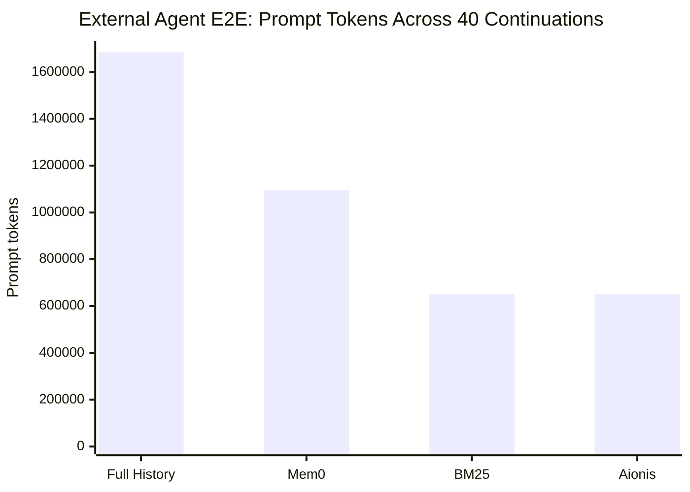
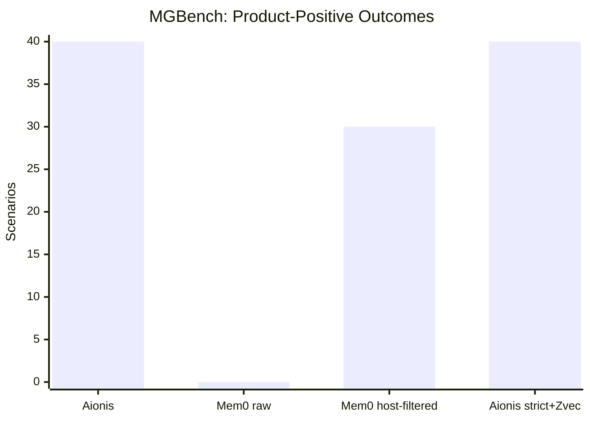
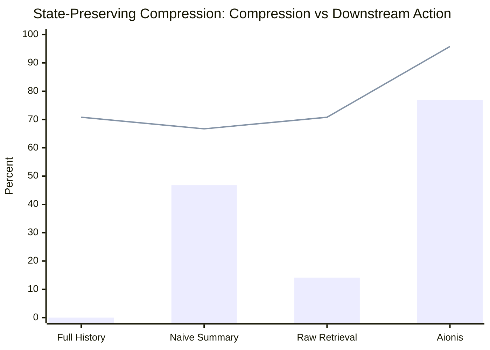

# Aionis v0.3 Evaluation Evidence Report

Date: 2026-06-28

Aionis is a state-adjudicated memory Runtime for long-running Agents. The evidence below evaluates whether Aionis can compile shorter, cleaner, auditable execution context while preserving the active state an Agent needs to continue work.

The core result across the current evidence set is:

> Aionis preserves executable state while reducing context size and adding admission governance, rehydrate pointers, and traceable memory-use decisions.

This report consolidates the current local and public evidence artifacts. It intentionally separates product-path results from diagnostics, ablations, and historical runs.

## Evidence Map

The current evidence is spread across three main locations:

| Evidence area | Folder | Use in this report |
| --- | --- | --- |
| Runtime/eval harness reports | `/Volumes/ziel/AionisRuntime-evals` | External Agent E2E, state-preserving compression, admission dataset, LLM/admission diagnostics |
| Public benchmark repository | `/Volumes/ziel/MGBench` | MGBench v0.1.1 public benchmark, DOI-backed frozen fixtures and reports |
| Runtime product docs/examples | `/Volumes/ziel/AionisRuntime-focused/docs` | Product evidence snapshots, Memory Firewall A/B, recall/Zvec diagnostics |

Primary report artifacts:

- External Agent E2E 40-case report:
  `/Volumes/ziel/AionisRuntime-evals/external-agent-e2e/reports/external-credibility-five-arm-all40-rehydrate-mem0deps-2026-06-28/EXTERNAL_AGENT_CONTEXT_STABILITY_REPORT.md`
- External Agent E2E aggregate:
  `/Volumes/ziel/AionisRuntime-evals/external-agent-e2e/reports/external-credibility-five-arm-all40-rehydrate-mem0deps-2026-06-28/summary.json`
- MGBench v0.3 evidence bundle:
  `/Volumes/ziel/MGBench/reports/aionis-v0.3-context-reliability/summary.md`
- MGBench v0.3 evidence aggregate:
  `/Volumes/ziel/MGBench/reports/aionis-v0.3-context-reliability/summary.json`
- State-preserving compression report:
  `/Volumes/ziel/AionisRuntime-evals/state-preserving-compression-benchmark/reports/state-compression-2026-06-10T09-03-00-174Z/summary.json`
- Admission dataset baseline:
  `/Volumes/ziel/AionisRuntime-focused/docs/research/2026-06-18-admission-dataset-batch-baseline.md`
- Memory Firewall A/B:
  `/Volumes/ziel/AionisRuntime-focused/docs/AIONIS_MEM0_FIREWALL_AB_REPORT.md`
- Zvec recall diagnostics:
  `/Volumes/ziel/AionisRuntime-focused/docs/examples/zvec-recall-scale-comparison/summary.json`

## Result 1: External Agent Context Stability

This eval used 40 real external coding-agent continuation records across four history hygiene levels: `tidy`, `separated`, `implicit`, and `buried`. Five arms were compared: No Memory, Full History, BM25 Retrieval, Mem0, and Aionis.

| Arm | Runs | Action completion | Accepted direction | Prompt tokens | Completion tokens | Total tokens |
| --- | ---: | ---: | ---: | ---: | ---: | ---: |
| No Memory | 40 | 22.5% | 15.0% | 914,534 | 298,299 | 1,212,833 |
| Full History | 40 | 97.5% | 100.0% | 1,684,567 | 137,241 | 1,821,808 |
| BM25 Retrieval | 40 | 100.0% | 100.0% | 651,377 | 151,243 | 802,620 |
| Mem0 | 40 | 100.0% | 100.0% | 1,096,738 | 151,315 | 1,248,053 |
| Aionis | 40 | 100.0% | 100.0% | 650,482 | 143,714 | 794,196 |

Aionis completed 40/40 continuation tasks while using:

- 61.4% fewer prompt tokens than Full History.
- 56.4% fewer total tokens than Full History.
- 40.7% fewer prompt tokens than Mem0.
- 36.4% fewer total tokens than Mem0.

The hardest stress level is `buried`, where useful execution state is hidden inside much larger noisy history:

| Arm | Buried runs | Action completion | Prompt tokens |
| --- | ---: | ---: | ---: |
| Full History | 10 | 100% | 981,860 |
| BM25 Retrieval | 10 | 100% | 169,801 |
| Mem0 | 10 | 100% | 295,392 |
| Aionis | 10 | 100% | 166,537 |

On buried histories, Aionis preserved 100% completion while reducing prompt tokens by 83.0% versus Full History and 43.6% versus Mem0.



Interpretation:

- Full History can preserve state, but it becomes expensive and difficult to audit.
- Retrieval baselines can be efficient, but they do not expose Aionis' admission contract, rehydrate pointers, or decision trace.
- Aionis matches the lean retrieval profile while keeping governed execution context as the product surface.

## Result 2: MGBench Context Reliability

MGBench v0.1.1 is a public benchmark for memory governance under interference. The release is archived with DOI `10.5281/zenodo.20793097`.

The Aionis v0.3 product path under test is:

```text
/v1/observe -> /v1/guide
```

### Real-Source Interference

| Arm | Governance owner | Completed | Product-positive | Active-state recovery | Unsafe direct-use | Rehydrate recall | Trace present | Avg context chars |
| --- | --- | ---: | ---: | ---: | ---: | ---: | ---: | ---: |
| Aionis observe->guide | runtime internal | 40/40 | 40/40 | 100% | 0/40 | 100% | 100% | 1,320 |
| Mem0 raw retrieval | none | 39/40 | 0/40 | 97.5% | 39/40 | 75.0% | 0% | 1,276 |
| Mem0 host-filtered | external host | 40/40 | 30/40 | 100% | 0/40 | 75.0% | 0% | 526 |

The key distinction is governance ownership. Raw retrieval can find relevant state, but it does not decide whether that state is admissible as Agent context. Host filtering can make retrieval safer, but the filtering responsibility moves out of the memory system and into the host. Aionis keeps admission governance, rehydrate pointers, and trace coverage inside the Runtime.

### Strict ID-Neutral Holdout

The strict holdout removes lifecycle-bearing IDs and role hints from observed text. This is a stronger recovery test because the Runtime cannot rely on semantic memory IDs.

| Arm | Completed | Product-positive | Active-state recovery | Unsafe direct-use | Rehydrate recall | Trace present | Avg context chars |
| --- | ---: | ---: | ---: | ---: | ---: | ---: | ---: |
| Aionis strict ID-neutral + Zvec ANN | 40/40 | 40/40 | 100% | 0/40 | 100% | 100% | 1,306 |
| Aionis strict ID-neutral + Zvec ANN rerun | 40/40 | 40/40 | 100% | 0/40 | 100% | 100% | 1,305 |

Diagnostic note: a strict no-ANN run preserved the governance boundary but recovered active state in only 15/40 cases. That diagnostic is not a product headline. It shows why candidate retrieval quality matters beneath Aionis' admission layer.



Interpretation:

- Aionis recovered active execution state and kept unsafe history out of direct-use context.
- Aionis preserved rehydrate and trace surfaces in every scenario.
- Zvec improves candidate retrieval without changing Aionis' admission semantics.

## Result 3: State-Preserving Context Compression

This internal benchmark measures whether a context compiler preserves execution state under compression. It does not measure external GitHub issue success.

Scenario count: 24.

| Arm | Compression | Current state | Negative memory | Stale leak | Procedure | Rehydrate | Audit | Downstream action |
| --- | ---: | ---: | ---: | ---: | ---: | ---: | ---: | ---: |
| Full History | 0.0% | 100.0% | 100.0% | 12.5% | 100.0% | 0.0% | 0.0% | 70.8% |
| Naive Summary | 46.8% | 100.0% | 87.5% | 12.5% | 100.0% | 0.0% | 0.0% | 66.7% |
| Raw Retrieval | 14.1% | 100.0% | 50.0% | 12.5% | 100.0% | 0.0% | 0.0% | 70.8% |
| Aionis | 76.9% | 100.0% | 100.0% | 0.0% | 100.0% | 100.0% | 100.0% | 95.8% |

Aionis passed the benchmark threshold:

- Compression ratio >= 50%.
- Current-state recall >= 95%.
- Negative-memory recall >= 95%.
- Stale leak <= 2%.
- Audit coverage = 100%.
- Downstream action accuracy not below Full History.



Interpretation:

- Full History preserves state but does not compress and does not provide audit or rehydrate coverage.
- Naive Summary compresses but leaks stale information and loses rehydrate/audit surfaces.
- Raw Retrieval is weak at negative-memory retention.
- Aionis compresses aggressively while preserving current state, negative memory, rehydrate pointers, and audit coverage.

## Result 4: Backend-Agnostic Memory Firewall

This 12-scenario local Mem0 A/B evaluates whether Aionis can govern memories retrieved from another backend before they become Agent instructions.

| Arm | Wrong direct-use | Primary route chosen | Current route recall | Audit coverage | Mean chars |
| --- | ---: | ---: | ---: | ---: | ---: |
| Mem0 raw | 83.3% | 58.3% | 100.0% | 0.0% | 560 |
| Mem0 + Aionis Firewall | 0.0% | 100.0% | 100.0% | 100.0% | 722 |

The important product point is not that Aionis replaces the backend. Aionis sits between retrieval and the Agent prompt, routing candidates through:

```text
use_now | inspect_before_use | do_not_use | rehydrate
```

Interpretation:

- Mem0 retrieved the current route in all cases.
- Mem0 also retrieved unsafe memories in 10 cases.
- Aionis preserved current-route recall and prevented unsafe retrieved memories from becoming direct-use Agent instructions.

## Result 5: Admission Dataset And Policy Flywheel

Aionis records admission decisions and feedback attribution as dataset rows. This creates a path to evaluate and improve admission policy over time.

The current private/local admission dataset baseline contains:

| Metric | Value |
| --- | ---: |
| Rows | 411 |
| Runs | 191 |
| Tasks | 191 |
| Task signatures | 25 |
| Positive-use rows | 81 |
| Negative-use rows | 81 |
| Blocked/suppressed rows | 191 |
| Rehydrate-requested rows | 29 |
| Unused-exposed rows | 29 |

Offline policy comparison on this dataset:

| Policy | Score | Positive capture | Direct-use risk | Direct-use precision proxy | Direct use | Missed positive |
| --- | ---: | ---: | ---: | ---: | ---: | ---: |
| Aionis recorded policy | 0.5759 | 100.0% | 42.4% | 42.4% | 191 | 0 |
| Always use | 0.2676 | 100.0% | 73.2% | 19.7% | 411 | 0 |
| Raw retrieval prompt proxy | 0.2676 | 100.0% | 73.2% | 19.7% | 411 | 0 |
| Always block | 0.0000 | 0.0% | 0.0% | 0.0% | 0 | 81 |

Closed-loop active gray testing reached the 100-row gate:

| Metric | Value |
| --- | ---: |
| Rows | 120 |
| Task signatures | 12 |
| Candidate downgrades applied | 48 |
| Runtime mutation count | 0 |
| Hard-boundary upgrade count | 0 |
| Negative direct-use rate after projection | 33.3% |

Real-Agent rerun on the same active gray dataset:

| Metric | Recorded Runtime policy | Candidate policy |
| --- | ---: | ---: |
| Accepted action rate | 50.0% | 50.0% |
| Hard-boundary direct-use rate | 0.0% | 0.0% |
| Negative direct-risk rate | 50.0% | 33.3% |
| Missed actionable rate | 0.0% | 0.0% |

Interpretation:

- Aionis has a functioning data flywheel for admission policy evaluation.
- The dataset captures positive use, negative use, suppression, rehydrate, and unused exposure.
- The current candidate policy evidence supports isolated active-gray testing, not default global rollout.
- The flywheel is strategically important because it turns memory admission from a fixed heuristic into an auditable, measurable policy surface.

## Result 6: Candidate Retrieval And Zvec

Aionis keeps SQLite as the truth source. Optional ANN backends such as Zvec are candidate indexes: they improve recall candidate generation, then Aionis still verifies scope, lifecycle, authority, and relations against the truth store.

Synthetic recall-scale diagnostic:

| Provider | Total nodes | Target recall@10 | Target recall@50 | First-rank hit rate | p50 recall latency |
| --- | ---: | ---: | ---: | ---: | ---: |
| Off / bounded SQLite scan | 4,096 | 0% | 0% | 0% | 20.27 ms |
| Local ANN sidecar | 4,096 | 100% | 100% | 100% | 6.32 ms |
| Zvec ANN sidecar | 4,096 | 100% | 100% | 100% | 5.70 ms |

Write-through smoke checks:

| Check | Result |
| --- | --- |
| New inline embedding updates ANN | pass |
| Target visible after write without restart | pass |
| Failed embedding mutation removed from ANN | pass |
| SQLite remains truth source | pass |

Interpretation:

- Zvec improves candidate retrieval at scale.
- Zvec does not replace the governance layer.
- The evidence supports optional ANN sidecar use for larger local deployments.

## Product-Level Interpretation

Across the evidence set, Aionis' strongest validated product claims are:

1. **Shorter execution context without losing state.**

   Aionis reduced external-Agent prompt tokens by 61.4% versus Full History overall, and 83.0% on buried histories, while preserving 100% continuation completion in the 40-case run.

2. **Cleaner context under interference.**

   In MGBench real-source interference, Aionis achieved 40/40 product-positive outcomes with 0/40 unsafe direct-use, 100% rehydrate recall, and 100% trace coverage.

3. **Auditable memory admission.**

   Aionis does not only retrieve memory. It records why memory was used, inspected, suppressed, or kept as a rehydrate pointer.

4. **Backend-agnostic governance.**

   Aionis can govern candidates from external memory backends before they become Agent instructions.

5. **A measurable admission-policy flywheel.**

   Admission records and feedback attribution can be exported, evaluated, split into holdout sets, and used to test candidate policies.

## Methodology Boundaries

These results are deliberately bounded:

- External Agent E2E results measure context stability and continuation behavior, not general GitHub issue-solving accuracy.
- MGBench measures memory governance under interference, not broad LLM reasoning.
- State-preserving compression is an internal benchmark with deterministic scoring plus downstream LLM scoring.
- Memory Firewall A/B is a small product evidence snapshot, not a broad market benchmark.
- Admission dataset results prove the flywheel and policy-evaluation path; they do not by themselves prove a learned admission policy.
- Zvec results are recall diagnostics; they do not change Aionis admission semantics.

## Recommended External Claims

Use these statements as the current public wording:

> Aionis turns long execution history into shorter, cleaner, auditable Agent context.

> In a 40-case external coding-agent continuation eval, Aionis preserved 100% continuation completion while using 61.4% fewer prompt tokens than Full History and 40.7% fewer than Mem0.

> On buried histories, Aionis preserved 100% completion while reducing prompt tokens by 83.0% versus Full History.

> On MGBench v0.1.1 real-source interference, Aionis achieved 40/40 product-positive outcomes with 0/40 unsafe direct-use, 100% rehydrate recall, and 100% trace coverage.

> Aionis matches lean retrieval on context cost while adding governed admission, rehydrate evidence, and a traceable memory-use record.

## Next Evidence Work

The next useful evidence work is:

1. Expand external Agent E2E beyond the current 40-case run across more repositories and host Agents.
2. Publish a cleaned public benchmark page that points to MGBench v0.1.1 DOI, context reliability results, and external-Agent context stability results.
3. Add a dedicated “state-preserving context compression” research post with charts from this report.
4. Continue admission-policy flywheel work with closed-loop prior-state features, holdout validation, and real Agent reruns.
5. Keep diagnostic failures in diagnostics sections, not in product headline claims.

